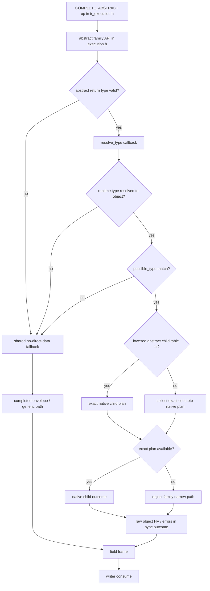

## Compiled IR VM Runtime Plan

This document defines the next execution project for `compiled_ir`.

The goal is not to incrementally optimize the current mixed executor forever.
The goal is to introduce a separate execution-lowered runtime that keeps
public API compatibility while dropping internal compatibility with legacy AST
and Perl object execution shapes.

## Scope

Keep compatible:

- schema / type objects that users already construct
- promise adapter behavior at the public API boundary
- `execute*` entry points and their observable result semantics
- error semantics and response shape

Do not preserve internally:

- legacy AST node shape
- graphql-perl-compatible internal selection / field bucket structures
- shared executor helpers when they force Perl object bridges
- current `compiled_ir` internal plan layout, if a better lowered form exists

The feature-gap inventory in `docs/ecosystem-feature-gap.md` is an explicit
design input for this runtime project. The VM/runtime may ignore internal
legacy shapes, but it should still preserve clean extension points for
high-priority missing features such as mutation serial execution, modern
introspection support, execution hooks / extensions, and future async
transport or incremental-delivery work.

## Why A New Runtime

Recent experiments showed:

- omitting `resolve_type` info in `compiled_ir` is useful as an opt-in
  compatibility shortcut, but it is not the main throughput lever
- `sv_does`, `sv_derived_from`, and possible-type micro-optimizations do not
  produce a stable large win by themselves
- the remaining cost is dominated less by one lookup and more by the fact that
  execution still returns to generic completion / Perl-owned intermediate
  shapes after important runtime decisions have already been made

So the next profitable step is to make `compiled_ir` execution mostly a new
runtime, not a longer chain of local fast paths.

## External Reference

`Text::Xslate` is a useful reference point for this project. Its published
design explicitly compiles templates into intermediate code and executes them
on a virtual machine, with the goal of high performance in persistent
applications. That is close to the architectural direction desired here for
`compiled_ir`, even though GraphQL execution semantics are more complex than a
template engine. See the distribution overview and description:

- MetaCPAN `Text::Xslate`: <https://metacpan.org/pod/Text::Xslate>
- GitHub repository: <https://github.com/xslate/p5-Text-Xslate>

The useful lessons to import are architectural, not surface-level:

- own an explicit lowered/intermediate representation
- keep the hot runtime on a small native instruction/data model
- separate immutable program metadata from mutable execution frames
- delay host-language object materialization until API boundaries

The runtime here should follow those principles while still preserving the
public GraphQL execution API, promise behavior, and response semantics.

Additional useful references for design ideas:

- SQLite VDBE, for an owned lowered program and explicit opcode/operand model
- Lua 5.0, for a compact register-based VM and runtime frame design
- CPython PEP 659, for specialization, quickening, and inline-cache thinking

Those references matter here not because GraphQL execution should look like a
template engine or SQL VM, but because they all separate:

- immutable program state
- mutable execution state
- specialization metadata
- delayed host-language object materialization

## Target Architecture

Planned stages:

1. normalized IR
2. typed / specialized IR
3. execution-lowered IR
4. fused lowered IR
5. threaded-op / VM program

Only stages 3-5 are runtime-facing.

### Execution-Lowered IR

The new lowered IR should own:

- field ops
- resolver dispatch operands
- completion dispatch operands
- abstract child dispatch tables
- native result writer metadata
- native promise merge metadata

It should not own:

- legacy field buckets
- legacy compiled field hashes
- AST-compatible selection trees
- eager resolve-info/path Perl objects

### VM Runtime

The VM should execute against:

- a native execution environment
- a native per-field frame
- a native accumulator / result writer
- delayed Perl materialization only at response / error / promise boundaries

Expected op families:

- `RESOLVE_FIXED_EMPTY_ARGS`
- `RESOLVE_FIXED_BUILD_ARGS`
- `RESOLVE_CONTEXT_EMPTY_ARGS`
- `RESOLVE_CONTEXT_BUILD_ARGS`
- `DISPATCH_ABSTRACT_CHILD`
- `EXECUTE_CHILD_PLAN`
- `COMPLETE_TRIVIAL`
- `COMPLETE_OBJECT`
- `COMPLETE_LIST`
- `COMPLETE_ABSTRACT`
- `CONSUME_DIRECT_VALUE`
- `CONSUME_ERROR`
- `QUEUE_PROMISE`

This is intentionally more specialized than the current generic executor.

## Whole-Runtime Design

The future `compiled_ir` runtime should be designed as four explicit layers,
with each layer owning a clear kind of state.

### 1. Front-End Compatibility Layer

This layer keeps public GraphQL behavior stable and may still accept:

- schema/type objects users already build today
- prepared IR / compiled IR entry points
- current promise adapter API
- current execute-style public call shapes

This layer should *not* decide hot-path runtime shape. Its job is to:

- validate options
- select operation / runtime mode
- invoke lowering
- expose final response objects

### 2. Lowering Pipeline

The lowering pipeline should be explicit and multi-stage:

1. normalized IR
2. typed/specialized IR
3. execution-lowered IR
4. fused lowered IR
5. threaded-op/VM program

Expected responsibilities:

- normalized IR:
  preserve source-level meaning, but remove parser/AST specifics
- typed/specialized IR:
  resolve field metadata, return types, abstract dispatch metadata,
  resolver-call shape, and static argument/directive facts
- execution-lowered IR:
  own child edges, block layout, writer metadata, and completion strategy
- fused lowered IR:
  collapse trivial stage boundaries where runtime data flow is fixed
- threaded-op/VM program:
  produce compact hot-path records for the actual runtime

The key point is that runtime branching should be moved into lowering whenever
possible.

### 3. Runtime Core

The runtime core should be split into:

- immutable program
- immutable field/block metadata
- mutable execution frame
- mutable native result writer
- finalization / promise boundary

The runtime core should not use Perl objects as its internal currency except
where user code forces it.

#### Immutable Program

Own:

- blocks
- field records
- child edges
- abstract dispatch tables
- static specialization flags
- inline-cache slots / metadata hooks

Do not own:

- AST-compatible node trees
- legacy compiled bucket hashes
- eager `ResolveInfo`
- eager Perl paths

#### Execution Frame

Per-field mutable state should contain only data needed for the current step:

- resolved value
- native outcome kind
- native outcome payload
- promise/pending marker
- optional lazy-info/path handles

The frame should be cheap to initialize, cheap to recycle, and small enough to
stay hot in cache.

#### Native Result Writer

The writer should become the primary sink for successful execution.
It should accept:

- scalar/null direct value
- raw object `HV*`
- list head data
- aggregated child errors
- pending promise entries

It should not require intermediate completed-envelope hashes on the sync happy
path.

### 4. Boundary Materialization

Perl object materialization should be delayed to explicit boundaries:

- resolver call arguments
- `ResolveInfo` when actually needed
- path materialization when needed for errors/info
- promise adapter boundaries
- final response hash creation

That means the runtime should prefer:

- native path chains over eager Perl arrays
- native outcomes over `{ data, errors }`
- writer state over temporary result hashes
- shared immutable metadata over repeated field/node lookups

## Primary Performance Priorities

The most strategic optimization priorities are:

1. reduce Perl `HV/AV/SV` creation on sync happy paths
2. reduce pointer chasing in the field loop
3. keep hot runtime structs cache-local and compact
4. move runtime shape decisions into lowering
5. let promise/error/final-response handling remain colder paths

This project is not primarily limited by syscalls. The dominant costs are more
often:

- heap allocation
- refcount churn
- hash/array traversal
- MRO/type checks
- generic completion fallback
- bridge crossings between native runtime and Perl-owned intermediates

## What To Build Next

The highest-value next steps are:

1. compiled-IR-only sync `COMPLETE_OBJECT`
2. compiled-IR-only sync `COMPLETE_LIST`
3. compiled-IR-only sync `COMPLETE_ABSTRACT`
4. child-plan boundaries that pass native outcomes, not completed envelopes
5. a real threaded/block runner that consumes the lowered program directly

That ordering is deliberate:

- first remove generic completion fallback from common success paths
- then make child execution and writer ownership fully native
- only then let the VM/opcode runner become the dominant execution surface

## Inline Cache Strategy

The runtime should leave room for inline caches similar in spirit to
specializing interpreters:

- field-def / resolver-call shape caches
- abstract dispatch hit caches
- completion strategy caches
- argument-building shape caches

These caches should live in immutable program-owned slots plus tiny mutable
runtime counters/guards, not in ad hoc Perl hashes.

## Compatibility Boundary

Compatibility should be preserved at the public surface:

- returned response shape
- promise behavior
- schema/type object API
- execute entry points

Compatibility does *not* need to be preserved for:

- internal AST-like data structures
- internal compiled field bucket shape
- internal executor helper boundaries
- internal intermediate result representation

If a future optimization requires a user-visible compatibility tradeoff,
document and review it explicitly before landing.

## Short-Term Implementation Order

1. Introduce an explicit execution-lowered plan object for `compiled_ir`
   sync/object/abstract execution, separate from legacy-compatible plan data.
2. Introduce a native result writer and make abstract child execution write
   into it directly.
3. Replace `completed { data, errors }` as the internal success-path currency
   with native outcome structs.
4. Add a minimal threaded-op runner for sync root/object/abstract execution.
5. Extend the same runtime to promise-aware execution after sync semantics are
   stable.

## First Concrete Slice

The first implementation slice should stay intentionally narrow:

1. define a new lowered sync plan that only targets root/object/abstract
   execution
2. let that lowered plan own native field-op records directly, instead of
   borrowing node-attached legacy metadata
3. introduce a native result writer that can accept:
   - scalar/null direct values
   - object child-plan results
   - error payloads
   without immediately materializing `{ data, errors }`
4. keep promise handling outside this first slice; a miss may fall back to the
   existing compiled-IR executor

That gives a minimal correctness boundary for a new runtime while preserving a
safe fallback path.

Current status:

- the first ownership split has landed in code as a narrow, behavior-preserving
  step: lowered compiled-IR execution now routes through an owned
  `program -> root_block -> field_plan` boundary
- this is still backed by the existing native field-plan executor, but it
  establishes the control-flow owner that later VM blocks and op arrays should
  hang from
- a second narrow split is now in progress: stable field metadata is being
  hoisted into an immutable metadata record that the runtime field frame can
  point at, while mutable resolver/result/outcome state remains in the frame
- the next narrow slice has also landed: sync generic completion in
  `compiled_ir` can now produce a direct native list outcome when the field is
  no-promise and every list item completes through the existing direct-data
  helper; this stays inside the compiled-IR runtime instead of broadening the
  generic execution helper too early
- the sync child-plan `*_sync_to_outcome(...)` path has also been narrowed so
  it no longer allocates a full execution accumulator just to run a sync child
  plan; it now drives the loop with `writer + promise_present` directly, which
  better matches the future VM split between hot-path result sinks and
  execution-level finalization
- compiled-IR-owned direct child execution now also reuses the parent native
  execution env for sync object/abstract child plans, instead of rebuilding a
  fresh env from `context` for each nested direct-plan hop; this reduces
  repeated context-cache fetch/setup work on the native path
- the same direct object/abstract child path now also keeps child object data
  as raw native `HV*` outcomes until the parent writer consumes them, instead
  of eagerly allocating a temporary Perl hashref at each child-plan boundary
- that boundary is now slightly narrower again: direct sync object/abstract
  child-plan execution can write its raw child-object outcome straight into
  the current field frame, rather than first staging the same `HV*`/errors
  pair in local temporaries and then copying that state into the frame
- lowering now also specializes generic completion one step further for the
  compiled-IR runtime: exact `object`, `list`, and `abstract` return types are
  tagged in field metadata so the hot loop can try only the relevant narrow
  sync completion path instead of probing all generic object/list/abstract
  helpers in sequence
- field metadata has also moved toward cache-local storage: the runtime no
  longer needs one heap allocation for `gql_ir_vm_field_meta_t` per field-plan
  entry, and instead keeps that metadata inline with the compiled entry while
  preserving the existing `entry->meta` access pattern

## Early Design Constraints

The first lowered runtime should deliberately leave room for:

- serial mutation execution by keeping field-loop ordering explicit
- execution hooks / `extensions` by keeping a boundary around final response
  materialization
- future modern introspection additions by not baking old introspection layout
  assumptions into the lowered plan
- future async transport / incremental delivery by not assuming that the only
  terminal output is one eagerly completed Perl response hash

## Concrete First Runtime Boundary

The current lowered runtime still uses these legacy-leaning structures as its
main currency:

- `gql_ir_compiled_root_field_plan_t`
- `gql_ir_compiled_root_field_plan_entry_t`
- `gql_ir_native_exec_env_t`
- `gql_ir_native_exec_accum_t`
- `gql_ir_native_field_frame_t`

That is good enough for shaping experiments, but not yet a clean VM runtime
boundary. The next design step should split these roles more explicitly.

### 1. Lowered Program

Introduce a new owned lowered program type for `compiled_ir`, separate from
legacy-compatible root field plans:

- `gql_ir_vm_program_t`
- `gql_ir_vm_block_t`
- `gql_ir_vm_op_t`

Initial scope:

- one root block
- child blocks for object selections
- child blocks for abstract dispatch targets

The important part is that the lowered program owns execution order and child
edges directly, instead of reconstructing them from node-attached or
legacy-compatible metadata.

### 2. Static Field Metadata

Move per-field stable operands into a dedicated immutable record, for example:

- result key
- field name
- field def
- return type
- parent type
- resolver dispatch kind
- args dispatch kind
- completion kind
- abstract child dispatch table pointer

This record should be owned by the lowered program, not lazily rediscovered
from legacy `SV` containers during the hot loop.

### 3. Runtime Frame

Keep runtime-only mutable state in a separate frame struct:

- resolver result
- native outcome kind
- native outcome payload
- promise marker
- lazy info/path handles if still needed

The runtime frame should never own plan metadata. That separation makes later
threaded execution or register-style execution much simpler.

### 4. Result Writer

The first real new runtime component should be a writer that owns:

- object field writes
- null writes
- child object attachment
- error accumulation
- pending promise slots

The writer should become the only place that knows how to materialize Perl
response hashes or arrays. Field execution itself should only produce native
outcomes for the writer to consume.

This boundary is now partially landed in the current branch: the execution
accumulator no longer directly owns result slots as its primary interface.
Instead, it owns a dedicated native result-writer struct, and field execution
talks to writer helpers first. The next step is to let the writer become the
primary runtime sink for native outcomes and make the accumulator mostly about
execution-level state such as promise presence / finalization policy.

That next step is now in progress as well: the field executor is being moved
off `exec_accum` and toward explicit `(writer, promise_state)` inputs, so the
hot path stops treating the accumulator as its mutable write surface.

As a follow-up, sync trivial completion paths are now being normalized into
direct native outcomes before the consume phase. This is important because it
shrinks the remaining places where the runtime still has to treat Perl
`{ data, errors }` envelopes as an internal execution currency.

The next extension of that idea is now underway too: when a compiled-IR field
completes to a plain object with a single-node concrete child plan, the sync
generic completion path may jump straight into the native child-plan executor
and return a direct outcome instead of first materializing a completed hash.

That object-child direct path is now being hoisted into a narrower
execution-level fast helper as well. This matters because the longer-term
goal is not to keep adding compiled-IR-only branches everywhere, but to grow a
small set of direct-data / native-outcome helpers that both compiled-IR and
future VM lowering can target.

### 5. Fallback Boundary

The first VM/runtime slice should still allow explicit fallback to the current
compiled-IR executor when a field or completion shape is not yet lowered.

That fallback boundary should be:

- visible in the lowered program
- counted / measurable in benchmarks
- narrow enough that it can be retired block by block

This avoids another mixed executor with hidden bridge paths.

## Constraints

- memory ownership must stay explicit; lowered plans own lowered data
- no new hidden reliance on node-attached legacy metadata
- if a compatibility shortcut is introduced, it must be opt-in and documented
- async/promise support is required, but after the sync VM core is stable
- optimizations must not paint the runtime into a corner for the
  high-priority gaps tracked in `docs/ecosystem-feature-gap.md`

## Success Criteria

The new runtime is worth keeping if it can do both:

- materially improve `abstract_with_fragment`
- not regress broader sync cases like `nested_variable_object`

If it only improves one micro-benchmark by layering more mixed-mode branches
onto the old executor, that is not success.

## Cache-Locality Direction

The next runtime work should explicitly optimize for CPU cache locality and
pointer-chase reduction, not just "fewer Perl objects".

That means treating a lowered field-plan entry as two different shapes:

- hot: operands touched by the inner execution loop on nearly every field
- cold: counts, path/debug metadata, fallback-only details, and setup data

The first hot/cold split is now partially landed:

- immutable field metadata is already separated from mutable runtime frames
- each lowered entry now also has an inline hot-operand view carrying:
  - `field_def`
  - `return_type`
  - `type`
  - `resolve`
  - `nodes`
  - `first_node`
  - `abstract_child_plan_table`
- resolver selection, generic completion, frame setup, and abstract-child
  lookup now prefer that hot view

The next small slice of that split is now landed too:

- path/count-style fields live behind a separate cold view
- frame setup / cleanup, metadata extraction, cloning, and legacy
  materialization use the cold view instead of assuming those fields belong in
  the hot loop's primary struct
- runtime name lookups now prefer metadata-first accessors instead of reading
  `result_name` / `field_name` directly from the full entry
- the main field loop now also prefers hot-view `field_def`, `nodes`, `type`,
  and fixed resolver operands instead of treating the full entry as the
  primary runtime operand store

This does not yet create a radically different memory layout, but it does make
the intended boundary explicit: the field loop should mostly walk `meta + hot`,
while `cold` stays on the side for fallback, path, and exported-plan concerns.

This is intentionally conservative. The current step is not trying to build an
entire new memory layout in one shot; it is creating a clear place where we can
move hot operands without keeping the whole execution loop coupled to the full
entry struct.

The next ownership cleanup on top of that split is now landed as well:

- op-stream state no longer lives redundantly on the full lowered entry
- trivial-completion flags and completion dispatch state also moved under
  immutable field metadata
- clone/build paths now seed metadata and derive op arrays from that metadata,
  instead of preserving a second control copy on the full entry

This matters because the eventual VM/runtime should not need the full entry to
be a shadow owner of the same control state. The hot loop should only need:

- immutable metadata
- hot operands
- mutable frame state
- result writer state

and the full lowered entry should be free to keep shrinking toward import /
clone / export duties rather than hot execution duties.

The next cleanup on that same axis is now landed too:

- `result_name` and `field_name` are no longer duplicated on the full lowered
  entry
- immutable metadata is now the sole owner of runtime field names
- clone/import/export paths already had metadata-first accessors, so this
  change mostly removes duplicated name storage and trims the full entry shape

This is important for cache locality because those names are read constantly by
field execution and writer paths, but they no longer need to live in two
places. The runtime can now keep treating metadata as the primary read-only
source while the full entry continues shrinking toward cold/import/export use.

The same ownership cleanup now applies to `return_type` as well:

- the full lowered entry no longer stores a duplicate `return_type`
- immutable metadata is now the only owner of runtime `return_type`
- the hot view refresh derives `return_type` from metadata, so runtime code
  keeps seeing the same operand through `hot + meta` without carrying another
  full-entry copy

This is a small but important step toward the intended shape:

- metadata owns read-only names/types/control state
- hot owns the minimal runtime operand view
- cold owns path/count/fallback/export details
- the full entry becomes mostly a container for those views plus mutable
  runtime-adjacent pointers

That ownership split now goes one step further for count-like metadata:

- `argument_count`, `field_arg_count`, `directive_count`, and
  `selection_count` no longer live in the cold view
- immutable metadata is now their only owner
- the cold view keeps just `path` and `node_count`, which are the only pieces
  that still behave like true export/fallback payload rather than execution
  control

This matters because those counts were read-mostly, duplicated, and not part
of the true hot execution operand set. Moving them into metadata trims the
full entry and cold view without destabilizing the ownership model that the
runtime loop already depends on.

### Why This Matters

The compiled-IR runtime is now much closer to a VM-style executor, so the next
real performance wins are likely to come from:

- tighter hot structs that fit more useful operands per cache line
- fewer dependent loads from cold/full entries
- fewer transient Perl allocations on success paths

This is a better fit for the current architecture than more local
`sv_does`/`sv_derived_from`/resolve-type micro-optimizations.

### Near-Term Plan

1. continue moving hot operands into the hot view
2. keep path/count/debug/fallback data in the cold view and stop re-reading
   them from the full entry in hot paths
3. let child-plan runners and outcome writers operate mostly on hot metadata
4. only after that, lower those hot operands into a more explicit VM opcode /
   operand stream

That last step has now started in a concrete way for completion families:

- `COMPLETE_OBJECT`, `COMPLETE_LIST`, and `COMPLETE_ABSTRACT` now exist as
  distinct native field ops rather than being represented only as metadata
  that funnels into one `COMPLETE_GENERIC` stage
- lowering chooses those op families up front, and the threaded dispatcher
  jumps directly to the matching object/list/abstract completion helper
- `COMPLETE_GENERIC` remains the true catch-all fallback, which keeps the cold
  compatibility path isolated while the hot path becomes more VM-like

This is intentionally a structural step, not a local micro-optimization.
Its value is that the runtime is no longer forced to re-discover completion
shape inside one generic stage. That in turn makes the next steps much
cleaner:

1. teach each completion-family op to own more of the sync happy path
2. reduce how often those ops fall back into `execution.h` completed envelopes
3. keep pushing native outcome / writer handling across child-plan boundaries
4. only then consider further dispatch tightening or more specialized op
   families

One small cleanup in that direction is now in place:

- specialized completion ops no longer retry their narrow sync helper after a
  miss by flowing back through `COMPLETE_GENERIC`
- instead, `COMPLETE_OBJECT`, `COMPLETE_LIST`, and `COMPLETE_ABSTRACT` try
  their narrow path once and then jump directly into the generic fallback-only
  helper

This does not remove the generic fallback itself yet, but it does improve the
shape of the runtime:

- fewer redundant control-flow edges between completion families
- clearer ownership of "specialized op first, generic fallback second"
- a better foundation for teaching those completion-family ops to own more of
  the sync happy path without duplicating retry logic

The next lowering-aligned step now in place is exact object child-plan
ownership:

- when a lowered field entry has a concrete object completion type and its
  current nodes can already be lowered into a single-node native child plan,
  that child plan is now owned directly by the lowered entry
- the hot operand view exposes that owned child plan so `COMPLETE_OBJECT` can
  jump into native child execution without re-collecting the same child plan
  from `nodes` on every execution

This matters less as a standalone micro-benchmark win and more as a runtime
ownership improvement:

- object child execution moves one step closer to "program-owned plan plus
  mutable frame" rather than "runtime re-discovery from Perl node buckets"
- the full entry now owns more of the exact child execution shape up front
- future VM work can treat exact object child execution more like a direct op
  edge and less like a helper that rebuilds its own child plan from scratch

That same ownership split now extends into object fallback handling:

- `COMPLETE_OBJECT` no longer falls back by calling the fully generic
  `direct_data_fast` probe again after its native object path already missed
- instead it now has its own fallback helper that goes straight to the shared
  XS completion semantics

This is still not the end-state, but it improves the shape of the runtime:

- object completion family owns more of its own miss path
- the generic fallback helper becomes more clearly the catch-all path rather
  than a second object fast-path probe
- future compiled-IR-native object completion can replace that fallback helper
  without having to disentangle duplicated direct-data checks first

The same ownership idea now extends one level deeper:

- after the initial lowered program is built, the schema-aware lowering pass
  now recursively attaches exact concrete object child native plans where they
  can be reconstructed from compiled concrete field buckets
- this is used both for direct object completion and for list item object
  completion, so child runners can stay on owned lowered plans more often

This is an important architectural step even when the benchmark impact is
mixed:

- object/list child execution becomes less dependent on re-collecting plans
  from Perl node buckets at runtime
- more of the true child execution shape is now owned by the lowered program
  rather than rediscovered by helpers
- it creates a cleaner base for a later VM/runtime where `COMPLETE_OBJECT` and
  `COMPLETE_LIST` can jump into owned child blocks directly

The next cleanup in the same direction removes duplicated generic retries from
specialized completion families:

- `COMPLETE_OBJECT`, `COMPLETE_LIST`, and `COMPLETE_ABSTRACT` now fall back
  directly into the shared XS completion semantics after their own narrow
  helper misses
- only `COMPLETE_GENERIC` still performs the generic `direct_data_fast` probe
- this keeps the specialized op families from re-probing the same general
  direct-data path after they already attempted their own family-specific
  fast path

This matters less as an isolated throughput trick and more as runtime-shape
cleanup:

- each specialized completion family now owns its miss path more explicitly
- the generic direct-data probe is confined to the true catch-all path
- future compiled-IR-native `COMPLETE_OBJECT/LIST/ABSTRACT` implementations
  can replace those specialized families without first disentangling duplicate
  retry behavior

The same hot/cold split is now being applied to execution state, not just field
metadata:

- the native exec env now groups `context`, `parent_type`, `root_value`,
  `base_path`, and `promise_code` into a hot view used by child-plan runners
  and completion-family helpers
- resolver-support state such as `context_value`, `variable_values`,
  `empty_args`, and `field_resolver` remains outside that hot cluster
- this keeps the hottest runtime reads closer together and prepares the
  eventual VM/runtime loop to operate on a tighter execution-frame working set

This is primarily a memory-locality and responsibility-boundary change:

- it reduces full-env scatter in the completion and child-runner hot paths
- it complements the earlier field `meta/hot/cold` split with an equivalent
  `env hot/cold` split
- it gives the later VM/runtime a cleaner model: immutable lowered program,
  mutable field frame, native writer, and compact hot execution env

The next boundary cleanup now in place is a shared sync outcome API in
`execution.h`:

- sync direct-data completion and sync full-XS-completion-plus-envelope-extract
  are now exposed through one shared outcome helper
- compiled IR specialized fallbacks call that helper instead of duplicating the
  "complete then extract `data/errors`" logic locally
- this keeps compiled IR focused on runtime shape and lowers the amount of
  completion-envelope glue that lives only in `ir_execution.h`

This is an enabling change for later performance work:

- future object/list/abstract narrowing can reduce calls to the shared outcome
  helper without changing the writer/frame contract
- future optimizations inside the shared outcome helper automatically benefit
  compiled IR
- the runtime is one step closer to a clean split between lowered program,
  native frame/writer, and a narrow generic-completion escape hatch

That shared sync outcome boundary is now also split by role:

- one variant keeps the generic `direct_data_fast` probe
- one variant skips the generic probe and goes directly to full completion plus
  sync outcome extraction
- compiled IR now uses the generic-probe variant only for `COMPLETE_GENERIC`
  and keeps `COMPLETE_OBJECT/LIST/ABSTRACT` on the no-direct-data path

This keeps the architecture honest:

- generic probing stays in the generic family
- specialized completion families do not regain duplicated generic work through
  the shared boundary
- further narrowing work can focus on reducing calls to the shared fallback
  itself, not on disentangling duplicated probes again

The same cleanup is now being applied one level lower at the child-plan
boundary:

- sync child-plan execution now has a native `gql_ir_native_child_outcome_t`
  currency instead of passing `HV** + AV**` pairs through each helper
- `sync_to_outcome`, `sync_to_frame_outcome`, and list-item direct child
  execution all consume the same child-outcome struct
- this keeps child object/list/abstract execution aligned with the broader
  "native frame + native writer + native outcome" direction

This matters because it removes another source of runtime glue:

- specialized completion families no longer need bespoke out-parameter wiring
  for child-plan execution
- future widening of `COMPLETE_OBJECT/LIST/ABSTRACT` can reuse a single child
  outcome contract
- later VM/runtime work can treat child execution as another native op/family
  boundary instead of a Perl-oriented helper API

The same ownership direction now extends into abstract list items:

- lowered field metadata caches the list item type as immutable metadata
  instead of recomputing it on every specialized list completion
- lowered entries can now own a `list_item_abstract_child_plan_table` alongside
  the existing exact object child native plan
- `COMPLETE_LIST` can therefore keep both exact object items and abstract items
  on owned lowered child plans before resorting to the shared sync fallback

This is another structural step toward a compiled-IR-native runtime:

- list completion depends less on runtime shape rediscovery
- abstract list items move closer to the same "owned lowered plan + native
  child outcome" model already used for object and abstract field completion
- future VM/runtime work can treat list item object/abstract execution as
  lowered operands rather than ad hoc helper selection

The first spot benchmark after this step is instructive:

- `nested_variable_object` and `list_of_objects` remain ahead or roughly ahead
  with the owned lowered-plan direction intact
- `abstract_with_fragment` still trails slightly, so the next priority remains
  widening `COMPLETE_OBJECT` and `COMPLETE_ABSTRACT` before the next benchmark
  round

That matches the intended strategy:

- list ownership work is now good enough as a base
- the target-case work has shifted back to abstract/object completion family
  narrowing
- further progress is more likely to come from reducing specialized-family
  fallback than from more list-specific micro-layout tweaks

The latest object-family step extends that same idea at the execution boundary:

- `execution.h` now provides `gql_execution_execute_fields_sync_head(...)` as a
  narrow sync/no-promise helper that returns `HV *data + AV *errors` directly
  for already-collected simple object field sets
- compiled IR uses that helper through
  `gql_execution_try_complete_object_sync_head_fast(...)` after exact native
  child-plan dispatch misses inside `COMPLETE_OBJECT`
- this is intentionally limited to the compiled IR object family; broader
  reuse of `execute_fields()`-style helpers previously caused regressions

This is useful even before full VM op lowering:

- object-family fallback can stay on a native head representation longer
- compiled IR avoids forcing a top-level completed `{ data, errors }` envelope
  for this narrow sync path
- future `COMPLETE_OBJECT` / `COMPLETE_ABSTRACT` work can widen around this
  head helper instead of rediscovering object fallback shapes from scratch

That same narrow head boundary now extends one step into abstract completion:

- after `resolve_type`, if compiled IR cannot jump directly into an exact native
  child plan, it now tries the object-head sync helper before using the shared
  sync outcome fallback
- this means the specialized `COMPLETE_ABSTRACT` family can keep the
  `resolve_type -> concrete object child` path on `HV *data + AV *errors`
  longer, instead of immediately recreating a completed envelope

Architecturally this is an important confirmation:

- narrowing specialized families pays off more than reusing broader generic
  execution loops
- the right boundary is still `specialized family -> native child outcome /
  native head -> shared fallback`, not `specialized family -> generic helper`
- future VM work should keep lowering these family-specific boundaries instead
  of trying to fold them back into legacy completion APIs

The next runtime checkpoint pushes that boundary one level lower:

- `execution.h` now exposes distinct shared sync outcome entrypoints for
  generic-with-probe, generic-without-probe, and object-family fallback
- `ir_execution.h` uses one family-owned fallback helper that dispatches by
  completion family instead of hard-coding different completion calls inside
  `COMPLETE_OBJECT`, `COMPLETE_LIST`, and `COMPLETE_ABSTRACT`
- the specialized completion families still share the same native outcome
  contract, but they no longer own mismatched completion-envelope glue

This is mainly a runtime-architecture win:

- future widening of `COMPLETE_OBJECT` can replace only the object-family
  fallback contract without touching list/abstract paths
- future widening of `COMPLETE_ABSTRACT` can reuse the same family-owned
  boundary while changing only the pre-fallback narrow path
- the generic shared fallback is now a thinner cold escape hatch instead of a
  partially inlined execution path inside each family

The latest benchmark checkpoint reflects that shape:

- `nested_variable_object` stays clearly ahead
- `list_of_objects` is effectively tied
- `abstract_with_fragment` is still slightly behind

That combination reinforces the current plan:

- stop spending effort on item-level list tricks
- keep object/abstract family widening as the main target
- treat shared sync outcome fallbacks as cold contracts that should become
  rarer, not smarter

The next structural step pushes that ownership split into `execution.h`:

- `OBJECT`, `LIST`, and `ABSTRACT` sync outcome fallbacks now each have a
  dedicated entrypoint on the shared XS side
- `compiled_ir` no longer chooses between raw generic helper variants for
  specialized families; it asks the corresponding family API instead
- `LIST` and `ABSTRACT` still reuse the same no-direct-data body today, but the
  widening seam now lives entirely behind the family-owned API

This is mainly about keeping the runtime malleable:

- future widening of `COMPLETE_OBJECT` can stay local to the object-family API
- future widening of `COMPLETE_ABSTRACT` can diverge from list/generic fallback
  without another boundary reshuffle
- the VM/runtime is closer to `family op -> family fallback contract` instead
  of `family op -> generic helper selection`

That ownership split has now been enforced for the object family as well:

- `COMPLETE_OBJECT` no longer carries its own post-exact-plan object-head probe
  in `ir_execution.h`
- the object-head probe is owned only by the object-family fallback API in
  `execution.h`
- this keeps compiled IR on a cleaner runtime shape:
  exact child plan -> family fallback contract -> frame/writer

This matters because it removes duplicated narrowing logic:

- future object-family widening happens in one place
- `ir_execution.h` keeps the family runtime orchestration role instead of
  regaining helper-specific escape branches
- the VM path becomes easier to reason about as "family op invokes family
  contract" rather than "family op mixes orchestration and fallback tricks"

That same ownership move is now one step deeper:

- the object-family API in `execution.h` can now receive a pre-lowered exact
  native child plan directly
- `COMPLETE_OBJECT` no longer tries exact child-plan execution before entering
  the family contract; the family API now owns the whole chain:
  exact child plan -> object head -> no-direct-data fallback
- this is intentionally biased toward VM/runtime clarity rather than tiny
  local wins, because it keeps exact-plan narrowing behind the same family
  contract that will later own more of object completion

The same pattern now applies to the abstract family as well:

- the abstract-family API in `execution.h` can now receive the lowered
  abstract child plan table directly
- `COMPLETE_ABSTRACT` no longer owns an early
  `resolve_type -> exact child plan/object-head` branch in `ir_execution.h`
- the abstract-family contract now owns the whole sync chain:
  `resolve_type -> exact child plan/object-head -> no-direct-data fallback`

This matters for the VM/runtime split because:

- `ir_execution.h` stays closer to orchestration and field-family dispatch
- narrowing policy for abstract completion lives behind a single family
  contract, just like object completion
- future widening of abstract completion can happen in one execution-side
  family API instead of reintroducing mixed ownership in the runtime loop

The same ownership model now also applies to list completion:

- the list-family API in `execution.h` can now receive lowered list-item
  metadata directly:
  exact item type, exact item native plan, and abstract item child-plan table
- `COMPLETE_LIST` no longer owns an early list-narrowing branch in
  `ir_execution.h`
- the list-family contract now owns the sync chain:
  exact item plan / abstract item plan -> no-direct-data fallback

This is important because it gives all three completion families the same
structural runtime shape:

- `COMPLETE_OBJECT` -> object-family contract
- `COMPLETE_ABSTRACT` -> abstract-family contract
- `COMPLETE_LIST` -> list-family contract

That alignment is more important than any single micro-optimization. It means
future widening can happen inside one family contract at a time while
`ir_execution.h` stays focused on field-family orchestration and VM/runtime
dispatch.

The next boundary cleanup has now landed as well:

- `execution.h` exposes native sync-outcome wrappers for generic/object/list/
  abstract family fallbacks
- `ir_execution.h` no longer carries raw `(direct_data, direct_errors,
  completed_sv)` tuples across the family boundary
- instead, field-family orchestration now receives one
  `gql_execution_sync_outcome_t`, which matches the direction of
  `field frame -> native outcome -> writer`

This matters more than the immediate benchmark delta because it removes one
more mixed boundary:

- future widening of `COMPLETE_OBJECT/LIST/ABSTRACT` can return richer native
  outcomes without rewriting every compiled-IR caller
- the execution-side family contracts now own both narrowing policy and the
  sync outcome currency
- `ir_execution.h` becomes closer to a VM/runtime dispatcher that consumes
  immutable plan metadata and mutable frame state, rather than manually
  translating between several fallback result shapes

That ownership model has now been pushed one step deeper:

- `OBJECT`, `LIST`, and `ABSTRACT` family APIs in `execution.h` now build
  `gql_execution_sync_outcome_t` directly as their primary sync result
  currency
- the older tuple-style export interfaces remain only as adapters around that
  native outcome
- this means the runtime boundary is finally uniform:
  family contract -> `gql_execution_sync_outcome_t` -> field frame/writer

This is a meaningful architectural checkpoint even though the benchmark is
mixed:

- it removes another full layer of tuple/result-shape translation
- it makes future family widening local to execution-side APIs
- it narrows the remaining problem to one core issue: how often specialized
  families still fall back to generic completion, not how many temporary
  result shapes the boundary has to translate

That boundary cleanup has now crossed the next threshold:

- `OBJECT`, `LIST`, and `ABSTRACT` family APIs are no longer thin wrappers
  around tuple-style result exports
- they now build `gql_execution_sync_outcome_t` directly as their primary sync
  result representation
- tuple exports remain only as adapters for older callers

This is an important turning point for the runtime design:

- the execution-side family contracts now own both narrowing policy and the
  native sync result currency
- `ir_execution.h` can stay focused on orchestration, field frames, and
  writer consumption
- future widening work can target family-specific narrow paths directly,
  without first refactoring result-boundary plumbing again

That family-owned contract model has now started to pay for real widening:

- the object-family API can lazily derive an exact concrete native child plan
  for single-node object completion even when no pre-lowered exact plan was
  attached
- the abstract-family API now reuses that widened object-family path after
  `resolve_type`, so `resolve_type -> object child` stays under execution-side
  ownership longer
- the list-family API can derive and reuse an exact item native child plan and
  route concrete object items through the object-family contract before
  falling back

This is the first stage where execution-side family ownership is doing
meaningful hot-path work instead of only boundary cleanup:

- `execution.h` now owns more of the "can I stay native?" logic for
  object/list/abstract sync completion
- `ir_execution.h` remains orchestration-heavy and does not need to regain
  helper-specific widening logic
- the remaining performance problem is sharper: `COMPLETE_ABSTRACT` still
  reaches generic completion too often, while `OBJECT` and `LIST` are already
  beginning to benefit from widened family-owned narrow paths

The next narrowing step has now pushed that ownership into the internal
success currency as well:

- sync execution outcomes can now carry a direct object `HV*` without forcing
  an immediate `RV` wrapper
- exact native child-plan execution inside execution-side family APIs now
  prefers `gql_ir_native_child_outcome_t`, so `OBJECT/LIST/ABSTRACT` families
  can keep raw object results and child errors together in a native shape
  longer
- `ir_execution.h` already understands direct object outcomes at the field
  frame level, so this change shortens the remaining path between
  family-owned success cases and writer consumption

This matters because it shifts the next optimization target again:

- the runtime no longer spends as much effort translating exact child-plan
  success into temporary Perl reference shapes
- `OBJECT` and `LIST` are now mostly constrained by how often they still hit
  generic completion, not by exact-plan result packaging
- `ABSTRACT` remains the main lagging family, which confirms that future
  widening should focus on reducing `resolve_type -> generic completion`
  frequency rather than on more generic result-shape cleanup

Current `COMPLETE_ABSTRACT` sync flow in the compiled-IR runtime:

Two practical observations from this flow:

- the hot path is already cleaner than earlier checkpoints, because exact
  native child-plan success can now stay in raw object/native-child outcome
  shapes longer
- the remaining weak point is still the `resolve_type -> possible_type match
  -> fallback` corridor, which means `COMPLETE_ABSTRACT` needs better
  hit-rate on the native side rather than more generic result-shape cleanup

The next inline-cache step now targets that corridor:

- lowered abstract child-plan tables now carry a tiny cache of the last
  `runtime_type -> native_field_plan` hit
- repeated abstract completions with the same runtime type can skip the linear
  table walk and keep pointer-chasing lower on the hot path

Checkpoint result after landing that cache:

- the cache is cheap and composes cleanly with the raw object/native child
  outcome work
- object-heavy and list-heavy checkpoints stay healthy, which means the cache
  is not perturbing the stronger compiled-IR families
- abstract completion still trails `xs_ast`, so the main remaining problem is
  not table-walk overhead by itself; it is still the overall frequency of
  falling from `resolve_type` back toward generic completion

The next abstract-family widening step now builds on that cache:

- after `resolve_type` and `possible_type` succeed, the abstract family no
  longer tries to own a bespoke split between exact native child plans,
  object-head, and no-direct-data fallback
- instead, it delegates that whole corridor into the object-family sync
  outcome contract
- this keeps the abstract family narrower and pushes more success-path
  ownership behind one execution-side family API

Architecturally this is important because it removes another mixed boundary:

- `COMPLETE_ABSTRACT` now decides "can I stay native?" and then hands off to
  the object-family contract, instead of re-implementing part of object
  completion locally
- exact child plan success, object-head success, and no-direct-data fallback
  now live under one family-owned contract more often
- this is much closer to the future VM shape, where abstract completion should
  mostly be "resolve + dispatch to object completion family" rather than a
  separate mini-runtime
