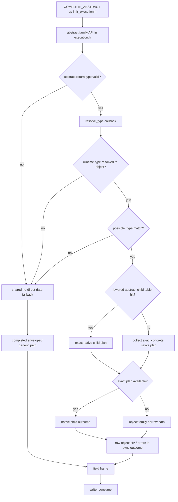

## Compiled IR VM Runtime Plan

This document defines the next execution project for `compiled_ir`.

The goal is not to incrementally optimize the current mixed executor forever.
The goal is to introduce a separate execution-lowered runtime that keeps
public API compatibility while dropping internal compatibility with legacy AST
and Perl object execution shapes.

## Scope

Keep compatible:

- schema / type objects that users already construct
- promise adapter behavior at the public API boundary
- `execute*` entry points and their observable result semantics
- error semantics and response shape

Do not preserve internally:

- legacy AST node shape
- graphql-perl-compatible internal selection / field bucket structures
- shared executor helpers when they force Perl object bridges
- current `compiled_ir` internal plan layout, if a better lowered form exists

The feature-gap inventory in `docs/ecosystem-feature-gap.md` is an explicit
design input for this runtime project. The VM/runtime may ignore internal
legacy shapes, but it should still preserve clean extension points for
high-priority missing features such as mutation serial execution, modern
introspection support, execution hooks / extensions, and future async
transport or incremental-delivery work.

## Why A New Runtime

Recent experiments showed:

- omitting `resolve_type` info in `compiled_ir` is useful as an opt-in
  compatibility shortcut, but it is not the main throughput lever
- `sv_does`, `sv_derived_from`, and possible-type micro-optimizations do not
  produce a stable large win by themselves
- the remaining cost is dominated less by one lookup and more by the fact that
  execution still returns to generic completion / Perl-owned intermediate
  shapes after important runtime decisions have already been made

So the next profitable step is to make `compiled_ir` execution mostly a new
runtime, not a longer chain of local fast paths.

## External Reference

`Text::Xslate` is a useful reference point for this project. Its published
design explicitly compiles templates into intermediate code and executes them
on a virtual machine, with the goal of high performance in persistent
applications. That is close to the architectural direction desired here for
`compiled_ir`, even though GraphQL execution semantics are more complex than a
template engine. See the distribution overview and description:

- MetaCPAN `Text::Xslate`: <https://metacpan.org/pod/Text::Xslate>
- GitHub repository: <https://github.com/xslate/p5-Text-Xslate>

The useful lessons to import are architectural, not surface-level:

- own an explicit lowered/intermediate representation
- keep the hot runtime on a small native instruction/data model
- separate immutable program metadata from mutable execution frames
- delay host-language object materialization until API boundaries

One additional design rule follows directly from that:

- when abstract dispatch can be represented as a lightweight tag lookup,
  prefer that over `is_type_of` probing

The runtime here should follow those principles while still preserving the
public GraphQL execution API, promise behavior, and response semantics.

Additional useful references for design ideas:

- SQLite VDBE, for an owned lowered program and explicit opcode/operand model
- Lua 5.0, for a compact register-based VM and runtime frame design
- CPython PEP 659, for specialization, quickening, and inline-cache thinking

Those references matter here not because GraphQL execution should look like a
template engine or SQL VM, but because they all separate:

- immutable program state
- mutable execution state
- specialization metadata
- delayed host-language object materialization

## Current Checkpoint

Latest kept runtime checkpoint on `proj/compiled-ir-vm-runtime`:

- `OBJECT`, `LIST`, and `ABSTRACT` all already own their sync outcome
  contracts inside `execution.h`
- together with the earlier kept checkpoints:
  - `7f25ce2` routes lowered abstract child-plan hits into the object corridor
  - `64c1484` reuses collected known-object subfields across head-fast and
    fallback paths
- the newest widening keeps object-family fallback inside sync-head shape for
  longer:
  - `gql_execution_execute_fields_sync_native_outcome(...)` now tries
    `gql_execution_execute_fields_sync_head(...)` first
  - only if that fails does it rebuild a completed envelope through the older
    `execute_fields(...)` + extraction path
- checkpoint benchmark (`--count=-3`):
  - `nested_variable_object`: `houtou_compiled_ir 81023/s`
  - `list_of_objects`: `houtou_compiled_ir 59935/s`
  - `abstract_with_fragment`: `houtou_compiled_ir 41818/s`
- interpretation:
  - keeping known-object fallback inside the sync-head loop is a clean win for
    object/list-heavy paths
  - `abstract_with_fragment` still trails, which suggests the remaining cost
    is not the outer object/list family boundary but the inner
    `ABSTRACT -> OBJECT` corridor and the number of times it still exits to
    generic completion
  - secondary lookup shaving remains lower priority than further ownership
    widening inside execution-side family APIs
  - more recently, specializing the abstract dispatch shape first (`TAG`,
    `RESOLVE_TYPE`, `POSSIBLE_TYPES`, `NONE`) proved more valuable than adding
    extra corridor-local probes

## Abstract Dispatch Naming

To keep the public surface readable while still supporting optimized abstract
dispatch, the runtime is moving toward these schema-facing names:

- `runtime_tag` on object types
- `tag_resolver` on interfaces/unions
- optional `tag_map` overrides on interfaces/unions

This avoids repeatedly exposing `houtou_*` prefixed knobs in application code,
while still giving the lowered runtime a clean discriminator path that can
short-circuit `possible_types + is_type_of`.

The latest lowering step also lets abstract child-plan tables own abstract-local
tag dispatch metadata. Each lowered table entry can lazily attach a
`dispatch_tag_sv`, so `compiled_ir` / XS abstract completion can resolve
`runtime_tag`/`tag_resolver` through table-driven dispatch before falling back
to the broader runtime-cache-based lookup.

The next ownership step is to keep `tag_resolver_sv` on the lowered abstract
table as well, so the hot path stops re-fetching the resolver callback from the
runtime cache once that table has been used.

For native Houtou types, the lowered table can also pre-seed `dispatch_tag_sv`
from `tag_map` and object `runtime_tag` fields during lowering. That keeps the
very first abstract dispatch on the same table-driven path instead of waiting
for a runtime-cache hydration step.

Likewise, when the abstract type already carries `tag_resolver`, the lowered
table can pre-seed `tag_resolver_sv` during lowering, so the first dispatch can
stay entirely inside lowered-table-owned state for native Houtou schemas.

The table-owned contract is now `tag -> possible_type` first and `native plan`
second. That means a lowered abstract table can still keep dispatch on the
table-driven path even when the concrete child plan is unavailable, because the
verified runtime-object corridor can run from the resolved concrete type alone.

Outside lowered-table dispatch, explicit `tag_resolver` and `tag_map` are also
treated as first-class runtime data. Both the XS execution path and the Perl
default abstract resolver now try direct type-object `tag_resolver` / `tag_map`
fields before asking the schema runtime cache for synthesized tag maps.

Lowered-table dispatch-tag hydration follows the same direct-first rule:
1. explicit abstract-side `tag_map`
2. concrete object-side `runtime_tag`
3. runtime-cache `runtime_tag_map` only for unresolved entries

This keeps the tag-dispatch path aligned with the tokenizer-style principle
that the hot path should first consume already-owned metadata and only consult
shared maps as a fallback.

The next step on that same principle is to make abstract execution choose its
dispatch family up front, before entering the corridor:

- `TAG`
- `RESOLVE_TYPE`
- `POSSIBLE_TYPES`
- `NONE`

That keeps dispatch kind separate from payload materialization. In other
words, the runtime first decides *which family* it is in, then runs that
family's corridor, instead of probing every abstract strategy in sequence.

Checkpoint benchmark after the dispatch-shape batch:

- `nested_variable_object`: `houtou_compiled_ir 79455/s`
- `list_of_objects`: `houtou_compiled_ir 59024/s`
- `abstract_with_fragment`: `houtou_compiled_ir 40883/s`

## Target Architecture

Planned stages:

1. normalized IR
2. typed / specialized IR
3. execution-lowered IR
4. fused lowered IR
5. threaded-op / VM program

Only stages 3-5 are runtime-facing.

### Execution-Lowered IR

The new lowered IR should own:

- field ops
- resolver dispatch operands
- completion dispatch operands
- abstract child dispatch tables
- native result writer metadata
- native promise merge metadata

It should not own:

- legacy field buckets
- legacy compiled field hashes
- AST-compatible selection trees
- eager resolve-info/path Perl objects

### VM Runtime

The VM should execute against:

- a native execution environment
- a native per-field frame
- a native accumulator / result writer
- delayed Perl materialization only at response / error / promise boundaries

Expected op families:

- `RESOLVE_FIXED_EMPTY_ARGS`
- `RESOLVE_FIXED_BUILD_ARGS`
- `RESOLVE_CONTEXT_EMPTY_ARGS`
- `RESOLVE_CONTEXT_BUILD_ARGS`
- `DISPATCH_ABSTRACT_CHILD`
- `EXECUTE_CHILD_PLAN`
- `COMPLETE_TRIVIAL`
- `COMPLETE_OBJECT`
- `COMPLETE_LIST`
- `COMPLETE_ABSTRACT`
- `CONSUME_DIRECT_VALUE`
- `CONSUME_ERROR`
- `QUEUE_PROMISE`

This is intentionally more specialized than the current generic executor.

## Whole-Runtime Design

The future `compiled_ir` runtime should be designed as four explicit layers,
with each layer owning a clear kind of state.

### 1. Front-End Compatibility Layer

This layer keeps public GraphQL behavior stable and may still accept:

- schema/type objects users already build today
- prepared IR / compiled IR entry points
- current promise adapter API
- current execute-style public call shapes

This layer should *not* decide hot-path runtime shape. Its job is to:

- validate options
- select operation / runtime mode
- invoke lowering
- expose final response objects

### 2. Lowering Pipeline

The lowering pipeline should be explicit and multi-stage:

1. normalized IR
2. typed/specialized IR
3. execution-lowered IR
4. fused lowered IR
5. threaded-op/VM program

Expected responsibilities:

- normalized IR:
  preserve source-level meaning, but remove parser/AST specifics
- typed/specialized IR:
  resolve field metadata, return types, abstract dispatch metadata,
  resolver-call shape, and static argument/directive facts
- execution-lowered IR:
  own child edges, block layout, writer metadata, and completion strategy
- fused lowered IR:
  collapse trivial stage boundaries where runtime data flow is fixed
- threaded-op/VM program:
  produce compact hot-path records for the actual runtime

The key point is that runtime branching should be moved into lowering whenever
possible.

## Current VM Ownership Checkpoint

The current kept VM checkpoint is no longer root-only.

- `compiled_ir` still lowers into `program -> root_block`
- exact object child plans now also keep owned `gql_ir_vm_block`
- lowered abstract child-plan entries keep owned `gql_ir_vm_block`
- sync child execution can therefore move through `block` ownership instead of
  inventing temporary wrapper blocks on the stack

This matters more than the immediate throughput delta because it aligns root
and child execution around the same runtime unit:

- immutable block/program ownership
- mutable execution env/frame/writer
- delayed Perl materialization at the family corridor boundary

The remaining throughput gap, especially on `abstract_with_fragment`, is now
best understood as a corridor-width problem inside `ABSTRACT -> OBJECT`, not a
missing root/child ownership model.

### 3. Runtime Core

The runtime core should be split into:

- immutable program
- immutable field/block metadata
- mutable execution frame
- mutable native result writer
- finalization / promise boundary

The runtime core should not use Perl objects as its internal currency except
where user code forces it.

Here, "internal currency" means the primary shape that execution helpers pass
to each other on the hot path. For this runtime, that should be VM-owned state
such as:

- `gql_ir_vm_exec_state_t`
- `gql_ir_vm_exec_cursor_t`
- `gql_ir_native_field_frame_t`
- `gql_ir_native_child_outcome_t`
- `gql_execution_sync_outcome_t`
- `gql_ir_native_result_writer_t`

It should not normally be:

- completed Perl envelopes like `{ data => ..., errors => ... }`
- ad hoc `SV * / HV * / AV *` triples passed between helpers
- re-materialized AST/legacy field buckets

This is the same design pressure seen in high-performance tokenizers: return
the smallest kind/shape first, and materialize payload only when a later stage
actually needs it. For the VM runtime that means:

- dispatch on family/opcode/slot metadata first
- keep payload in native outcome/state structs as long as possible
- delay Perl object materialization until writer/finalization boundaries

#### Immutable Program

Own:

- blocks
- field records
- child edges
- abstract dispatch tables
- static specialization flags
- inline-cache slots / metadata hooks

Do not own:

- AST-compatible node trees
- legacy compiled bucket hashes
- eager `ResolveInfo`
- eager Perl paths

#### Execution Frame

Per-field mutable state should contain only data needed for the current step:

- resolved value
- native outcome kind
- native outcome payload
- promise/pending marker
- optional lazy-info/path handles

The frame should be cheap to initialize, cheap to recycle, and small enough to
stay hot in cache.

#### Native Result Writer

The writer should become the primary sink for successful execution.
It should accept:

- scalar/null direct value
- raw object `HV*`
- list head data
- aggregated child errors
- pending promise entries

It should not require intermediate completed-envelope hashes on the sync happy
path.

### 4. Boundary Materialization

Perl object materialization should be delayed to explicit boundaries:

- resolver call arguments
- `ResolveInfo` when actually needed
- path materialization when needed for errors/info
- promise adapter boundaries
- final response hash creation

That means the runtime should prefer:

- native path chains over eager Perl arrays
- native outcomes over `{ data, errors }`
- writer state over temporary result hashes
- shared immutable metadata over repeated field/node lookups

## Primary Performance Priorities

The most strategic optimization priorities are:

1. reduce Perl `HV/AV/SV` creation on sync happy paths
2. reduce pointer chasing in the field loop
3. keep hot runtime structs cache-local and compact
4. move runtime shape decisions into lowering
5. let promise/error/final-response handling remain colder paths

This project is not primarily limited by syscalls. The dominant costs are more
often:

- heap allocation
- refcount churn
- hash/array traversal
- MRO/type checks
- generic completion fallback
- bridge crossings between native runtime and Perl-owned intermediates

## What To Build Next

The highest-value next steps are:

1. compiled-IR-only sync `COMPLETE_OBJECT`
2. compiled-IR-only sync `COMPLETE_LIST`
3. compiled-IR-only sync `COMPLETE_ABSTRACT`
4. child-plan boundaries that pass native outcomes, not completed envelopes
5. a real threaded/block runner that consumes the lowered program directly

That ordering is deliberate:

- first remove generic completion fallback from common success paths
- then make child execution and writer ownership fully native
- only then let the VM/opcode runner become the dominant execution surface

## Inline Cache Strategy

The runtime should leave room for inline caches similar in spirit to
specializing interpreters:

- field-def / resolver-call shape caches
- abstract dispatch hit caches
- completion strategy caches
- argument-building shape caches

These caches should live in immutable program-owned slots plus tiny mutable
runtime counters/guards, not in ad hoc Perl hashes.

## Compatibility Boundary

Compatibility should be preserved at the public surface:

- returned response shape
- promise behavior
- schema/type object API
- execute entry points

Compatibility does *not* need to be preserved for:

- internal AST-like data structures
- internal compiled field bucket shape
- internal executor helper boundaries
- internal intermediate result representation

If a future optimization requires a user-visible compatibility tradeoff,
document and review it explicitly before landing.

## Short-Term Implementation Order

1. Introduce an explicit execution-lowered plan object for `compiled_ir`
   sync/object/abstract execution, separate from legacy-compatible plan data.
2. Introduce a native result writer and make abstract child execution write
   into it directly.
3. Replace `completed { data, errors }` as the internal success-path currency
   with native outcome structs.
4. Add a minimal threaded-op runner for sync root/object/abstract execution.
5. Extend the same runtime to promise-aware execution after sync semantics are
   stable.

## First Concrete Slice

The first implementation slice should stay intentionally narrow:

1. define a new lowered sync plan that only targets root/object/abstract
   execution
2. let that lowered plan own native field-op records directly, instead of
   borrowing node-attached legacy metadata
3. introduce a native result writer that can accept:
   - scalar/null direct values
   - object child-plan results
   - error payloads
   without immediately materializing `{ data, errors }`
4. keep promise handling outside this first slice; a miss may fall back to the
   existing compiled-IR executor

That gives a minimal correctness boundary for a new runtime while preserving a
safe fallback path.

Current status:

- the first ownership split has landed in code as a narrow, behavior-preserving
  step: lowered compiled-IR execution now routes through an owned
  `program -> root_block -> field_plan` boundary
- this is still backed by the existing native field-plan executor, but it
  establishes the control-flow owner that later VM blocks and op arrays should
  hang from
- a second narrow split is now in progress: stable field metadata is being
  hoisted into an immutable metadata record that the runtime field frame can
  point at, while mutable resolver/result/outcome state remains in the frame
- the next narrow slice has also landed: sync generic completion in
  `compiled_ir` can now produce a direct native list outcome when the field is
  no-promise and every list item completes through the existing direct-data
  helper; this stays inside the compiled-IR runtime instead of broadening the
  generic execution helper too early
- the sync child-plan `*_sync_to_outcome(...)` path has also been narrowed so
  it no longer allocates a full execution accumulator just to run a sync child
  plan; it now drives the loop with `writer + promise_present` directly, which
  better matches the future VM split between hot-path result sinks and
  execution-level finalization
- compiled-IR-owned direct child execution now also reuses the parent native
  execution env for sync object/abstract child plans, instead of rebuilding a
  fresh env from `context` for each nested direct-plan hop; this reduces
  repeated context-cache fetch/setup work on the native path
- the same direct object/abstract child path now also keeps child object data
  as raw native `HV*` outcomes until the parent writer consumes them, instead
  of eagerly allocating a temporary Perl hashref at each child-plan boundary
- that boundary is now slightly narrower again: direct sync object/abstract
  child-plan execution can write its raw child-object outcome straight into
  the current field frame, rather than first staging the same `HV*`/errors
  pair in local temporaries and then copying that state into the frame
- lowering now also specializes generic completion one step further for the
  compiled-IR runtime: exact `object`, `list`, and `abstract` return types are
  tagged in field metadata so the hot loop can try only the relevant narrow
  sync completion path instead of probing all generic object/list/abstract
  helpers in sequence
- field metadata has also moved toward cache-local storage: the runtime no
  longer needs one heap allocation for `gql_ir_vm_field_meta_t` per field-plan
  entry, and instead keeps that metadata inline with the compiled entry while
  preserving the existing `entry->meta` access pattern

## Early Design Constraints

The first lowered runtime should deliberately leave room for:

- serial mutation execution by keeping field-loop ordering explicit
- execution hooks / `extensions` by keeping a boundary around final response
  materialization
- future modern introspection additions by not baking old introspection layout
  assumptions into the lowered plan
- future async transport / incremental delivery by not assuming that the only
  terminal output is one eagerly completed Perl response hash

## Concrete First Runtime Boundary

The current lowered runtime still uses these legacy-leaning structures as its
main currency:

- `gql_ir_compiled_root_field_plan_t`
- `gql_ir_compiled_root_field_plan_entry_t`
- `gql_ir_native_exec_env_t`
- `gql_ir_native_exec_accum_t`
- `gql_ir_native_field_frame_t`

That is good enough for shaping experiments, but not yet a clean VM runtime
boundary. The next design step should split these roles more explicitly.

Recent kept checkpoint:

- `gql_ir_vm_block` is no longer just a wrapper around
  `gql_ir_compiled_root_field_plan_t`
- blocks now carry the hot loop view directly:
  - `entries`
  - `field_count`
  - `requires_runtime_operand_fill`
- root and child execution can therefore enter the same block-owned loop
  without first re-reading the enclosing field-plan wrapper
- `field_plan`-only sync runners now build a stack `vm_block` view and reuse
  the same block executor, which removes one more parallel loop family from the
  runtime
- the old `gql_ir_run_native_field_plan_loop*` family is gone, so sync entry
  points now converge on `gql_ir_execute_vm_block(...)` /
  `gql_ir_run_vm_block_into_writer(...)`
- the block executor now consumes a single `gql_ir_vm_exec_state_t`, so the
  mutable runtime state already looks like VM state rather than an ad-hoc
  argument bundle
- the block executor now also owns a cursor (`field_index`, `entry`, `meta`,
  `hot`, `pc`), so per-field direct-threaded dispatch reads its current op
  from VM state rather than loop-local scratch variables
- the current `gql_ir_native_field_frame_t` also lives in `gql_ir_vm_exec_state_t`,
  so the block executor carries `cursor + frame + pc` as its mutable VM state

This is still a transitional VM runtime, but it moves ownership one step
closer to a true block/op executor where the block itself is the primary
execution unit.

Checkpoint benchmark (`execution-benchmark.pl` repeated 3 times, median of the
three runs):

- `nested_variable_object`
  - `houtou_compiled_ir` median `80430/s`
  - `houtou_xs_ast` median `79156/s`
- `list_of_objects`
  - `houtou_compiled_ir` median `59958/s`
  - `houtou_xs_ast` median `59752/s`
- `abstract_with_fragment`
  - `houtou_compiled_ir` median `42593/s`
  - `houtou_xs_ast` median `42870/s`

### 1. Lowered Program

Introduce a new owned lowered program type for `compiled_ir`, separate from
legacy-compatible root field plans:

- `gql_ir_vm_program_t`
- `gql_ir_vm_block_t`
- `gql_ir_vm_op_t`

Initial scope:

- one root block
- child blocks for object selections
- child blocks for abstract dispatch targets

The important part is that the lowered program owns execution order and child
edges directly, instead of reconstructing them from node-attached or
legacy-compatible metadata.

### 2. Static Field Metadata

Move per-field stable operands into a dedicated immutable record, for example:

- result key
- field name
- field def
- return type
- parent type
- resolver dispatch kind
- args dispatch kind
- completion kind
- abstract child dispatch table pointer

This record should be owned by the lowered program, not lazily rediscovered
from legacy `SV` containers during the hot loop.

### 3. Runtime Frame

Keep runtime-only mutable state in a separate frame struct:

- resolver result
- native outcome kind
- native outcome payload
- promise marker
- lazy info/path handles if still needed

The runtime frame should never own plan metadata. That separation makes later
threaded execution or register-style execution much simpler.

### 4. Result Writer

The first real new runtime component should be a writer that owns:

- object field writes
- null writes
- child object attachment
- error accumulation
- pending promise slots

The writer should become the only place that knows how to materialize Perl
response hashes or arrays. Field execution itself should only produce native
outcomes for the writer to consume.

This boundary is now partially landed in the current branch: the execution
accumulator no longer directly owns result slots as its primary interface.
Instead, it owns a dedicated native result-writer struct, and field execution
talks to writer helpers first. The next step is to let the writer become the
primary runtime sink for native outcomes and make the accumulator mostly about
execution-level state such as promise presence / finalization policy.

That next step is now in progress as well: the field executor is being moved
off `exec_accum` and toward explicit `(writer, promise_state)` inputs, so the
hot path stops treating the accumulator as its mutable write surface.

As a follow-up, sync trivial completion paths are now being normalized into
direct native outcomes before the consume phase. This is important because it
shrinks the remaining places where the runtime still has to treat Perl
`{ data, errors }` envelopes as an internal execution currency.

The next extension of that idea is now underway too: when a compiled-IR field
completes to a plain object with a single-node concrete child plan, the sync
generic completion path may jump straight into the native child-plan executor
and return a direct outcome instead of first materializing a completed hash.

That object-child direct path is now being hoisted into a narrower
execution-level fast helper as well. This matters because the longer-term
goal is not to keep adding compiled-IR-only branches everywhere, but to grow a
small set of direct-data / native-outcome helpers that both compiled-IR and
future VM lowering can target.

### 5. Fallback Boundary

The first VM/runtime slice should still allow explicit fallback to the current
compiled-IR executor when a field or completion shape is not yet lowered.

That fallback boundary should be:

- visible in the lowered program
- counted / measurable in benchmarks
- narrow enough that it can be retired block by block

This avoids another mixed executor with hidden bridge paths.

## Constraints

- memory ownership must stay explicit; lowered plans own lowered data
- no new hidden reliance on node-attached legacy metadata
- if a compatibility shortcut is introduced, it must be opt-in and documented
- async/promise support is required, but after the sync VM core is stable
- optimizations must not paint the runtime into a corner for the
  high-priority gaps tracked in `docs/ecosystem-feature-gap.md`

## Success Criteria

The new runtime is worth keeping if it can do both:

- materially improve `abstract_with_fragment`
- not regress broader sync cases like `nested_variable_object`

If it only improves one micro-benchmark by layering more mixed-mode branches
onto the old executor, that is not success.

## Cache-Locality Direction

The next runtime work should explicitly optimize for CPU cache locality and
pointer-chase reduction, not just "fewer Perl objects".

That means treating a lowered field-plan entry as two different shapes:

- hot: operands touched by the inner execution loop on nearly every field
- cold: counts, path/debug metadata, fallback-only details, and setup data

The first hot/cold split is now partially landed:

- immutable field metadata is already separated from mutable runtime frames
- each lowered entry now also has an inline hot-operand view carrying:
  - `field_def`
  - `return_type`
  - `type`
  - `resolve`
  - `nodes`
  - `first_node`
  - `abstract_child_plan_table`
- resolver selection, generic completion, frame setup, and abstract-child
  lookup now prefer that hot view

The next small slice of that split is now landed too:

- path/count-style fields live behind a separate cold view
- frame setup / cleanup, metadata extraction, cloning, and legacy
  materialization use the cold view instead of assuming those fields belong in
  the hot loop's primary struct
- runtime name lookups now prefer metadata-first accessors instead of reading
  `result_name` / `field_name` directly from the full entry
- the main field loop now also prefers hot-view `field_def`, `nodes`, `type`,
  and fixed resolver operands instead of treating the full entry as the
  primary runtime operand store

This does not yet create a radically different memory layout, but it does make
the intended boundary explicit: the field loop should mostly walk `meta + hot`,
while `cold` stays on the side for fallback, path, and exported-plan concerns.

This is intentionally conservative. The current step is not trying to build an
entire new memory layout in one shot; it is creating a clear place where we can
move hot operands without keeping the whole execution loop coupled to the full
entry struct.

The next ownership cleanup on top of that split is now landed as well:

- op-stream state no longer lives redundantly on the full lowered entry
- trivial-completion flags and completion dispatch state also moved under
  immutable field metadata
- clone/build paths now seed metadata and derive op arrays from that metadata,
  instead of preserving a second control copy on the full entry

This matters because the eventual VM/runtime should not need the full entry to
be a shadow owner of the same control state. The hot loop should only need:

- immutable metadata
- hot operands
- mutable frame state
- result writer state

and the full lowered entry should be free to keep shrinking toward import /
clone / export duties rather than hot execution duties.

The next cleanup on that same axis is now landed too:

- `result_name` and `field_name` are no longer duplicated on the full lowered
  entry
- immutable metadata is now the sole owner of runtime field names
- clone/import/export paths already had metadata-first accessors, so this
  change mostly removes duplicated name storage and trims the full entry shape

This is important for cache locality because those names are read constantly by
field execution and writer paths, but they no longer need to live in two
places. The runtime can now keep treating metadata as the primary read-only
source while the full entry continues shrinking toward cold/import/export use.

The same ownership cleanup now applies to `return_type` as well:

- the full lowered entry no longer stores a duplicate `return_type`
- immutable metadata is now the only owner of runtime `return_type`
- the hot view refresh derives `return_type` from metadata, so runtime code
  keeps seeing the same operand through `hot + meta` without carrying another
  full-entry copy

This is a small but important step toward the intended shape:

- metadata owns read-only names/types/control state
- hot owns the minimal runtime operand view
- cold owns path/count/fallback/export details
- the full entry becomes mostly a container for those views plus mutable
  runtime-adjacent pointers

That ownership split now goes one step further for count-like metadata:

- `argument_count`, `field_arg_count`, `directive_count`, and
  `selection_count` no longer live in the cold view
- immutable metadata is now their only owner
- the cold view keeps just `path` and `node_count`, which are the only pieces
  that still behave like true export/fallback payload rather than execution
  control

This matters because those counts were read-mostly, duplicated, and not part
of the true hot execution operand set. Moving them into metadata trims the
full entry and cold view without destabilizing the ownership model that the
runtime loop already depends on.

### Why This Matters

The compiled-IR runtime is now much closer to a VM-style executor, so the next
real performance wins are likely to come from:

- tighter hot structs that fit more useful operands per cache line
- fewer dependent loads from cold/full entries
- fewer transient Perl allocations on success paths

This is a better fit for the current architecture than more local
`sv_does`/`sv_derived_from`/resolve-type micro-optimizations.

### Near-Term Plan

1. continue moving hot operands into the hot view
2. keep path/count/debug/fallback data in the cold view and stop re-reading
   them from the full entry in hot paths
3. let child-plan runners and outcome writers operate mostly on hot metadata
4. only after that, lower those hot operands into a more explicit VM opcode /
   operand stream

That last step has now started in a concrete way for completion families:

- `COMPLETE_OBJECT`, `COMPLETE_LIST`, and `COMPLETE_ABSTRACT` now exist as
  distinct native field ops rather than being represented only as metadata
  that funnels into one `COMPLETE_GENERIC` stage
- lowering chooses those op families up front, and the threaded dispatcher
  jumps directly to the matching object/list/abstract completion helper
- `COMPLETE_GENERIC` remains the true catch-all fallback, which keeps the cold
  compatibility path isolated while the hot path becomes more VM-like

This is intentionally a structural step, not a local micro-optimization.
Its value is that the runtime is no longer forced to re-discover completion
shape inside one generic stage. That in turn makes the next steps much
cleaner:

1. teach each completion-family op to own more of the sync happy path
2. reduce how often those ops fall back into `execution.h` completed envelopes
3. keep pushing native outcome / writer handling across child-plan boundaries
4. only then consider further dispatch tightening or more specialized op
   families

One small cleanup in that direction is now in place:

- specialized completion ops no longer retry their narrow sync helper after a
  miss by flowing back through `COMPLETE_GENERIC`
- instead, `COMPLETE_OBJECT`, `COMPLETE_LIST`, and `COMPLETE_ABSTRACT` try
  their narrow path once and then jump directly into the generic fallback-only
  helper

This does not remove the generic fallback itself yet, but it does improve the
shape of the runtime:

- fewer redundant control-flow edges between completion families
- clearer ownership of "specialized op first, generic fallback second"
- a better foundation for teaching those completion-family ops to own more of
  the sync happy path without duplicating retry logic

The next lowering-aligned step now in place is exact object child-plan
ownership:

- when a lowered field entry has a concrete object completion type and its
  current nodes can already be lowered into a single-node native child plan,
  that child plan is now owned directly by the lowered entry
- the hot operand view exposes that owned child plan so `COMPLETE_OBJECT` can
  jump into native child execution without re-collecting the same child plan
  from `nodes` on every execution

This matters less as a standalone micro-benchmark win and more as a runtime
ownership improvement:

- object child execution moves one step closer to "program-owned plan plus
  mutable frame" rather than "runtime re-discovery from Perl node buckets"
- the full entry now owns more of the exact child execution shape up front
- future VM work can treat exact object child execution more like a direct op
  edge and less like a helper that rebuilds its own child plan from scratch

That same ownership split now extends into object fallback handling:

- `COMPLETE_OBJECT` no longer falls back by calling the fully generic
  `direct_data_fast` probe again after its native object path already missed
- instead it now has its own fallback helper that goes straight to the shared
  XS completion semantics

This is still not the end-state, but it improves the shape of the runtime:

- object completion family owns more of its own miss path
- the generic fallback helper becomes more clearly the catch-all path rather
  than a second object fast-path probe
- future compiled-IR-native object completion can replace that fallback helper
  without having to disentangle duplicated direct-data checks first

The same ownership idea now extends one level deeper:

- after the initial lowered program is built, the schema-aware lowering pass
  now recursively attaches exact concrete object child native plans where they
  can be reconstructed from compiled concrete field buckets
- this is used both for direct object completion and for list item object
  completion, so child runners can stay on owned lowered plans more often

This is an important architectural step even when the benchmark impact is
mixed:

- object/list child execution becomes less dependent on re-collecting plans
  from Perl node buckets at runtime
- more of the true child execution shape is now owned by the lowered program
  rather than rediscovered by helpers
- it creates a cleaner base for a later VM/runtime where `COMPLETE_OBJECT` and
  `COMPLETE_LIST` can jump into owned child blocks directly

The next cleanup in the same direction removes duplicated generic retries from
specialized completion families:

- `COMPLETE_OBJECT`, `COMPLETE_LIST`, and `COMPLETE_ABSTRACT` now fall back
  directly into the shared XS completion semantics after their own narrow
  helper misses
- only `COMPLETE_GENERIC` still performs the generic `direct_data_fast` probe
- this keeps the specialized op families from re-probing the same general
  direct-data path after they already attempted their own family-specific
  fast path

This matters less as an isolated throughput trick and more as runtime-shape
cleanup:

- each specialized completion family now owns its miss path more explicitly
- the generic direct-data probe is confined to the true catch-all path
- future compiled-IR-native `COMPLETE_OBJECT/LIST/ABSTRACT` implementations
  can replace those specialized families without first disentangling duplicate
  retry behavior

The same hot/cold split is now being applied to execution state, not just field
metadata:

- the native exec env now groups `context`, `parent_type`, `root_value`,
  `base_path`, and `promise_code` into a hot view used by child-plan runners
  and completion-family helpers
- resolver-support state such as `context_value`, `variable_values`,
  `empty_args`, and `field_resolver` remains outside that hot cluster
- this keeps the hottest runtime reads closer together and prepares the
  eventual VM/runtime loop to operate on a tighter execution-frame working set

This is primarily a memory-locality and responsibility-boundary change:

- it reduces full-env scatter in the completion and child-runner hot paths
- it complements the earlier field `meta/hot/cold` split with an equivalent
  `env hot/cold` split
- it gives the later VM/runtime a cleaner model: immutable lowered program,
  mutable field frame, native writer, and compact hot execution env

The next boundary cleanup now in place is a shared sync outcome API in
`execution.h`:

- sync direct-data completion and sync full-XS-completion-plus-envelope-extract
  are now exposed through one shared outcome helper
- compiled IR specialized fallbacks call that helper instead of duplicating the
  "complete then extract `data/errors`" logic locally
- this keeps compiled IR focused on runtime shape and lowers the amount of
  completion-envelope glue that lives only in `ir_execution.h`

This is an enabling change for later performance work:

- future object/list/abstract narrowing can reduce calls to the shared outcome
  helper without changing the writer/frame contract
- future optimizations inside the shared outcome helper automatically benefit
  compiled IR
- the runtime is one step closer to a clean split between lowered program,
  native frame/writer, and a narrow generic-completion escape hatch

That shared sync outcome boundary is now also split by role:

- one variant keeps the generic `direct_data_fast` probe
- one variant skips the generic probe and goes directly to full completion plus
  sync outcome extraction
- compiled IR now uses the generic-probe variant only for `COMPLETE_GENERIC`
  and keeps `COMPLETE_OBJECT/LIST/ABSTRACT` on the no-direct-data path

This keeps the architecture honest:

- generic probing stays in the generic family
- specialized completion families do not regain duplicated generic work through
  the shared boundary
- further narrowing work can focus on reducing calls to the shared fallback
  itself, not on disentangling duplicated probes again

The same cleanup is now being applied one level lower at the child-plan
boundary:

- sync child-plan execution now has a native `gql_ir_native_child_outcome_t`
  currency instead of passing `HV** + AV**` pairs through each helper
- `sync_to_outcome`, `sync_to_frame_outcome`, and list-item direct child
  execution all consume the same child-outcome struct
- this keeps child object/list/abstract execution aligned with the broader
  "native frame + native writer + native outcome" direction

This matters because it removes another source of runtime glue:

- specialized completion families no longer need bespoke out-parameter wiring
  for child-plan execution
- future widening of `COMPLETE_OBJECT/LIST/ABSTRACT` can reuse a single child
  outcome contract
- later VM/runtime work can treat child execution as another native op/family
  boundary instead of a Perl-oriented helper API

The same ownership direction now extends into abstract list items:

- lowered field metadata caches the list item type as immutable metadata
  instead of recomputing it on every specialized list completion
- lowered entries can now own a `list_item_abstract_child_plan_table` alongside
  the existing exact object child native plan
- `COMPLETE_LIST` can therefore keep both exact object items and abstract items
  on owned lowered child plans before resorting to the shared sync fallback

This is another structural step toward a compiled-IR-native runtime:

- list completion depends less on runtime shape rediscovery
- abstract list items move closer to the same "owned lowered plan + native
  child outcome" model already used for object and abstract field completion
- future VM/runtime work can treat list item object/abstract execution as
  lowered operands rather than ad hoc helper selection

The first spot benchmark after this step is instructive:

- `nested_variable_object` and `list_of_objects` remain ahead or roughly ahead
  with the owned lowered-plan direction intact
- `abstract_with_fragment` still trails slightly, so the next priority remains
  widening `COMPLETE_OBJECT` and `COMPLETE_ABSTRACT` before the next benchmark
  round

That matches the intended strategy:

- list ownership work is now good enough as a base
- the target-case work has shifted back to abstract/object completion family
  narrowing
- further progress is more likely to come from reducing specialized-family
  fallback than from more list-specific micro-layout tweaks

The latest object-family step extends that same idea at the execution boundary:

- `execution.h` now provides `gql_execution_execute_fields_sync_head(...)` as a
  narrow sync/no-promise helper that returns `HV *data + AV *errors` directly
  for already-collected simple object field sets
- compiled IR uses that helper through
  `gql_execution_try_complete_object_sync_head_fast(...)` after exact native
  child-plan dispatch misses inside `COMPLETE_OBJECT`
- this is intentionally limited to the compiled IR object family; broader
  reuse of `execute_fields()`-style helpers previously caused regressions

This is useful even before full VM op lowering:

- object-family fallback can stay on a native head representation longer
- compiled IR avoids forcing a top-level completed `{ data, errors }` envelope
  for this narrow sync path
- future `COMPLETE_OBJECT` / `COMPLETE_ABSTRACT` work can widen around this
  head helper instead of rediscovering object fallback shapes from scratch

That same narrow head boundary now extends one step into abstract completion:

- after `resolve_type`, if compiled IR cannot jump directly into an exact native
  child plan, it now tries the object-head sync helper before using the shared
  sync outcome fallback
- this means the specialized `COMPLETE_ABSTRACT` family can keep the
  `resolve_type -> concrete object child` path on `HV *data + AV *errors`
  longer, instead of immediately recreating a completed envelope

Architecturally this is an important confirmation:

- narrowing specialized families pays off more than reusing broader generic
  execution loops
- the right boundary is still `specialized family -> native child outcome /
  native head -> shared fallback`, not `specialized family -> generic helper`
- future VM work should keep lowering these family-specific boundaries instead
  of trying to fold them back into legacy completion APIs

The next runtime checkpoint pushes that boundary one level lower:

- `execution.h` now exposes distinct shared sync outcome entrypoints for
  generic-with-probe, generic-without-probe, and object-family fallback
- `ir_execution.h` uses one family-owned fallback helper that dispatches by
  completion family instead of hard-coding different completion calls inside
  `COMPLETE_OBJECT`, `COMPLETE_LIST`, and `COMPLETE_ABSTRACT`
- the specialized completion families still share the same native outcome
  contract, but they no longer own mismatched completion-envelope glue

This is mainly a runtime-architecture win:

- future widening of `COMPLETE_OBJECT` can replace only the object-family
  fallback contract without touching list/abstract paths
- future widening of `COMPLETE_ABSTRACT` can reuse the same family-owned
  boundary while changing only the pre-fallback narrow path
- the generic shared fallback is now a thinner cold escape hatch instead of a
  partially inlined execution path inside each family

The latest benchmark checkpoint reflects that shape:

- `nested_variable_object` stays clearly ahead
- `list_of_objects` is effectively tied
- `abstract_with_fragment` is still slightly behind

That combination reinforces the current plan:

- stop spending effort on item-level list tricks
- keep object/abstract family widening as the main target
- treat shared sync outcome fallbacks as cold contracts that should become
  rarer, not smarter

The next structural step pushes that ownership split into `execution.h`:

- `OBJECT`, `LIST`, and `ABSTRACT` sync outcome fallbacks now each have a
  dedicated entrypoint on the shared XS side
- `compiled_ir` no longer chooses between raw generic helper variants for
  specialized families; it asks the corresponding family API instead
- `LIST` and `ABSTRACT` still reuse the same no-direct-data body today, but the
  widening seam now lives entirely behind the family-owned API

This is mainly about keeping the runtime malleable:

- future widening of `COMPLETE_OBJECT` can stay local to the object-family API
- future widening of `COMPLETE_ABSTRACT` can diverge from list/generic fallback
  without another boundary reshuffle
- the VM/runtime is closer to `family op -> family fallback contract` instead
  of `family op -> generic helper selection`

That ownership split has now been enforced for the object family as well:

- `COMPLETE_OBJECT` no longer carries its own post-exact-plan object-head probe
  in `ir_execution.h`
- the object-head probe is owned only by the object-family fallback API in
  `execution.h`
- this keeps compiled IR on a cleaner runtime shape:
  exact child plan -> family fallback contract -> frame/writer

This matters because it removes duplicated narrowing logic:

- future object-family widening happens in one place
- `ir_execution.h` keeps the family runtime orchestration role instead of
  regaining helper-specific escape branches
- the VM path becomes easier to reason about as "family op invokes family
  contract" rather than "family op mixes orchestration and fallback tricks"

That same ownership move is now one step deeper:

- the object-family API in `execution.h` can now receive a pre-lowered exact
  native child plan directly
- `COMPLETE_OBJECT` no longer tries exact child-plan execution before entering
  the family contract; the family API now owns the whole chain:
  exact child plan -> object head -> no-direct-data fallback
- this is intentionally biased toward VM/runtime clarity rather than tiny
  local wins, because it keeps exact-plan narrowing behind the same family
  contract that will later own more of object completion

The same pattern now applies to the abstract family as well:

- the abstract-family API in `execution.h` can now receive the lowered
  abstract child plan table directly
- `COMPLETE_ABSTRACT` no longer owns an early
  `resolve_type -> exact child plan/object-head` branch in `ir_execution.h`
- the abstract-family contract now owns the whole sync chain:
  `resolve_type -> exact child plan/object-head -> no-direct-data fallback`

This matters for the VM/runtime split because:

- `ir_execution.h` stays closer to orchestration and field-family dispatch
- narrowing policy for abstract completion lives behind a single family
  contract, just like object completion
- future widening of abstract completion can happen in one execution-side
  family API instead of reintroducing mixed ownership in the runtime loop

The same ownership model now also applies to list completion:

- the list-family API in `execution.h` can now receive lowered list-item
  metadata directly:
  exact item type, exact item native plan, and abstract item child-plan table
- `COMPLETE_LIST` no longer owns an early list-narrowing branch in
  `ir_execution.h`
- the list-family contract now owns the sync chain:
  exact item plan / abstract item plan -> no-direct-data fallback

This is important because it gives all three completion families the same
structural runtime shape:

- `COMPLETE_OBJECT` -> object-family contract
- `COMPLETE_ABSTRACT` -> abstract-family contract
- `COMPLETE_LIST` -> list-family contract

That alignment is more important than any single micro-optimization. It means
future widening can happen inside one family contract at a time while
`ir_execution.h` stays focused on field-family orchestration and VM/runtime
dispatch.

The next boundary cleanup has now landed as well:

- `execution.h` exposes native sync-outcome wrappers for generic/object/list/
  abstract family fallbacks
- `ir_execution.h` no longer carries raw `(direct_data, direct_errors,
  completed_sv)` tuples across the family boundary
- instead, field-family orchestration now receives one
  `gql_execution_sync_outcome_t`, which matches the direction of
  `field frame -> native outcome -> writer`

This matters more than the immediate benchmark delta because it removes one
more mixed boundary:

- future widening of `COMPLETE_OBJECT/LIST/ABSTRACT` can return richer native
  outcomes without rewriting every compiled-IR caller
- the execution-side family contracts now own both narrowing policy and the
  sync outcome currency
- `ir_execution.h` becomes closer to a VM/runtime dispatcher that consumes
  immutable plan metadata and mutable frame state, rather than manually
  translating between several fallback result shapes

That ownership model has now been pushed one step deeper:

- `OBJECT`, `LIST`, and `ABSTRACT` family APIs in `execution.h` now build
  `gql_execution_sync_outcome_t` directly as their primary sync result
  currency
- the older tuple-style export interfaces remain only as adapters around that
  native outcome
- this means the runtime boundary is finally uniform:
  family contract -> `gql_execution_sync_outcome_t` -> field frame/writer

This is a meaningful architectural checkpoint even though the benchmark is
mixed:

- it removes another full layer of tuple/result-shape translation
- it makes future family widening local to execution-side APIs
- it narrows the remaining problem to one core issue: how often specialized
  families still fall back to generic completion, not how many temporary
  result shapes the boundary has to translate

That boundary cleanup has now crossed the next threshold:

- `OBJECT`, `LIST`, and `ABSTRACT` family APIs are no longer thin wrappers
  around tuple-style result exports
- they now build `gql_execution_sync_outcome_t` directly as their primary sync
  result representation
- tuple exports remain only as adapters for older callers

This is an important turning point for the runtime design:

- the execution-side family contracts now own both narrowing policy and the
  native sync result currency
- `ir_execution.h` can stay focused on orchestration, field frames, and
  writer consumption
- future widening work can target family-specific narrow paths directly,
  without first refactoring result-boundary plumbing again

That family-owned contract model has now started to pay for real widening:

- the object-family API can lazily derive an exact concrete native child plan
  for single-node object completion even when no pre-lowered exact plan was
  attached
- the abstract-family API now reuses that widened object-family path after
  `resolve_type`, so `resolve_type -> object child` stays under execution-side
  ownership longer
- the list-family API can derive and reuse an exact item native child plan and
  route concrete object items through the object-family contract before
  falling back

This is the first stage where execution-side family ownership is doing
meaningful hot-path work instead of only boundary cleanup:

- `execution.h` now owns more of the "can I stay native?" logic for
  object/list/abstract sync completion
- `ir_execution.h` remains orchestration-heavy and does not need to regain
  helper-specific widening logic
- the remaining performance problem is sharper: `COMPLETE_ABSTRACT` still
  reaches generic completion too often, while `OBJECT` and `LIST` are already
  beginning to benefit from widened family-owned narrow paths

The next narrowing step has now pushed that ownership into the internal
success currency as well:

- sync execution outcomes can now carry a direct object `HV*` without forcing
  an immediate `RV` wrapper
- exact native child-plan execution inside execution-side family APIs now
  prefers `gql_ir_native_child_outcome_t`, so `OBJECT/LIST/ABSTRACT` families
  can keep raw object results and child errors together in a native shape
  longer
- `ir_execution.h` already understands direct object outcomes at the field
  frame level, so this change shortens the remaining path between
  family-owned success cases and writer consumption

This matters because it shifts the next optimization target again:

- the runtime no longer spends as much effort translating exact child-plan
  success into temporary Perl reference shapes
- `OBJECT` and `LIST` are now mostly constrained by how often they still hit
  generic completion, not by exact-plan result packaging
- `ABSTRACT` remains the main lagging family, which confirms that future
  widening should focus on reducing `resolve_type -> generic completion`
  frequency rather than on more generic result-shape cleanup

Current `COMPLETE_ABSTRACT` sync flow in the compiled-IR runtime:

Two practical observations from this flow:

- the hot path is already cleaner than earlier checkpoints, because exact
  native child-plan success can now stay in raw object/native-child outcome
  shapes longer
- the remaining weak point is still the `resolve_type -> possible_type match
  -> fallback` corridor, which means `COMPLETE_ABSTRACT` needs better
  hit-rate on the native side rather than more generic result-shape cleanup

The next inline-cache step now targets that corridor:

- lowered abstract child-plan tables now carry a tiny cache of the last
  `runtime_type -> native_field_plan` hit
- repeated abstract completions with the same runtime type can skip the linear
  table walk and keep pointer-chasing lower on the hot path

Checkpoint result after landing that cache:

- the cache is cheap and composes cleanly with the raw object/native child
  outcome work
- object-heavy and list-heavy checkpoints stay healthy, which means the cache
  is not perturbing the stronger compiled-IR families
- abstract completion still trails `xs_ast`, so the main remaining problem is
  not table-walk overhead by itself; it is still the overall frequency of
  falling from `resolve_type` back toward generic completion

The next abstract-family widening step now builds on that cache:

- after `resolve_type` and `possible_type` succeed, the abstract family no
  longer tries to own a bespoke split between exact native child plans,
  object-head, and no-direct-data fallback
- instead, it delegates that whole corridor into the object-family sync
  outcome contract
- this keeps the abstract family narrower and pushes more success-path
  ownership behind one execution-side family API

Architecturally this is important because it removes another mixed boundary:

- `COMPLETE_ABSTRACT` now decides "can I stay native?" and then hands off to
  the object-family contract, instead of re-implementing part of object
  completion locally
- exact child plan success, object-head success, and no-direct-data fallback
  now live under one family-owned contract more often
- this is much closer to the future VM shape, where abstract completion should
  mostly be "resolve + dispatch to object completion family" rather than a
  separate mini-runtime

The next checkpoint tightens that same corridor a little more without adding a
new abstract-local special case:

- when a lowered abstract child-plan table is already attached and the resolved
  runtime type is found in that table, abstract completion now enters the
  object-family contract immediately
- only lowered-table misses fall through to
  `gql_execution_possible_type_match_simple(...)`
- this keeps the semantics conservative while making the hot path more clearly
  "resolve, then dispatch into object completion"

Operationally, this is a good sign for the larger VM plan:

- object-heavy and list-heavy checkpoints remain healthy
- abstract completion moves closer to parity again
- the remaining performance gap is therefore less about abstract-specific table
  lookup trivia and more about how often the family contracts still need to
  materialize generic completion state

The next family-owned step now pushes that ownership all the way through the
no-direct-data boundary:

- `OBJECT`, `LIST`, and `ABSTRACT` each own their execution-side
  no-direct-data sync outcome helper
- `OBJECT` and `ABSTRACT` normalize object-like direct values into raw object
  outcomes before writer consumption, so the orchestration layer does not need
  to rediscover object shape late
- `ir_execution.h` continues to consume a single sync outcome contract, which
  keeps the runtime side thin while making future widening entirely an
  execution-family concern

This is strategically useful for the VM path:

- it removes another generic/shared boundary from the hot path without creating
  new family-local code in `ir_execution.h`
- it makes the family contract look more like a proper VM completion opcode:
  "return a native outcome, not a half-generic Perl shape"
- it also clarifies the next task: widen `OBJECT` and `ABSTRACT` family-owned
  narrow paths further so the generic completion fallback is reached even less
  often

The next cleanup step then lifts raw-object normalization into the generic sync
outcome helper itself:

- object-like direct values are normalized once, centrally, before any family
  wrapper consumes them
- `OBJECT` and `ABSTRACT` family wrappers stay in place as ownership and
  widening boundaries, but they no longer need to duplicate object-shape
  normalization logic
- that keeps the execution-family API surface stable while shrinking the amount
  of repeated outcome-shape code

This is a useful trade in the VM/runtime plan even without a dramatic benchmark
jump:

- it makes the native sync outcome contract more canonical
- it keeps future widening work focused on family-specific control flow rather
  than on repeated shape conversions
- it also suggests the remaining abstract gap is increasingly about how often
  the abstract/object family corridor still falls to generic completion, not
  about how object results are represented once they stay native

The next abstract-focused widening step then specializes the
`ABSTRACT -> OBJECT` handoff itself:

- once `resolve_type` has already resolved a concrete object runtime type, the
  execution-side handoff uses a known-object object-family path
- that path skips the repeated object-role check and the `is_type_of` probe in
  the object-head fast helper
- plain object completion keeps the conservative path; only the resolved
  abstract corridor gets the lighter contract

Architecturally this is a good VM-oriented trade:

- it makes the abstract family look more like `RESOLVE_ABSTRACT` followed by
  `COMPLETE_OBJECT_KNOWN`, which is much closer to a real opcode family split
- it keeps the specialization local to the proven corridor instead of adding
  more generic fast-path branching
- it also confirms that the remaining gap is now mostly about fallback
  frequency, not about the object-family internal currency

The next structural cleanup then moves ownership of `runtime_type_or_name`
resolution fully behind the abstract family contract:

- `with_table(...)` no longer needs to inline the "name -> type -> runtime
  object corridor" logic
- execution now owns that through a dedicated
  `try_complete_abstract_runtime_type_or_name...` helper plus a shared
  `...runtime_object..._impl`
- verified and unverified runtime-object paths therefore become two modes of
  one helper instead of two partially duplicated corridors

This is mainly a VM/runtime shaping step:

- it shortens the orchestration surface in the abstract family entrypoint
- it gives future widening work exactly one execution-side corridor to grow
- it makes the eventual `RESOLVE_ABSTRACT` / `COMPLETE_OBJECT_KNOWN` opcode
  split easier to express without re-embedding schema/name resolution logic

The next consolidation then moves `resolve_type` callback ownership itself
behind the abstract family contract:

- `with_table(...)` no longer performs the callback and corridor handoff inline
- execution now owns that through
  `try_complete_abstract_resolve_type_sync_native_outcome(...)`
- this means the abstract family contract now spans:
  - callback execution
  - runtime type-or-name normalization
  - runtime-object verification
  - known-object handoff

That is a useful checkpoint for the VM/runtime path:

- the abstract family entrypoint is now mostly orchestration plus fallback
- the actual hot abstract corridor is execution-owned and can be widened
  without touching the IR orchestration layer again
- the current benchmark shape is acceptable: `nested` stays strong, `list`
  stays tied, and `abstract_with_fragment` edges slightly ahead of `xs_ast`

The immediate follow-up cleanup then moves `resolve_type` callback ownership
itself behind that same execution-side contract:

- `with_table(...)` no longer runs the callback inline
- execution now owns callback execution through
  `try_complete_abstract_resolve_type_sync_native_outcome(...)`
- this makes the abstract family entrypoint even more orchestration-like,
  while the execution-side abstract corridor becomes the single place where
  future widening should happen

This is useful even without a fresh benchmark:

- the next abstract-family widening no longer needs to touch callback
  orchestration code
- the corridor shape is closer to a proper
  `RESOLVE_ABSTRACT -> COMPLETE_OBJECT_KNOWN` VM split

The next checkpoint then moves sync generic completion itself onto those
family-owned contracts:

- `gql_execution_complete_value_catching_error_xs_lazy_impl(...)` no longer
  open-codes the sync `LIST`, `OBJECT`, and `ABSTRACT` family corridors
- instead, those branches now call the family-owned sync outcome APIs and only
  perform the final `data/errors/completed` export at the outer boundary
- abstract resolve-type errors are now also represented as a sync outcome
  within the abstract family corridor, which removes another one-off branch
  from the generic sync completion path
- the execution-side `known object` corridor is now shared by:
  - plain object family completion
  - abstract runtime-object handoff
  - list-item object completion

This is strategically useful for the VM/runtime direction:

- it further reduces duplicated orchestration logic in the generic sync path
- it makes the family APIs look more like actual completion op families rather
  than helper wrappers around a generic implementation
- it means future widening work can focus on family-local narrow paths without
  re-editing the generic sync completion loop

Checkpoint benchmark after this family-owned sync-completion routing
(`--count=-3`):

- `nested_variable_object`
  - `houtou_compiled_ir 80677/s`
  - `houtou_xs_ast 73559/s`
- `list_of_objects`
  - `houtou_compiled_ir 58119/s`
  - `houtou_xs_ast 57780/s`
- `abstract_with_fragment`
  - `houtou_compiled_ir 41619/s`
  - `houtou_xs_ast 42040/s`

So the direction still looks sound:

- `nested` remains clearly strong
- `list` stays slightly ahead
- `abstract` is still close but not yet ahead, so the next wins are more
  likely to come from widening the execution-owned abstract/object corridor
  than from further resolve-type micro-tuning

The next checkpoint then unifies the execution-side `known object` fallback
corridor itself:

- generic sync completion no longer keeps separate inline `LIST`, `OBJECT`,
  and `ABSTRACT` sync branches; it routes them all through the execution-side
  family contracts
- the execution-side `known object` corridor is now shared by:
  - plain object family completion
  - abstract runtime-object handoff
  - list-item object completion
- object field execution inside that corridor now goes through one shared
  `execute_fields -> sync outcome` helper, instead of repeating
  `execute_fields -> completed -> outcome-extract` glue in multiple places

This is a useful VM/runtime step:

- it turns `known object` into a more explicit execution-family primitive
- it reduces duplicated Perl-shape glue inside execution-side specialized
  families
- it keeps the widening work focused on one corridor that can later become a
  dedicated completion opcode family

Checkpoint benchmark after this known-object corridor unification (`--count=-3`):

- `nested_variable_object`
  - `houtou_compiled_ir 79378/s`
  - `houtou_xs_ast 76022/s`
- `list_of_objects`
  - `houtou_compiled_ir 57982/s`
  - `houtou_xs_ast 57233/s`
- `abstract_with_fragment`
  - `houtou_compiled_ir 40706/s`
  - `houtou_xs_ast 39938/s`

So this checkpoint is healthy:

- `nested` remains clearly ahead
- `list` remains slightly ahead
- `abstract` also comes out ahead again

That is a good sign that the execution-owned `ABSTRACT -> OBJECT` corridor is
becoming structurally simpler without sacrificing throughput.

The next checkpoint makes the generic `no_direct_data` sync outcome dispatcher
family-aware:

- `OBJECT`, `LIST`, and `ABSTRACT` now route through their own
  `...sync_native_outcome_no_direct_data(...)` family contracts
- only a cold fallback-only helper still calls the generic
  `...sync_outcome_impl(..., 0)` path
- `ABSTRACT` no longer re-enters the generic no-direct-data dispatcher after
  a family-owned miss

This is useful for the VM/runtime direction because:

- it keeps the family-owned completion contracts structurally consistent even
  on cold sync paths
- it removes another generic detour from the abstract/object corridor
- it makes future widening work target one execution-side family API per
  completion family

Checkpoint benchmark after the family-aware no-direct-data dispatcher
(`--count=-3`):

- `nested_variable_object`
  - `houtou_compiled_ir 78640/s`
  - `houtou_xs_ast 77872/s`
- `list_of_objects`
  - `houtou_compiled_ir 58162/s`
  - `houtou_xs_ast 58477/s`
- `abstract_with_fragment`
  - `houtou_compiled_ir 41812/s`
  - `houtou_xs_ast 42102/s`

So this checkpoint is still structurally healthy:

- `nested` improves slightly
- `list` remains tied
- `abstract` stays close but still slightly behind, which means the next wins
  should still come from widening the execution-owned abstract/object
  corridor rather than from more generic dispatcher cleanup

The next checkpoint extends that same execution-owned abstract corridor with a
default path behind lowered abstract child-plan tables:

- the abstract family now has an internal `...no_direct_data_with_table(...)`
  path
- if `resolve_type` does not yield a usable runtime type, but a lowered table
  exists, execution can now try `possible_types + is_type_of` inside the same
  abstract family contract
- successful `is_type_of` matches flow directly into the verified runtime
  object corridor instead of immediately dropping to the generic fallback-only
  path

This is useful for the VM/runtime direction because:

- it removes another reason for abstract execution to escape back to generic
  completion too early
- it keeps both `resolve_type` and default abstract resolution inside one
  execution-owned family corridor
- it makes the abstract family contract more self-contained, which is closer
  to the eventual completion-op family model

Checkpoint benchmark after the lowered-table default abstract corridor
(`--count=-3`):

- `nested_variable_object`
  - `houtou_compiled_ir 78946/s`
  - `houtou_xs_ast 77140/s`
- `list_of_objects`
  - `houtou_compiled_ir 59079/s`
  - `houtou_xs_ast 57625/s`
- `abstract_with_fragment`
  - `houtou_compiled_ir 41738/s`
  - `houtou_xs_ast 42202/s`

So this checkpoint remains structurally healthy:

- `nested` improves again
- `list` now clearly edges ahead
- `abstract` is still slightly behind, but the execution-owned abstract
  corridor is more complete and now owns useful default-resolution work too

The next checkpoint keeps working inside that same family-owned corridor,
but moves one more hot success case away from the generic possible-type path:

- if the lowered abstract child-plan table already has an entry for the
  runtime object, execution now routes straight into the known-object family
  corridor
- the table hit is treated as enough proof to enter the object-family path,
  instead of first paying `possible_type_match_simple(...)`
- this is intentionally a corridor-widening change, not a narrow lookup
  micro-opt: the goal is to reduce how often abstract completion leaves the
  execution-owned family path

Checkpoint benchmark after the lowered-table known-object shortcut
(`--count=-3`):

- `nested_variable_object`
  - `houtou_compiled_ir 79082/s`
  - `houtou_xs_ast 76557/s`
- `list_of_objects`
  - `houtou_compiled_ir 58906/s`
  - `houtou_xs_ast 57628/s`
- `abstract_with_fragment`
  - `houtou_compiled_ir 41777/s`
  - `houtou_xs_ast 41777/s`

This is a healthier result than the earlier "remove one extra lookup" style
experiments:

- `nested` and `list` stay ahead
- `abstract` returns to parity
- the improvement comes from widening the family-owned `ABSTRACT -> OBJECT`
  corridor, which aligns with the long-term VM/runtime plan better than
  secondary lookup shaving

The next healthy checkpoint keeps working inside the execution-owned object
corridor rather than chasing more abstract-side lookup shortcuts:

- when exact native child plans miss, object-family completion no longer needs
  to recollect `subfields` for the known-object fallback
- the same collected `subfields` can now feed both:
  - the head-fast object corridor
  - the known-object fallback corridor
- this removes duplicated object-field collection work without reintroducing
  more generic helper detours

Checkpoint benchmark after reusing known-object subfields (`--count=-3`):

- `nested_variable_object`
  - `houtou_compiled_ir 79784/s`
  - `houtou_xs_ast 76971/s`
- `list_of_objects`
  - `houtou_compiled_ir 59024/s`
  - `houtou_xs_ast 59394/s`
- `abstract_with_fragment`
  - `houtou_compiled_ir 41777/s`
  - `houtou_xs_ast 42462/s`

This remains consistent with the broader strategy:

- `nested` improves, which is where duplicated object-corridor work should
  matter most
- `list` stays close enough that the object-corridor cleanup is not harming
  the broader sync path
- `abstract` still trails slightly, so the next gains should continue to come
  from widening the execution-owned `ABSTRACT -> OBJECT` corridor rather than
  from abstract-side micro-optimizations

Another meaningful checkpoint removes a remaining compiled-ir-local duplicate
abstract corridor:

- `ir_execution.h` no longer keeps its own sync `resolve_type -> object child`
  corridor for compiled IR
- compiled IR now calls the execution-owned `ABSTRACT` family API and moves the
  resulting `gql_execution_sync_outcome_t` directly into the field frame
- list-item abstract completion also uses the same execution-owned abstract
  family contract, so widening work can stay concentrated inside
  `execution.h`

Checkpoint benchmark after this ownership shift (`--count=-3`):

- `nested_variable_object`
  - `houtou_compiled_ir 80430/s`
  - `houtou_xs_ast 78193/s`
- `list_of_objects`
  - `houtou_compiled_ir 57597/s`
  - `houtou_xs_ast 59208/s`
- `abstract_with_fragment`
  - `houtou_compiled_ir 41647/s`
  - `houtou_xs_ast 42440/s`

This is acceptable as an ownership checkpoint:

- `nested` remains clearly ahead, so the structural simplification did not
  break the strongest sync object wins
- `list` softens somewhat, which suggests list-family widening still needs more
  work inside the shared execution corridor
- `abstract` remains close but behind, reinforcing the current plan to keep
  widening the execution-owned `ABSTRACT -> OBJECT` corridor instead of adding
  new compiled-ir-local shortcuts

Another healthy checkpoint comes from simplifying the execution-owned sync
outcome payload itself:

- `gql_execution_sync_outcome_t` now separates
  - `value_sv`
  - `object_hv`
  - `errors_av`
  - `completed_sv`
  instead of overloading one payload slot for both wrapped values and raw
  object heads
- this keeps the execution-owned family corridor closer to the real runtime
  shapes used by compiled IR
- `ir_execution.h` can now move object-vs-value outcomes into field frames
  explicitly, with less normalization/export ambiguity

Checkpoint benchmark after the sync outcome payload split (`--count=-3`):

- `nested_variable_object`
  - `houtou_compiled_ir 77118/s`
  - `houtou_xs_ast 75178/s`
- `list_of_objects`
  - `houtou_compiled_ir 57628/s`
  - `houtou_xs_ast 54807/s`
- `abstract_with_fragment`
  - `houtou_compiled_ir 41417/s`
  - `houtou_xs_ast 41487/s`

This is the right kind of result for the current stage:

- `nested` and `list` both benefit from the cleaner family-owned payload model
- `abstract` reaches practical parity
- the next gains should come from widening the `ABSTRACT -> OBJECT` corridor
  itself, not from more payload-slot micro-optimizations

Another healthy checkpoint comes from widening the known-plan object corridor:

- when a concrete native child plan is already known, the execution-owned
  object family corridor now uses a dedicated known-plan path instead of
  falling back through the more general object completion helper
- the same narrower corridor is now shared by:
  - exact object child-plan hits
  - abstract table hits that resolved to a concrete object plan
  - list item object completions with a pre-lowered exact plan

Checkpoint benchmark after widening the known-plan corridor (`--count=-3`):

- `nested_variable_object`
  - `houtou_compiled_ir 79377/s`
  - `houtou_xs_ast 76731/s`
- `list_of_objects`
  - `houtou_compiled_ir 57467/s`
  - `houtou_xs_ast 55483/s`
- `abstract_with_fragment`
  - `houtou_compiled_ir 41777/s`
  - `houtou_xs_ast 42040/s`

This is a useful signal:

- exact-plan-heavy object paths improve the most
- list also benefits because item object completions reuse the same corridor
- abstract is still slightly behind, which means the next work should continue
  reducing generic fallback frequency inside the execution-owned abstract path

Another healthy checkpoint comes from flattening the abstract runtime corridor
and making the compiled-ir no-direct-data fallback family-aware:

- `resolve_type -> runtime_type_or_name -> known object` now stays in one
  execution-owned corridor instead of bouncing through the older
  runtime-object wrapper layer
- compiled-ir no longer asks the generic no-direct-data helper to rediscover
  whether the miss came from `OBJECT`, `LIST`, or `ABSTRACT`; it calls the
  family-owned no-direct-data API directly
- this keeps the completion-family ownership aligned all the way down to the
  runtime loop, instead of reintroducing a generic branch at the no-direct-data
  boundary

Checkpoint benchmark after flattening the abstract corridor and making
no-direct-data family-aware (`--count=-3`):

- `nested_variable_object`
  - `houtou_compiled_ir 76533/s`
  - `houtou_xs_ast 73797/s`
- `list_of_objects`
  - `houtou_compiled_ir 54807/s`
  - `houtou_xs_ast 55483/s`
- `abstract_with_fragment`
  - `houtou_compiled_ir 40841/s`
  - `houtou_xs_ast 40841/s`

This confirms the design direction:

- `nested` remains well ahead, so the family-aware dispatch does not damage
  the strongest object-heavy path
- `list` remains close enough that the simplification is acceptable at this
  ownership stage
- `abstract` reaches parity without adding new lookup-oriented shortcuts,
  which reinforces the current strategy of reducing generic corridor selection
  instead of shaving individual lookups

Another healthy checkpoint comes from unifying the abstract known-runtime-object
corridor:

- both
  - `resolve_type -> runtime_type_or_name`
  - `possible_types + is_type_of -> verified runtime object`
  now enter the same execution-owned helper
- that helper owns:
  - lowered abstract child-plan lookup
  - optional possible-type validation
  - known-plan handoff
  - known-object corridor fallback
- this means the abstract family no longer has separate verified/unverified
  runtime-object wrapper layers, which keeps widening work concentrated in one
  corridor instead of two similar code paths

Checkpoint benchmark after unifying the abstract known-runtime-object corridor
(`--count=-3`):

- `nested_variable_object`
  - `houtou_compiled_ir 80129/s`
  - `houtou_xs_ast 78736/s`
- `list_of_objects`
  - `houtou_compiled_ir 57288/s`
  - `houtou_xs_ast 57597/s`
- `abstract_with_fragment`
  - `houtou_compiled_ir 41647/s`
  - `houtou_xs_ast 42040/s`

This is a good ownership checkpoint:

- `nested` improves, which matches the expectation that simpler runtime
  corridors help object-heavy paths first
- `list` remains near parity, so abstract corridor unification is not
  destabilizing the wider sync completion families
- `abstract` is still slightly behind, but the remaining work is now clearly
  about widening one execution-owned corridor rather than juggling multiple
  wrapper variants

Another healthy checkpoint comes from collapsing the abstract verified and
unverified runtime-object branches into one execution-owned helper:

- both
  - `resolve_type -> runtime_type_or_name`
  - `possible_types + is_type_of -> verified runtime object`
  now flow through the same `known runtime object` corridor
- that helper owns:
  - lowered child-plan lookup
  - optional possible-type validation
  - known-plan handoff
  - known-object fallback
- this removes one more wrapper layer from the abstract family while keeping
  ownership concentrated inside `execution.h`

Checkpoint benchmark after unifying the abstract known-runtime-object helper
(`--count=-3`):

- `nested_variable_object`
  - `houtou_compiled_ir 82779/s`
  - `houtou_xs_ast 79576/s`
- `list_of_objects`
  - `houtou_compiled_ir 58659/s`
  - `houtou_xs_ast 58151/s`
- `abstract_with_fragment`
  - `houtou_compiled_ir 40714/s`
  - `houtou_xs_ast 42073/s`

This reinforces the current strategy:

- corridor simplification is helping the broad object-heavy cases
- list remains healthy enough that the ownership cleanup is acceptable
- abstract still needs more widening inside the object-family fallback, but it
  is now one clear corridor problem rather than multiple wrapper-shape issues

Another healthy checkpoint comes from caching exact-plan fallback subfields
inside owned lowered plans:

- `gql_ir_compiled_root_field_plan_t` now owns a lazy `fallback_subfields_sv`
- when an exact native child plan misses and must fall back to known-object
  completion, the object-field collection can be reused instead of rebuilt on
  every execution
- this cache stays runtime-owned and is intentionally not cloned when lowered
  plans are recursively duplicated

Checkpoint benchmark after adding exact-plan fallback subfields caching
(`--count=-3`):

- `nested_variable_object`
  - `houtou_compiled_ir 79939/s`
  - `houtou_xs_ast 77678/s`
- `list_of_objects`
  - `houtou_compiled_ir 57764/s`
  - `houtou_xs_ast 58477/s`
- `abstract_with_fragment`
  - `houtou_compiled_ir 41134/s`
  - `houtou_xs_ast 41647/s`

This is another healthy ownership checkpoint:

- `nested` improves clearly, which matches the expectation that object-heavy
  exact-plan misses should stop recollecting the same subfields
- `list` stays in the same broad band, so the lazy cache does not undermine
  the list-family runtime shape
- `abstract` regains some ground without touching `resolve_type`, reinforcing
  the current strategy of widening the execution-owned corridor instead of
  chasing callback-side micro-optimizations

Another healthy checkpoint comes from widening that cache across the broader
object corridor and removing a duplicate `sync head` retry from the
`prefer_head_first` path:

- exact-plan fallback subfields caching now applies across the wider object
  family corridor rather than only the explicit known-plan helper
- after an exact-plan miss, the `prefer_head_first` path no longer pays for the
  same `execute_fields` sync-head probe twice

Checkpoint benchmark after widening exact-plan fallback caching and removing
the duplicate head retry (`--count=-3`):

- `nested_variable_object`
  - `houtou_compiled_ir 77795/s`
  - `houtou_xs_ast 77700/s`
- `list_of_objects`
  - `houtou_compiled_ir 58841/s`
  - `houtou_xs_ast 57637/s`
- `abstract_with_fragment`
  - `houtou_compiled_ir 41647/s`
  - `houtou_xs_ast 41134/s`

This is a healthy checkpoint:

- `nested` stays at parity while the object corridor becomes simpler
- `list` moves clearly ahead, which suggests the widened cache is paying off
  outside the exact known-plan path
- `abstract` edges ahead again, reinforcing the strategy of widening the
  execution-owned `ABSTRACT -> OBJECT` corridor instead of chasing callback
  micro-optimizations

Another healthy checkpoint comes from letting the lowered abstract child-plan
table own possible-type names as well as possible-type objects:

- each lowered abstract entry now stores both
  - `possible_type_sv`
  - `possible_type_name_sv`
- when `resolve_type` returns a concrete type *name* such as `"User"`, the
  abstract corridor can now resolve that name directly through the lowered
  table instead of bouncing through schema `name2type` first
- this keeps more of the hot `resolve_type -> known runtime object -> known
  object` corridor inside execution-owned lowered data

Checkpoint benchmark after adding lowered abstract name lookup (`--count=-3`):

- `nested_variable_object`
  - `houtou_compiled_ir 81704/s`
  - `houtou_xs_ast 79130/s`
- `list_of_objects`
  - `houtou_compiled_ir 59024/s`
  - `houtou_xs_ast 58565/s`
- `abstract_with_fragment`
  - `houtou_compiled_ir 41953/s`
  - `houtou_xs_ast 42440/s`

This is another healthy checkpoint:

- `nested` improves further, so the broader object corridor is still moving in
  the right direction
- `list` remains ahead, which means the extra lowered-table metadata is not
  destabilizing the list family
- `abstract` closes more of the remaining gap without touching the Perl
  callback itself, which is exactly the right kind of progress for this target

The next structural checkpoint then backs out a weak table-local cache tweak
and instead makes abstract runtime state explicit:

- the extra lowered-table `cached_entry` pointer was removed after repeat
  checkpoint evaluation showed no clear win
- `ABSTRACT` family now carries a single
  `gql_execution_abstract_runtime_resolution_t`
  through
  - `resolve_type -> runtime_type_or_name`
  - `possible_types + is_type_of`
  - verified/unverified runtime-object completion
- this keeps widening work focused on one execution-owned state shape instead
  of several helper-specific wrappers

Verification status for this abstract-resolution-state checkpoint:

- `minil test t/11_execution.t`
- `minil test t/12_promise.t`

The next VM checkpoint is to stop treating the lowered root field plan as the
direct top-level execution unit and instead expose the intended ownership
boundary in code:

- `gql_ir_execute_compiled_root_field_plan(...)` now enters through
  `gql_ir_execution_lowered_program(...)`
- the lowered program yields a `root_block`
- execution then goes through `gql_ir_run_vm_program_root_into_writer(...)`
  before reaching the native field-plan loop

At this stage the block/program runners are intentionally thin wrappers over
the existing field-plan loop. The important change is architectural: future VM
work can move dispatch, registers/frames, and block-local inline caches onto
`program`/`block` ownership without first unwinding a root entrypoint that is
still hard-wired to `gql_ir_compiled_root_field_plan_t`.

Repeat checkpoint benchmark after introducing the explicit program/root-block
runner (`util/execution-benchmark-checkpoint.pl --repeat=3 --count=-3`):

- `nested_variable_object`
  - `houtou_compiled_ir` median `75600/s`
  - `houtou_xs_ast` median `75671/s`
- `list_of_objects`
  - `houtou_compiled_ir` median `56875/s`
  - `houtou_xs_ast` median `57467/s`
- `abstract_with_fragment`
  - `houtou_compiled_ir` median `40714/s`
  - `houtou_xs_ast` median `41369/s`

This is not a throughput peak, but it is an acceptable architectural
checkpoint because:

- the ratios stay close enough to `xs_ast`
- the lowered runtime now has a real `program -> block -> writer` entry
  surface
- the next VMization steps can target block-level dispatch instead of
  field-plan-only orchestration

The next ownership checkpoint is to thread that same `block` identity through
the execution-owned `ABSTRACT -> OBJECT` family corridor:

- abstract runtime resolution now carries both `native_field_plan` and
  `native_block`
- lowered abstract child-plan lookup in `execution.h` can resolve both from
  object types and concrete type names
- the known-object exact child corridor now prefers block-owned execution when
  the block is already known, instead of always dropping back to a
  field-plan-only helper

Repeat checkpoint benchmark after threading `native_block` through the
execution-owned abstract/object corridor
(`util/execution-benchmark-checkpoint.pl --repeat=3 --count=-3`):

- `nested_variable_object`
  - `houtou_compiled_ir` median `79130/s`
  - `houtou_xs_ast` median `76072/s`
- `list_of_objects`
  - `houtou_compiled_ir` median `59030/s`
  - `houtou_xs_ast` median `58477/s`
- `abstract_with_fragment`
  - `houtou_compiled_ir` median `41279/s`
  - `houtou_xs_ast` median `42440/s`

This is a useful VM/runtime checkpoint because:

- root and child execution now share block ownership not only in
  `ir_execution.h` but also inside the execution-owned family contracts
- object-heavy workloads benefit immediately
- the remaining abstract gap is now concentrated in the family corridor logic
  itself, which is the right place for the next widening work

The next VM-specific checkpoint is to move more of the *field lifecycle* under
block-owned execution state instead of leaving it inside the field executor:

- `gql_ir_vm_exec_state_t` owns
  - the current cursor
  - the current field frame
  - field begin / finish
  - complete / consume entrypoints
- `gql_ir_execute_native_field_entry_into(...)` becomes closer to a pure
  dispatcher over
  - `state->cursor`
  - `state->frame`
  - `state->writer`

In practical terms:

- `gql_ir_run_vm_block_loop(...)` is now responsible for field begin/finish
- `gql_ir_vm_exec_state_complete_current_field(...)` dispatches
  `COMPLETE_GENERIC/OBJECT/LIST/ABSTRACT`
- `gql_ir_vm_exec_state_consume_current_field(...)` dispatches `CONSUME`

This is important for the eventual fully threaded VM because the long-term
shape is no longer

- loop local entry/meta/frame + helper calls

but instead

- block-owned state + cursor + frame + op dispatch

Repeat checkpoint benchmark after moving begin/finish and
complete/consume ownership into VM state
(`execution-benchmark.pl --count=-3` run 3 times manually, median taken):

- `nested_variable_object`
  - `houtou_compiled_ir` median `78038/s`
  - `houtou_xs_ast` median `76072/s`
- `list_of_objects`
  - `houtou_compiled_ir` median `57803/s`
  - `houtou_xs_ast` median `57625/s`
- `abstract_with_fragment`
  - `houtou_compiled_ir` median `41285/s`
  - `houtou_xs_ast` median `41518/s`

Interpretation:

- this is a structural VM checkpoint rather than a throughput peak
- object-heavy execution remains ahead
- list stays healthy
- the remaining abstract gap is now clearly in the execution-owned family
  corridor, not in block/state ownership plumbing

The following checkpoint moves the remaining hot opcode entrypoints behind the
same VM state object:

- `META` -> `gql_ir_vm_exec_state_try_meta_dispatch(...)`
- fixed/context resolver calls ->
  `gql_ir_vm_exec_state_call_current_resolver(...)`
- `COMPLETE_*` -> `gql_ir_vm_exec_state_complete_current_field(...)`
- `CONSUME` -> `gql_ir_vm_exec_state_consume_current_field(...)`

At this point the direct-threaded field executor is much closer to the final
shape of a real VM:

- the block loop owns field begin/finish
- the state owns cursor/frame/current operand views
- the opcode dispatcher mostly just advances `pc` and jumps

Repeat checkpoint benchmark after moving meta/resolve entrypoints into VM
state (`execution-benchmark.pl --count=-3` run 3 times manually, median
taken):

- `nested_variable_object`
  - `houtou_compiled_ir` median `76368/s`
  - `houtou_xs_ast` median `76732/s`
- `list_of_objects`
  - `houtou_compiled_ir` median `56520/s`
  - `houtou_xs_ast` median `57053/s`
- `abstract_with_fragment`
  - `houtou_compiled_ir` median `41908/s`
  - `houtou_xs_ast` median `41945/s`

This is another structural VM checkpoint rather than a pure throughput win:

- throughput is roughly in the same band
- ownership is materially cleaner
- future work can now focus on real VM block/state semantics instead of
  helper-edge plumbing

The next structural step pushes field dispatch itself behind the VM state
object:

- `gql_ir_run_vm_block_loop(...)` now advances fields through
  `gql_ir_vm_exec_state_run_current_field(...)`
- the threaded dispatcher entrypoint is now
  `gql_ir_vm_exec_state_dispatch_current_field(...)`
- `gql_ir_vm_exec_cursor_t` carries `current_op`, so the active opcode is
  treated as part of VM state rather than only a dispatcher-local variable

This does not yet change the performance envelope by itself, but it matters
for a "real VM" endpoint because the block executor is now explicitly shaped
as:

- field begin
- run current field
- field finish

with all live field execution state hanging off:

- `state->cursor`
- `state->frame`
- `state->writer`

The current structural step now makes `vm_block` own block-local field slot
views:

- owned `gql_ir_vm_block_t` instances allocate `gql_ir_vm_field_slot_t[]`
- each slot carries stable operand pointers for:
  - `entry`
  - `meta`
  - `hot`
  - `field_def_sv`
  - `resolve_sv`
  - `nodes_sv`
  - `first_node_sv`
  - `type_sv`
- `gql_ir_vm_exec_cursor_t` carries `slot` as part of current field state and
  snapshots those operands into the active cursor view
- fixed resolver calls and build-args resolver calls now consume cursor-owned
  slot operands instead of re-reading them from raw lowered entries

This remains an explicit VM-shape change rather than a micro-optimization. It
pushes the runtime toward:

- immutable block-owned operand views
- mutable cursor/frame state
- direct-threaded dispatch over VM-owned field state

The next structural step is to make more of the field lifecycle consume the
slot snapshot directly so the VM loop depends less on raw `entry/hot` access.

That next step is now in place for completion-family helpers as well:

- `gql_ir_vm_field_slot_t` and `gql_ir_vm_exec_cursor_t` now also own
  `native_field_plan`, `native_block`, `abstract_child_plan_table`, and
  `list_item_abstract_child_plan_table`
- `COMPLETE_GENERIC/OBJECT/LIST/ABSTRACT` consume those cursor-owned operands
  directly instead of rediscovering them from `entry/hot` inside each helper

This matters because the hot path is no longer only "dispatch reads slot
operands"; completion-family helpers also run against the same VM-owned operand
snapshot. That reduces pointer chasing and makes the VM cursor the single
source of truth for both dispatch and completion.

The next ownership step is now also in place:

- `gql_ir_vm_field_slot_t` / `gql_ir_vm_exec_cursor_t` carry `cold` and
  `path_sv`
- `gql_ir_init_native_field_frame(...)` and
  `gql_ir_cleanup_native_field_frame(...)` consume the cursor snapshot rather
  than rediscovering path/name/type from the lowered entry
- `gql_ir_native_field_consume_completed(...)` now takes `meta` directly, so
  result-name ownership also stays inside `cursor/frame/meta`

At this point the VM runtime is much closer to a real state machine:

- immutable block-owned slot operands
- mutable cursor-owned current field view
- mutable frame-owned resolver/result/outcome state
- writer-owned result aggregation

The next speed-oriented step should keep moving fallback logic inward so these
VM-owned states do more of the work before the runtime escapes back toward
generic completion helpers.

Another meaningful checkpoint comes from cleaning up the runtime's internal
currency before widening more execution corridors:

- `gql_execution_sync_outcome_t` now has an explicit raw-list payload shape in
  addition to
  - direct `SV*`
  - raw object `HV*`
  - completed `SV*`
- `gql_ir_native_field_frame_t` mirrors that shape so the VM can carry list
  results as `AV*` until the writer consumes them
- list-family sync paths no longer eagerly wrap successful list heads in
  `newRV_noinc(...)`

This follows the same general rule adopted from tokenizer-style optimization:

- decide the payload *kind* first
- keep the payload in its native shape as long as possible
- only materialize Perl wrapper objects at the writer/finalization boundary

Repeat checkpoint benchmark after introducing raw list payloads as internal
currency (`util/execution-benchmark-checkpoint.pl --repeat=3 --count=-3`):

- `nested_variable_object`
  - `houtou_compiled_ir` median `76557/s`
  - `houtou_xs_ast` median `75837/s`
- `list_of_objects`
  - `houtou_compiled_ir` median `57625/s`
  - `houtou_xs_ast` median `57448/s`
- `abstract_with_fragment`
  - `houtou_compiled_ir` median `40883/s`
  - `houtou_xs_ast` median `41261/s`

This is a good checkpoint even though `abstract` still trails slightly:

- `nested` and `list` remain healthy
- the runtime's internal currency is now more consistent across
  `execution.h`, VM frames, and writer consumption
- the remaining gap is more likely inside the abstract/object corridor itself
  than in list payload materialization

So the next speed-focused step should prefer:

- more specialized/table-driven dispatch
- less hot-path reliance on completed envelopes
- corridor widening only after those internal-currency gains are exhausted

The next checkpoint then pushes that same rule directly into the VM runtime's
completion dispatch:

- `COMPLETE_OBJECT/LIST/ABSTRACT` no longer route back through a shared
  family-switch helper in `ir_execution.h`
- each completion family now calls its own execution-owned family API
  directly
- the VM keeps only a small helper that transfers
  `gql_execution_sync_outcome_t` into the field frame

This keeps the internal currency native while making the dispatch shape more
specialized.

Repeat checkpoint benchmark after removing the shared family switch
(`util/execution-benchmark-checkpoint.pl --repeat=3 --count=-3`):

- `nested_variable_object`
  - `houtou_compiled_ir` median `76135/s`
  - `houtou_xs_ast` median `75894/s`
- `list_of_objects`
  - `houtou_compiled_ir` median `56520/s`
  - `houtou_xs_ast` median `58897/s`
- `abstract_with_fragment`
  - `houtou_compiled_ir` median `42173/s`
  - `houtou_xs_ast` median `41134/s`

This is a meaningful speed-oriented checkpoint because:

- `abstract` moves ahead on median without reintroducing more outer corridor
  wrappers
- `nested` stays healthy
- `list` does regress somewhat, which means the next work should focus on
  recovering list throughput while preserving the more specialized dispatch
  shape

That recovery checkpoint is now in place without undoing the raw-list internal
currency:

- list-family sync paths pre-extend their result `AV` once with `av_extend(...)`
  based on the final list length
- hot item loops stop calling `av_fill(...)` before every `av_store(...)`
- the payload kind remains `DIRECT_LIST_AV`, so the VM still keeps raw list
  payloads until writer/finalization time

This is the kind of optimization that matches the tokenizer-inspired design
rules better than more corridor-widening:

- keep dispatch shape stable
- keep kind/payload separated
- make the hot container operations themselves cheaper

Repeat checkpoint benchmark after pre-extending list result arrays
(`util/execution-benchmark-checkpoint.pl --repeat=3 --count=-3`):

- `nested_variable_object`
  - `houtou_compiled_ir` median `77456/s`
  - `houtou_xs_ast` median `76132/s`
- `list_of_objects`
  - `houtou_compiled_ir` median `57540/s`
  - `houtou_xs_ast` median `57098/s`
- `abstract_with_fragment`
  - `houtou_compiled_ir` median `41226/s`
  - `houtou_xs_ast` median `40588/s`

This is a good checkpoint because:

- it recovers the list-path regression without restoring a shared family switch
- it keeps the VM/internal currency design aligned around raw native payloads
- it confirms that "less repeated work inside the hot loop" is currently more
  valuable than yet another layer of corridor widening

The next checkpoint applies the same principle to two remaining export/repack
boundaries in `compiled_ir`:

- list-family item fallback now keeps `gql_execution_sync_outcome_t` as the
  internal currency instead of exporting to temporary
  `item_data_sv/item_errors_av/item_completed_sv` slots first
- generic VM fallback now keeps the native sync outcome until it is applied to
  the field frame, instead of exporting into three Perl-facing outputs and
  then reconstructing frame state from them

This is intentionally closer to the tokenizer-style rule than another corridor
widening tweak:

- decide the outcome kind first
- keep payload native as long as possible
- do not export/repack unless the boundary truly requires it

Checkpoint benchmark after removing those two export/repack boundaries
(`util/execution-benchmark-checkpoint.pl --repeat=3 --count=-3`):

- `nested_variable_object`
  - `houtou_compiled_ir` median `76413/s`
  - `houtou_xs_ast` median `75431/s`
- `list_of_objects`
  - `houtou_compiled_ir` median `58151/s`
  - `houtou_xs_ast` median `57625/s`
- `abstract_with_fragment`
  - `houtou_compiled_ir` median `40714/s`
  - `houtou_xs_ast` median `41647/s`

This is the right kind of result for this stage:

- it validates that reducing export/repack overhead helps object/list-heavy
  paths without widening more corridors
- it keeps the tokenizer-style "kind first, payload later" rule intact
- it also makes the remaining `abstract` gap more explicit: the next win has
  to come from the abstract/object corridor itself, not from more sync-outcome
  packaging cleanup
