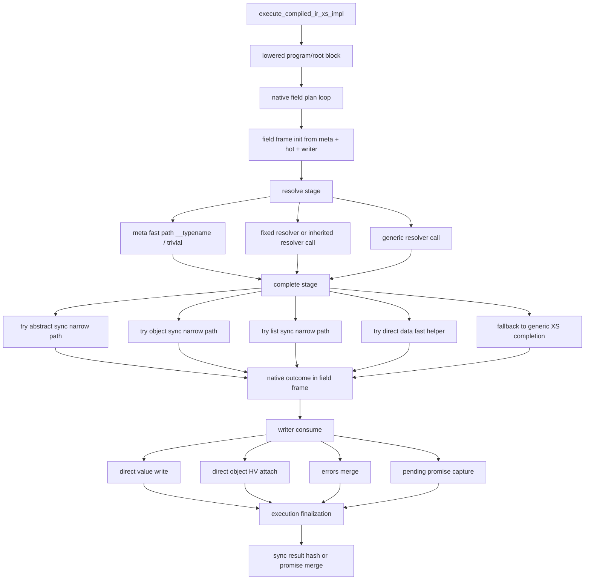
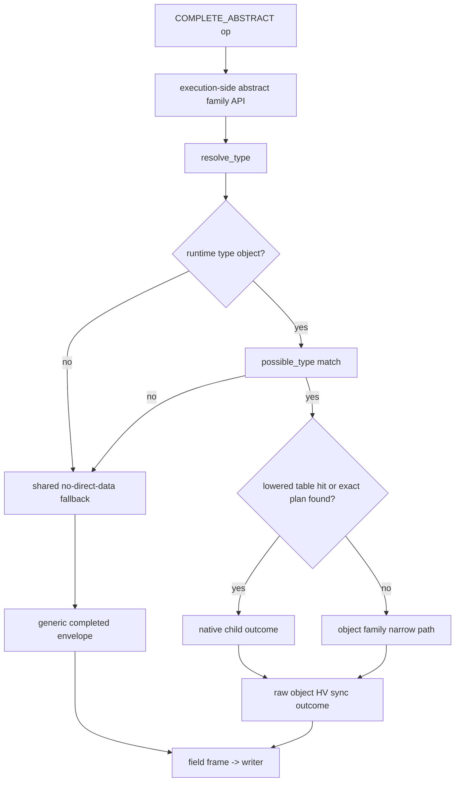

# Current Context

Compressed handoff for the current `GraphQL::Houtou` worktree.

## Pause Snapshot

Current pause point for `proj/compiled-ir-vm-runtime`:

- working tree is clean
- last kept runtime change is `44b5b0e` + `eebaa31`
  plus the newer VM/runtime split work already recorded below
- recent failed experiments were reverted:
  - list-item-level narrow recursion inside sync list completion
  - additional hot/cold layout tweaks that weakened `nested_variable_object`
- current tests rechecked before pause:
  - `minil test t/11_execution.t`
  - `minil test t/12_promise.t`
  - both passed
- next profitable area is still the same:
  - reduce the number of times `compiled_ir` falls back to
    `gql_execution_complete_field_value_catching_error_xs_impl(...)`
  - prefer object/list/abstract boundary narrowing over per-item recursion
  - keep optimizing for fewer Perl `HV/AV/SV`, less pointer chasing, and
    better hot-path locality
- the next design baseline is now explicitly documented as a four-layer
  runtime:
  - front-end compatibility boundary
  - lowering pipeline
  - native runtime core
  - delayed boundary materialization

## Current Runtime Flow

Hot-path interpretation:

- ideal path:
  `resolve -> narrow sync object/list/abstract completion -> native outcome ->
  writer`
- still-expensive path:
  `resolve -> generic XS completion -> completed Perl envelope ->
  outcome extraction -> writer`
- next optimization target is to shrink that second path further

## Latest Checkpoint

- branch: `proj/compiled-ir-vm-runtime`
- latest kept checkpoint:
  - `7f25ce2` routes lowered abstract child-plan hits into the object corridor
    before generic fallback
  - `64c1484` reuses collected known-object subfields across object-family
    head-fast and fallback paths
  - the newest batch makes `known object fallback -> execute_fields ->
    completed envelope -> extract` try `execute_fields_sync_head(...)` first,
    so object-family corridors can stay in native sync outcome form longer
- validation:
  - `minil test t/11_execution.t`
  - `minil test t/12_promise.t`
- benchmark (`--count=-3`):
  - `nested_variable_object`
    - `houtou_compiled_ir 81023/s`
    - `houtou_xs_ast 77456/s`
  - `list_of_objects`
    - `houtou_compiled_ir 59935/s`
    - `houtou_xs_ast 59458/s`
  - `abstract_with_fragment`
    - `houtou_compiled_ir 41818/s`
    - `houtou_xs_ast 42848/s`
- reading:
  - `nested` and `list` both improved after letting known-object fallback try
    the sync-head loop before rebuilding a completed envelope
  - `abstract_with_fragment` remains the laggard, which reinforces that the
    remaining cost sits inside the `ABSTRACT -> OBJECT` corridor rather than
    in the outer family-owned object/list boundaries
  - the next win should still come from widening execution-side family
    corridors and shrinking generic fallback frequency, not from `resolve_type`
    micro-optimizations

## April 2026 VM Reset

The active branch for the next phase is `proj/compiled-ir-vm-runtime`.

Recent conclusions that matter more than older commit-by-commit history:

- `compiled_ir` micro-optimizations around `resolve_type` are no longer the
  main focus
- `omit_resolve_type_info` did not produce a meaningful stable win on
  `abstract_with_fragment`
- `sv_does` / `sv_derived_from` / possible-type fast-path experiments also did
  not produce a clean strategic win
- the next profitable direction is a separate execution-lowered runtime for
  `compiled_ir`, not more mixed-mode shortcuts inside the current executor
- `docs/ecosystem-feature-gap.md` is now tracked and must be treated as a
  design constraint for that runtime
- the next concrete design task is to split the current lowered runtime into:
  - an owned lowered program
  - immutable field metadata
  - mutable execution frames
  - a dedicated native result writer
- the first code step in that split is now landed: `lowered_plan` no longer
  conceptually owns only a root field plan, and instead routes through an
  owned `program -> root_block -> field_plan` boundary
- the next code step is also underway: immutable field metadata is now being
  split from mutable field execution state, with the native field frame
  carrying a metadata pointer instead of rediscovering every stable operand
  directly from the entry
- the next code step after that is now landed as well: the native result
  writer has been split out of the execution accumulator so field execution
  can target a writer-owned boundary instead of reaching directly into
  accumulator state
- the latest follow-up step is also landed locally: field execution now
  receives the native writer plus promise-state separately, so `accum` is
  starting to collapse toward execution-level finalization state instead of
  being the hot-path write surface
- sync trivial completion paths now normalize `completed { data, errors }`
  hashes into direct native outcomes before `consume`, which further narrows
  the surface where the writer has to interpret Perl completed envelopes
- sync generic completion now also tries a plain-object native child-plan
  direct path for compiled IR single-node object children before falling back
  to generic completed envelopes
- that plain-object direct path has now been hoisted into
  `gql_execution_complete_value_catching_error_xs_lazy_data_fast(...)`, so the
  compiled-IR generic completion path can reuse a narrower execution helper
  instead of carrying the special case inline
- sync generic completion in `compiled_ir` now also has a compiled-IR-only
  narrow list path: if a list field is sync/no-promise and every item can be
  completed through the existing direct-data helper, the executor now produces
  a direct native list outcome instead of immediately falling back to
  completed-envelope list completion
- sync child-plan execution no longer needs a full `exec_accum` in the
  `*_sync_to_outcome(...)` path; it now runs against `writer + promise_present`
  directly, which is closer to the intended VM/runtime split between hot-path
  writing and execution-level finalization
- compiled-IR sync child-plan execution now also has an internal
  parent-env-reuse path: object and abstract direct child-plan completion can
  derive a child execution env from the current native env instead of
  rebuilding it from `context` and re-fetching cached members for every nested
  direct-plan hop
- compiled-IR direct object/abstract child completion now also keeps child
  object results as raw native `HV*` outcomes until the parent writer actually
  attaches them, instead of eagerly wrapping each child object result in a
  temporary Perl hashref at the child-plan boundary
- direct object/abstract child-plan execution now also writes those raw child
  outcomes straight into the field frame through a dedicated helper, instead
  of bouncing through local `HV*/AV*` temporaries before re-encoding the same
  state as a native field outcome
- completion dispatch is now also specialized one step earlier:
  lowered field metadata distinguishes exact `object`, `list`, and
  `abstract` generic-completion shapes, so the native field executor no
  longer has to probe all three narrow sync paths on every generic field
- VM/runtime work is now also explicitly targeting memory locality:
  native field metadata is no longer a separately allocated heap object per
  entry, and instead lives inline with the compiled field-plan entry so the
  field loop can touch one less pointer-indirection and one less tiny
  allocation/free pair per field
- latest writer-boundary spot measurements remain in-range:
  - `nested_variable_object --count=-3`
    - `houtou_compiled_ir 78884/s`
    - `houtou_xs_ast 75912/s`
  - `list_of_objects --count=-3`
    - `houtou_compiled_ir 58333/s`
    - `houtou_xs_ast 58477/s`
  - `abstract_with_fragment --count=-3`
    - `houtou_compiled_ir 42102/s`
    - `houtou_xs_ast 42040/s`

## Ecosystem Gap Guardrail

`docs/ecosystem-feature-gap.md` is now a tracked planning document and should
be treated as a guardrail for optimization work, not only as a feature-gap
inventory.

Implications for optimization planning:

- compiled-IR / VM work may freely discard internal AST / legacy execution
  shapes, but must not accidentally make high-priority missing features harder
  to add later
- in particular, runtime work should keep a clean insertion point for:
  - mutation serial execution
  - modern introspection data
  - execution `extensions` hooks / middleware-like interception
  - future incremental-delivery / subscription transport boundaries
- performance work that only wins by hard-coding away those insertion points
  is not strategic progress
- when choosing between two similar optimizations, prefer the one that leaves
  room for high-priority ecosystem gaps listed in
  `docs/ecosystem-feature-gap.md`

## Snapshot

- Main compatibility work stays on `main`.
- IR-direct execution work stays on `ir-direct-execution` only.
- Public parser / AST APIs are unchanged.
- graphql-perl-compatible AST execution remains the compatibility boundary.
- compiled-IR hot paths may diverge from AST/legacy code if that removes
  measurable bridge overhead.
- internal execution APIs may be changed destructively when needed.
- any user-visible compatibility tradeoff must be reviewed first and then
  documented before landing.
- compiled-IR-only code duplication is acceptable when comments identify the
  corresponding AST/legacy path and measurement shows the bridge cost matters.
- Current strategy has two parallel tracks:
  - query-side compiled execution plans
  - schema/runtime caches that also help AST execution

## Recent IR Branch Commits

- `f950c6d` Add initial prepared IR execution path
- `e1bcd5f` Add compiled IR execution plans
- `161c828` Cache nested metadata in compiled IR plans
- `5c9eeb5` Warm schema runtime caches for execution
- `a030daf` Use runtime schema caches in Perl abstract paths
- `45d816a` Reuse compiled nested field buckets
- `b2ccbac` Cache schema field maps for execution lookups
- `b35320d` Fold simple inline fragments into compiled buckets
- `690ffb8` Reuse compiled fragment buckets in nested selections
- `42a9d9f` Cache runtime schema lookups in execution contexts
- `646c10f` Use execution runtime caches in Perl abstract paths
- `6d7c2af` Attach compiled field defs to nested IR nodes
- `e7c04b8` Attach compiled field defs to fragment plans
- `c42263f` Use runtime caches in abstract fragment matching
- `0685c33` Precompute possible type maps in runtime cache
- `ec98231` Reduce retained legacy state in compiled IR
- `2bbee63` Store compiled IR root plans natively
- `c2f8742` Lazy-load compiled IR root selection plans
- `e817212` Use native tables for abstract child plans
- `5608d70` Use native tables for concrete subfields
- `e99c79e` Prefer native tables for compiled field buckets
- `edf499a` Strip legacy buckets from compiled root nodes
- `0918e04` Strip legacy buckets from compiled fragments
- `de6e3da` Cache hot execution context lookups
- `61eae3c` Lazy-load resolve info in field completion
- `3e98dc6` Run native abstract child field plans directly

## Current Execution State

### Shared XS execution core

Already XS-owned:

- AST coercion
- fragment map build
- operation selection
- field execution loop
- resolve info construction
- final response merge
- resolver invocation and error coercion
- simple / variable argument coercion fast paths
- built-in scalar fast paths
- enum fast paths
- common object/list/abstract completion fast paths
- promise dispatch / merge / response shaping

Still PP fallback:

- full argument coercion fallback
- complex object/list completion fallback

### IR direct execution

Available internal APIs:

- `_prepare_executable_ir_xs($source)`
- `_compile_executable_ir_plan_xs($schema, $prepared, $operation_name = undef)`
- `execute_prepared_ir_xs(...)`
- `execute_compiled_ir_xs(...)`

Current compiled plan caches:

- selected operation metadata
- root type
- root selection plan
- native root field plan entries
- nested selection metadata under root plans
- nested `compiled_fields` for simple reusable buckets
- nested/root `compiled_field_def`
- fragment child nodes can also carry `compiled_field_def`
- abstract child direct plans can also be retained in native node-attached
  lookup tables
- plain `compiled_fields` buckets on compiled nodes/fragments can also be
  mirrored into native bucket tables for direct merge paths

Legacy compatibility structures still exist, but the current direction is to
stop treating them as the canonical compiled form:

- `operation`
- `fragments`
- `root_fields`

Those are increasingly being treated as lazy materializations rather than
retained compiled state.

Additional note:

- root field plans are now retained primarily as native C entries and only
  materialized back to legacy `HV`/`AV` form on demand

Current compiled-plan execution reuse:

- root-level `field_def` lookup is short-circuited from compiled metadata
- plain nested field selections can carry `compiled_fields`
- `collect_simple_object_fields()` now reuses those nested compiled buckets
- simple inline fragments can be folded into compiled buckets
- nested fragment buckets can now be reused as well
- simple abstract single-node child execution can now use direct compiled field
  plans instead of rebuilding legacy field buckets first
- simple abstract single-node child execution can now prefer native compiled
  field plans and run them directly without going back through legacy
  `field_plan_sv` execution
- compiled abstract child direct-plan lookup now prefers native node-attached
  tables keyed by runtime object identity
- compiled field-bucket merges can also prefer native node/fragment-attached
  bucket tables before falling back to legacy `compiled_fields`
- hot execution-context members are now cached behind a context-attached magic
  struct so repeated `hv_fetch` calls are reduced in `resolve_info`,
  `execute_fields`, field-plan execution, and compiled-root execution
- per-field `path` materialization is now also deferred so compiled/object field
  execution does not eagerly allocate Perl path objects on the happy path
- native root and child executors now share a single "execute one field entry"
  helper plus explicit native execution env/accumulator structs, so the hot
  loop is closer to a VM-style dispatch over field ops than to duplicated
  root/child Perl-bridge code
- native field plan entries now also carry an explicit dispatch kind
  (`typename` / explicit resolver / inherited resolver / generic), so a future
  opcode executor can map field-plan entries to a smaller dispatch table
  without first re-deriving resolver shape from legacy Perl objects
- native field execution is now further split into helper-sized phases
  (`meta dispatch`, `resolver selection`, `resolver call`), so upcoming opcode
  lowering can move one phase at a time without re-cutting the main field loop
- native field plan entries now also carry completion dispatch kind, so
  trivial completion and generic completion are explicit operands on the plan
  rather than implicit branches rediscovered inside the field executor
- the field-entry executor now uses that completion dispatch kind through a
  dedicated trivial-completion helper, which further separates "resolve" from
  "complete" work in a VM-friendly way
- field execution is now also explicitly split into `complete` and `consume`
  helper phases after resolution, so the current native executor already
  resembles a fixed `resolve -> complete -> consume` pipeline
- that field-stage pipeline is now dispatched through a VM-friendly stage
  dispatcher as well: on GCC/Clang the executor uses computed-goto based
  direct threading, while other compilers use a matching `switch` fallback
  over the same explicit stage enum
- native field entries now also own the operands needed by the field-stage
  dispatcher; root execution lazily fills missing `nodes` / `field_def` /
  `type` once and then reuses the entry as a self-contained field-op record
- the field-op record is now further normalized into separate native enum
  operands for `meta`, `resolve`, `args`, and `completion`, which reduces
  runtime shape rediscovery from Perl objects and is closer to a future opcode
  stream
- field execution control flow is now also owned by the compiled plan entry:
  each native field entry carries a fixed op array, and the executor dispatches
  over that array rather than over a hard-coded internal stage enum

This means compiled IR is already faster than prepared IR and is now beating
`houtou_xs_ast` in several nested cases.

Current strategic conclusion:

- low-risk AST-path tuning still has some value
- abstract/fragment-heavy AST optimization now shows diminishing returns
- larger wins are more likely to come from compiled-IR-native execution than
  from adding more AST-compatible special cases
- if AST compatibility is not required, prefer multi-stage IR compilation over
  further incremental AST-path complexity
- reducing retained Perl-object state in prepared / compiled IR is now a
  first-class optimization target, not just a cleanup task

## Runtime Schema Cache

`GraphQL::Houtou::Schema` now has:

- `prepare_runtime`
- `runtime_cache`
- `clear_runtime_cache`

Current runtime cache contents:

- `root_types`
- `name2type`
- `interface2types`
- `possible_type_map`
- `possible_types`
- `field_maps`

Current runtime cache consumers:

- XS root type lookup
- XS abstract default path
- XS `get_field_def`
- XS execution context runtime cache lookups
- Perl `Object::_fragment_condition_match`
- Perl `Interface::_ensure_valid_runtime_type`

This is the current main path for "global" optimization that also improves
AST execution, not only IR execution.

Additional cached runtime data now also includes:

- `resolve_type_map`
- `is_type_of_map`

## Benchmark Direction

Known shape of results after latest landed work:

- `compiled_ir` > `prepared_ir`
- `compiled_ir` > `houtou_xs_ast` on nested object cases
- `compiled_ir` ~= `houtou_xs_ast` on abstract/fragment-heavy cases
- `compiled_ir` can now edge past `houtou_xs_ast` on
  `abstract_with_fragment` in favorable runs, but the margin is still small
- `compiled_ir` now has direct fast paths for trivial default-field resolution
  and `__typename` meta fields, so more child fields avoid allocating
  `resolve_info` / `path` objects in the happy path
- `compiled_ir` now carries lazy per-field resolve-info state through
  completion, so non-resolver object/list/abstract completion can defer
  `resolve_info` materialization until a callback or PP fallback actually needs
  it
- runtime-cache work targets AST and IR paths simultaneously
- abstract/fragment-heavy tuning on AST paths is now close to a diminishing
  returns region
- native root-plan retention does not regress `abstract_with_fragment` and
  pushes `nested_variable_object` further ahead of `houtou_xs_ast`

Current sampled numbers (`util/execution-benchmark.pl --count=-3`):

- `simple_scalar`
  - `houtou_prepared_ir`: `129787/s`
  - `houtou_compiled_ir`: `145878/s`
  - `houtou_xs_ast`: `141723/s`
- `nested_variable_object`
  - `houtou_prepared_ir`: `68776/s`
  - `houtou_compiled_ir`: `81177/s`
  - `houtou_xs_ast`: `79130/s`
- `list_of_objects`
  - `houtou_prepared_ir`: `54119/s`
  - `houtou_compiled_ir`: `57982/s`
  - `houtou_xs_ast`: `58298/s`
- `abstract_with_fragment`
  - `houtou_prepared_ir`: `38128/s`
  - `houtou_compiled_ir`: `41647/s`
  - `houtou_xs_ast`: `42173/s`
- `async_scalar`
  - `houtou_prepared_ir`: `77551/s`
  - `houtou_compiled_ir`: `78884/s`
  - `houtou_facade_ast`: `79696/s`
- `async_list`
  - `houtou_prepared_ir`: `44283/s`
  - `houtou_compiled_ir`: `44797/s`
  - `houtou_facade_ast`: `44655/s`

More recent spot checks after native child-plan/native bucket/context-cache
work:

- `nested_variable_object` (`--count=-4`)
  - `houtou_compiled_ir`: `83039/s`
  - `houtou_xs_ast`: `79643/s`
- `abstract_with_fragment` (`--count=-4`)
  - `houtou_compiled_ir`: `43320/s`

Most recent VM-shaping refactor checks:

- `nested_variable_object` (`--count=-4`)
  - `houtou_compiled_ir`: `77972/s`
  - `houtou_xs_ast`: `73397/s`
- `abstract_with_fragment` (`--count=-4`)
  - `houtou_compiled_ir`: `41351/s`
  - `houtou_xs_ast`: `39919/s`

Most recent dispatch-kind shaping checks:

- `nested_variable_object` (`--count=-4`)
  - `houtou_compiled_ir`: `77825/s`
  - `houtou_xs_ast`: `74591/s`
- `abstract_with_fragment` (`--count=-4`)
  - `houtou_compiled_ir`: `42308/s`
  - `houtou_xs_ast`: `41714/s`

Most recent helper-splitting checks:

- `nested_variable_object` (`--count=-4`)
  - `houtou_compiled_ir`: `77379/s`
  - `houtou_xs_ast`: `74513/s`
- `abstract_with_fragment` (`--count=-4`)
  - `houtou_compiled_ir`: `41954/s`
  - `houtou_xs_ast`: `41813/s`

Most recent completion-dispatch shaping checks:

- `nested_variable_object` (`--count=-4`)
  - `houtou_compiled_ir`: `78245/s`
  - `houtou_xs_ast`: `74854/s`
- `abstract_with_fragment` (`--count=-4`)
  - `houtou_compiled_ir`: `41518/s`
  - `houtou_xs_ast`: `40766/s`

Most recent completion-op shaping checks:

- `nested_variable_object` (`--count=-4`)
  - `houtou_compiled_ir`: `78245/s`
  - `houtou_xs_ast`: `74854/s`
- `abstract_with_fragment` (`--count=-4`)
  - `houtou_compiled_ir`: `41518/s`
  - `houtou_xs_ast`: `40766/s`

Most recent complete/consume shaping checks:

- `nested_variable_object` (`--count=-4`)
  - `houtou_compiled_ir`: `80397/s`
  - `houtou_xs_ast`: `76095/s`
- `abstract_with_fragment` (`--count=-4`)
  - `houtou_compiled_ir`: `42809/s`
  - `houtou_xs_ast`: `41565/s`

Most recent direct-threaded stage-dispatch checks:

- `nested_variable_object` (`--count=-4`)
  - `houtou_compiled_ir`: `79109/s`
  - `houtou_xs_ast`: `78887/s`
- `abstract_with_fragment` (`--count=-4`)
  - `houtou_compiled_ir`: `42048/s`
  - `houtou_xs_ast`: `42507/s`

Most recent operand-on-entry shaping checks:

- `nested_variable_object` (`--count=-4`)
  - `houtou_compiled_ir`: `80842/s`
  - `houtou_xs_ast`: `79853/s`
- `abstract_with_fragment` (`--count=-4`)
  - `houtou_compiled_ir`: `41751/s`
  - `houtou_xs_ast`: `42729/s`

Most recent enum-operand shaping checks:

- `nested_variable_object` (`--count=-4`)
  - `houtou_compiled_ir`: `77433/s`
  - `houtou_xs_ast`: `76554/s`
- `abstract_with_fragment` (`--count=-4`)
  - `houtou_compiled_ir`: `41751/s`
  - `houtou_xs_ast`: `42210/s`

Most recent fixed-op-array shaping checks:

- `nested_variable_object` (`--count=-4`)
  - `houtou_compiled_ir`: `77008/s`
  - `houtou_xs_ast`: `75037/s`
- `abstract_with_fragment` (`--count=-4`)
  - `houtou_compiled_ir`: `42629/s`
  - `houtou_xs_ast`: `42430/s`

Most recent shared native field-loop checks:

- `nested_variable_object` (`--count=-4`)
  - `houtou_compiled_ir`: `76463/s`
  - `houtou_xs_ast`: `76023/s`
- `abstract_with_fragment` (`--count=-4`)
  - `houtou_compiled_ir`: `41248/s`
  - `houtou_xs_ast`: `42313/s`

Interpretation:

- this change is VM-readiness work, not a direct throughput play
- root compiled plans and native child plans now share the same field-plan loop
- the main remaining difference is whether root execution must lazily fill
  runtime operands (`nodes` / `field_def` / `type`) before dispatch
- the next structural step should keep shrinking that distinction so field
  execution can be treated as one native op runner regardless of root vs child

Most recent self-contained root-plan checks:

- `nested_variable_object` (`--count=-4`)
  - `houtou_compiled_ir`: `77094/s`
  - `houtou_xs_ast`: `77754/s`
- `abstract_with_fragment` (`--count=-4`)
  - `houtou_compiled_ir`: `41324/s`
  - `houtou_xs_ast`: `42210/s`

Interpretation:

- root compiled plans now carry a plan-level `requires_runtime_operand_fill`
  flag
- when a compiled root plan is already self-contained, the shared native
  field-plan loop no longer pays the per-entry "do I need lazy operand fill?"
  branch
- this is still primarily VM-readiness work: the hot loop is closer to "run the
  plan as-is" and less tied to execution-time frontend reconstruction

Most recent abstract direct-consume checks:

- `nested_variable_object` (`--count=-4`)
  - `houtou_compiled_ir`: `77433/s`
  - `houtou_xs_ast`: `74953/s`
- `abstract_with_fragment` (`--count=-4`)
  - `houtou_compiled_ir`: `41917/s`
  - `houtou_xs_ast`: `41917/s`

Interpretation:

- sync abstract completion can now execute a native child field plan directly
  into the parent accumulator
- that removes one `completed` result `HV` build/consume round-trip from the
  native abstract path
- this is still only a first step toward the larger goal; `abstract` execution
  is not yet staying native all the way through completion/error handling

Latest spot check after lazy `resolve_info` materialization in field
completion (`--count=-6`):

- `nested_variable_object`
  - `houtou_compiled_ir`: `81662/s`
  - `houtou_xs_ast`: `78695/s`
- `abstract_with_fragment`
  - `houtou_compiled_ir`: `43114/s`
  - `houtou_xs_ast`: `42775/s`

Latest spot check after lazy `path` materialization and direct native abstract
child field-plan execution (`--count=-6`):

- `nested_variable_object`
  - `houtou_compiled_ir`: `85187/s`
  - `houtou_xs_ast`: `82525/s`
- `abstract_with_fragment`
  - `houtou_compiled_ir`: `45420/s`
  - `houtou_xs_ast`: `44940/s`

Latest spot check after caching `type` / `resolve` / field-arg metadata on
native field-plan entries (`--count=-6`):

- `nested_variable_object`
  - `houtou_compiled_ir`: `86706/s`
  - `houtou_xs_ast`: `83544/s`
- `abstract_with_fragment`
  - `houtou_compiled_ir`: `43626/s`
  - `houtou_xs_ast`: `43626/s`

Latest spot check after dropping eager retained root-plan `path` objects
(`--count=-6`):

- `abstract_with_fragment`
  - `houtou_compiled_ir`: `46264/s`
  - `houtou_xs_ast`: `45096/s`

Latest spot check after treating compiled-IR root `path` as implicit `undef`
until fallback (`--count=-6`):

- `abstract_with_fragment`
  - `houtou_compiled_ir`: `42791/s`
  - `houtou_xs_ast`: `43067/s`

Latest spot check after caching the first field node on native plan entries
(`--count=-6`):

- `abstract_with_fragment`
  - `houtou_compiled_ir`: `44167/s`
  - `houtou_xs_ast`: `43720/s`

Latest spot check after caching trivial-completion metadata on native plan
entries (`--count=-6`):

- `abstract_with_fragment`
  - `houtou_compiled_ir`: `45278/s`
  - `houtou_xs_ast`: `44392/s`

Latest spot check after sync native executors flatten completed field envelopes
directly into result data/errors (`--count=-6`):

- `abstract_with_fragment`
  - `houtou_compiled_ir`: `44478/s`
  - `houtou_xs_ast`: `43694/s`

Latest spot check after native sync executors bypass trivial response-envelope
allocation for `__typename` and leaf fast paths (`--count=-6`):

- `nested_variable_object`
  - `houtou_compiled_ir`: `85615/s`
  - `houtou_xs_ast`: `83240/s`
- `abstract_with_fragment`
  - `houtou_compiled_ir`: `45727/s`
  - `houtou_xs_ast`: `45420/s`

Latest spot check after caching native field `return_type` metadata and passing
it directly into XS completion (`--count=-6`):

- `nested_variable_object`
  - `houtou_compiled_ir`: `85289/s`
  - `houtou_xs_ast`: `79906/s`
- `abstract_with_fragment`
  - `houtou_compiled_ir`: `46116/s`
  - `houtou_xs_ast`: `44237/s`

Latest spot check after lazy `resolve_info` started reusing cached
`field_name` / `return_type` metadata instead of re-reading them from
`nodes[0]` and `field_def` (`--count=-6`):

- `nested_variable_object`
  - `houtou_compiled_ir`: `83503/s`
  - `houtou_xs_ast`: `78825/s`
- `abstract_with_fragment`
  - `houtou_compiled_ir`: `45229/s`
  - `houtou_xs_ast`: `43058/s`

Latest spot check after making native executor error arrays lazy so success
paths do not allocate `errors` storage unless a child completion actually
produces one (`--count=-6`):

- `nested_variable_object`
  - `houtou_compiled_ir`: `86658/s`
  - `houtou_xs_ast`: `82311/s`
- `abstract_with_fragment`
  - `houtou_compiled_ir`: `43286/s`
  - `houtou_xs_ast`: `42112/s`
- `async_scalar`
  - `houtou_compiled_ir`: `79906/s`
  - `houtou_facade_ast`: `79379/s`

Latest spot check after adding a compiled-IR-only sync fast path that consumes
abstract root-field native child plans directly back into the parent result
writer instead of round-tripping them through a field-level envelope
(`--count=-6`):

- `nested_variable_object`
  - `houtou_compiled_ir`: `81660/s`
  - `houtou_xs_ast`: `77825/s`
- `abstract_with_fragment`
  - `houtou_compiled_ir`: `45366/s`
  - `houtou_xs_ast`: `43484/s`

Latest spot check after extending that same direct-consume abstract fast path
to compiled native child execution as well, so sync abstract child fields can
reuse native concrete child plans without building a completed field envelope
first (`--count=-6`):

- `nested_variable_object`
  - `houtou_compiled_ir`: `84883/s`
  - `houtou_xs_ast`: `82197/s`
- `abstract_with_fragment`
  - `houtou_compiled_ir`: `45635/s`
  - `houtou_xs_ast`: `44812/s`

Interpretation:

- the current compiled-IR direction is still valid
- lazy `resolve_info` materialization is a better fit than adding more
  AST-compatible special cases, because it removes Perl `HV` allocation from
  both nested-object and abstract completion hot paths
- lazy `path` materialization pairs well with lazy `resolve_info`, because
  it removes another per-field Perl allocation that used to survive even after
  resolver fast paths were added
- direct native abstract child field-plan execution is the first step that
  removes part of the remaining `field_plan_sv` / legacy execution bridge from
  the `abstract_with_fragment` hot path
- that direct-consume path now exists for both root and child compiled-native
  execution, so sync abstract fields can stay inside the native writer path
  for longer before falling back to legacy completion
- native field-plan entries now cache `type`, `resolve`, and field-argument
  metadata, which reduces repeated `HV` inspection in both compiled root and
  abstract-child execution
- native root plans no longer need to retain eager per-field Perl `path`
  objects; legacy `path` arrays are synthesized only when compatibility code
  asks for them
- compiled-IR root execution now treats the root path as implicit until a
  fallback path actually needs a Perl array; this is a small simplification and
  allocation reduction, but measurement impact is modest
- native field-plan entries now also cache the first field node, which trims a
  small amount of `AV` traversal and node-shape checking on argument-heavy
  paths without adding much complexity
- native field-plan entries now also cache trivial-completion metadata so leaf
  field fast paths do not need to rediscover non-null/leaf structure on every
  execution
- sync compiled-IR executors now flatten completed field envelopes directly
  into result `data` / `errors` instead of always retaining per-field response
  hashes until the final merge step
- sync compiled-IR executors now also bypass per-field `{ data => ... }`
  response-envelope allocation for trivial `__typename`, nullable-null, and
  leaf fast paths; the native executor writes serialized values straight into
  the final response hash and only falls back to legacy completion when GraphQL
  semantics actually require it
- compiled-IR native executors now also use a borrowed default-field fast path
  before falling back to `share_or_copy_sv()`, which trims another allocation
  out of trivial hash-property reads such as `id` / `name`
- compiled-IR promise executors now keep already-resolved trivial/native fields
  in direct `data` accumulation while only promise-bearing fields flow through
  `Promise::Adapter::all`; the final merge helper recombines the sync head with
  the async tail instead of forcing everything back through per-field envelopes
- the promise-tail recombination step is now also in XS: Perl still owns the
  `then_promise(...)` control flow, but `_then_merge_hash_with_head_xs` no
  longer rebuilds hashes in Perl after fulfillment
- native field-plan entries now also cache `return_type`, so XS completion no
  longer needs to rediscover `field_def->{type}` on the hot path when compiled
  root/native child executors already know the answer
- lazy `resolve_info` materialization now also reuses cached `field_name` and
  `return_type` metadata, so building the Perl info hash no longer has to read
  `nodes[0]{name}` and `field_def->{type}` again once the native executor has
  already identified the field
- native root/child executors now keep `errors` arrays lazy as well; sync and
  promise paths only allocate Perl `AV`s for errors when a child completion
  actually returns them, instead of paying that cost unconditionally
- compiled-IR sync root execution now also has an abstract-field fast path that
  recognizes `runtime type -> native child plan` and feeds the child result
  straight back into the parent writer, which is the first concrete step toward
  a true native abstract executor instead of a field-level completion envelope
- `abstract_with_fragment` is still close enough to `houtou_xs_ast` that the
  remaining gap should be attacked by eliminating more Perl-object allocation,
  not by adding more AST-compatible branching
- further wins should come from removing more runtime Perl-object work, not
  from micro-tuning legacy bucket reshaping

Latest promise-path spot checks after preserving sync native head fields during
compiled-IR promise merges (`--count=-6`):

- `async_scalar`
  - `houtou_compiled_ir`: `81920/s`
- `async_list`
  - `houtou_compiled_ir`: `46265/s`

## Testing Rule

Primary verification workflow:

1. `minil test`

Use `./Build build` only when benchmark / profiling utilities need repo-root
`blib`.

## Next IR Direction

If the next optimization round targets raw performance rather than AST
compatibility, the preferred order is:

1. make `compiled_ir` execute native field plans instead of `root_fields_sv`
2. stop retaining eager legacy `operation` / `fragments` / `root_fields`
   objects inside compiled plans unless compatibility requires them
3. replace hot-path Perl execution-context hashes with IR-native structs where
   practical
4. compile abstract fields into per-concrete-type child execution plans
5. lower more arguments/directives at compile time

Concrete interpretation of the current plan:

- compiled handles should prefer native pointers / spans / plan arrays over
  retained `SV` graphs
- plan export / resolve-info compatibility is allowed to materialize legacy
  `SV` structures lazily
- VM work should start from native child/root execution plans, not from more
  `HV`/`AV` reshaping

Practical guidance:

- duplicating the plan runner for compiled IR is acceptable
- duplicating GraphQL semantics, error semantics, or promise semantics is not
  the preferred direction unless measurement forces it

Immediate next candidates for `abstract_with_fragment`:

1. replace more child-execution `HV/AV` plan state with native tables/arrays
   so abstract child execution no longer needs legacy bucket materialization at
   all
2. move path handling for compiled child plans from lazy Perl materialization
   toward native path segments or precompiled path templates
3. replace more compiled-IR execution-context / resolve-info state with native
   structs so the remaining hot-path `HV` traffic is minimized

## Promise::XS Experiment Note

A separate experiment branch (`promise-xs-fastpath`) tested a dedicated
`Promise::XS` backend.

Conclusion:

- do not merge the dedicated backend as-is
- real `Promise::XS` with public-API specialization was effectively tied with
  the existing generic hook path
- the remaining async overhead is in promise continuation / merge work, not in
  adapter dispatch alone

Measured with real `Promise::XS` installed locally and repo-root `blib`:

- `async_scalar`
  - generic hook: `81683/s`
  - dedicated `promise_xs`: `81704/s`
- `async_list`
  - generic hook: `40883/s`
  - dedicated `promise_xs`: `40758/s`

So the recommended direction remains:

- keep the generic promise-hook contract
- optimize continuation / merge internals instead of adding a Promise::XS-only
  execution mode

Latest verification:

- `minil test`
- `13 files / 189 tests / PASS`

## Coding Rule

When creating a temporary `SV` and passing it into another helper, the caller
owns that temporary unless ownership transfer is explicitly documented.

Perl API ownership model:

- track ownership, not just raw refcounts
- a temporary pushed only for stack/lifetime purposes should normally be made
  mortal with `sv_2mortal(...)`
- do not mortalize the same owned reference twice
- when embedding a freshly-created referent into an RV/container, prefer the
  `_noinc` form if ownership is being transferred rather than shared
- prefer APIs like `hv_store(...)` when the key is not already an `SV`, because
  they avoid creating temporary key SVs in the first place

Practical rule:

- `newSVsv(...)`
- `newSVpvf(...)`
- `newRV_noinc(...)`

If these are created only for a helper call, the call site must decide whether
to `SvREFCNT_dec(...)` afterward.

The same applies to temporary key SVs used with hash helpers.

- `hv_store_ent(...)` does not consume the key SV
- `hv_store_ent(...)` takes ownership of one reference to `val` on success, but
  not of `key`
- `hv_fetch_ent(...)` does not transfer ownership of a temporary key SV
- `hv_iterkeysv(...)` returns a mortal copy; treat it as borrowed temporary data

Practical rule:

- if a temporary key SV is created only to call `hv_store_ent(...)`, the call
  site must `SvREFCNT_dec(...)` it afterward unless the SV was made mortal
- avoid inline patterns like `hv_store_ent(hv, newSVsv(...), ...)` because they
  hide ownership and make leaks easy to miss; bind the temporary key SV to a
  local variable, call `hv_store_ent(...)`, then `SvREFCNT_dec(...)`
- treat the same ownership rule as applying to all same-shape patterns where a
  temporary SV is created solely to serve as a lookup/store key
- use `util/lint-xs-ownership.pl` before landing ownership-related XS changes;
  it checks for the most common inline temporary-key and nested-mortal patterns

## Next Step

Keep pushing compiled-native execution toward an envelope-less happy path.

Best next move:

- keep specializing compiled-native field ops so plan entries own more of the
  runtime branch structure; the current fixed op arrays now split resolver calls
  into `FIXED/CONTEXT x EMPTY/BUILD_ARGS`, which is the first useful step
  toward true opcode execution
- let compiled-native child execution write successful object/list completions
  into parent result state without first materializing `{ data, errors }`
- keep shrinking `resolve_info`, error, and path materialization in success
  paths so abstract/native child execution stays out of legacy completion
  helpers longer
- continue moving compiled child metadata from Perl `HV` / `AV` state into
  native plan entries and node-attached tables
- keep the native executor's terminal materialization in one shared helper so
  root/native-child execution already has a stable post-VM boundary
- keep execution-frame setup shared as well; root/native-child now initialize
  the same native env/accumulator shape before entering the field-op loop
- keep promise-pending field state in native arrays until the final merge step;
  `result_keys_av` / `result_values_av` no longer need to exist on the hot path
  before a promise actually appears

Latest spot verification after specializing native field call ops:

- `minil test t/11_execution.t`
- `minil test t/12_promise.t`
- `nested_variable_object` (`--count=-4`)
  - `houtou_compiled_ir 80200/s`
  - `houtou_xs_ast 76740/s`
- `abstract_with_fragment` (`--count=-4`)
  - `houtou_compiled_ir 41724/s`
  - `houtou_xs_ast 41616/s`

Interpretation:

- the resolver-op specialization is mainly a VM-readiness change, not a large
  speed win by itself
- `nested_variable_object` stays comfortably ahead, while
  `abstract_with_fragment` remains essentially tied
- this is consistent with the current model: dispatch is getting cheaper, but
  completion, Perl callback boundaries, and legacy bridge points still dominate
  the abstract hot path

After that, completion dispatch was also specialized in the fixed op array:

- `COMPLETE_TRIVIAL`
- `COMPLETE_GENERIC`

Latest spot verification after completion-op specialization:

- `minil test t/11_execution.t`
- `minil test t/12_promise.t`
- `nested_variable_object` (`--count=-4`)
  - `houtou_compiled_ir 79824/s`
  - `houtou_xs_ast 77457/s`
- `abstract_with_fragment` (`--count=-4`)
  - `houtou_compiled_ir 41421/s`
  - `houtou_xs_ast 41125/s`

Interpretation:

- splitting completion into explicit op kinds is also primarily a VM-readiness
  change
- the runtime remains neutral-to-slightly-positive while more branch structure
  moves from execution helpers into the compiled native plan

Latest spot verification after moving per-field execution state into a native
field frame struct:

- `minil test t/11_execution.t`
- `minil test t/12_promise.t`
- `nested_variable_object` (`--count=-4`)
  - `houtou_compiled_ir 82267/s`
  - `houtou_xs_ast 78569/s`
- `abstract_with_fragment` (`--count=-4`)
  - `houtou_compiled_ir 42308/s`
  - `houtou_xs_ast 41714/s`

Interpretation:

- the hot-loop field state is now carried in one native frame struct instead of
  a loose set of local Perl-facing temporaries
- this is primarily VM-readiness work: `resolve`, `complete`, and `consume`
  now operate over a more self-contained native execution state
- the change is neutral-to-positive on both spot cases, so it is a good
  foundation for moving more completion/error work out of ad hoc `SV *`
  temporaries and into native outcome structs

Latest spot verification after moving per-field completion results into a
native outcome state owned by that frame:

- `minil test t/11_execution.t`
- `abstract_with_fragment` (`--count=-4`)
  - `houtou_compiled_ir 43017/s`
  - `houtou_xs_ast 42722/s`
- `nested_variable_object` (`--count=-4`)
  - `houtou_compiled_ir 78887/s`
  - `houtou_xs_ast 78010/s`

Interpretation:

- `meta`, `trivial completion`, and generic completion now hand results to
  `consume` through a native outcome kind instead of scattering direct `HV`
  writes and `completed_sv` ownership across multiple helpers
- this is again mainly VM-readiness work, but it also keeps the dispatcher's
  dataflow more regular and does not regress the spot cases

Latest spot verification after routing sync abstract-native child completion
through the same frame outcome/consume boundary:

- `minil test t/11_execution.t`
- `abstract_with_fragment` (`--count=-4`)
  - `houtou_compiled_ir 42430/s`
  - `houtou_xs_ast 42619/s`

Interpretation:

- sync abstract completion no longer needs a special "write directly into the
  parent accumulator here" ownership convention
- native child plans now hand object results and child error lists back through
  the field frame outcome, and `consume` remains the single boundary that
  mutates the parent accumulator
- the throughput result is effectively flat, which is acceptable because this
  change reduces one more special-case branch on the path to a VM-like runner

Latest spot verification after normalizing sync generic completed hashes into
frame outcomes before `consume`:

- `minil test t/11_execution.t`
- `abstract_with_fragment` (`--count=-4`)
  - `houtou_compiled_ir 42643/s`
  - `houtou_xs_ast 41724/s`

Interpretation:

- sync generic completion now extracts `{ data, errors }` into the field
  frame's native outcome state before `consume`, instead of making `consume`
  reinterpret every completed hash itself
- the completed-hash allocation is still present upstream, but the execution
  boundary is more regular and ready for a future "generic complete directly to
  outcome" lowering

Latest spot verification after accumulating sync completed hashes directly into
head data/errors inside the XS execution loops:

- `minil test t/11_execution.t`
- `minil test t/12_promise.t`
- `nested_variable_object` (`--count=-4`)
  - `houtou_compiled_ir 78758/s`
  - `houtou_xs_ast 76204/s`
- `abstract_with_fragment` (`--count=-4`)
  - `houtou_compiled_ir 42308/s`
  - `houtou_xs_ast 42111/s`

Interpretation:

- `gql_execution_execute_fields(...)` and
  `gql_execution_execute_field_plan(...)` no longer retain sync completed
  `{ data, errors }` hashes in `result_values_av`; they now extract into a
  direct head accumulator immediately and only keep promises in the pending
  arrays
- this does not yet remove the upstream completed-hash allocation, but it
  aligns the AST/XS sync loops more closely with the compiled-IR
  `head data + pending promises` execution shape
- spot numbers are neutral-to-positive, so this is a good staging step before
  pushing `execution.h` completion helpers toward native outcomes as well

Latest spot verification after applying the same `head data + pending promises`
shape to list completion in `execution.h`:

- `minil test t/11_execution.t`
- `minil test t/12_promise.t`
- `nested_variable_object` (`--count=-4`)
  - `houtou_compiled_ir 77207/s`
  - `houtou_xs_ast 74974/s`
- `async_list` (`--count=-4`)
  - `houtou_compiled_ir 44032/s`
  - `houtou_facade_ast 44032/s`
- `abstract_with_fragment` (`--count=-4`)
  - run 1: `houtou_compiled_ir 40573/s`
  - run 2: `houtou_compiled_ir 42212/s`

Interpretation:

- sync list items are now accumulated directly into list `data/errors`, and
  promise items are tracked only as `(index, promise)` pending entries until
  the final merge step
- this is mainly a shape-alignment change for the non-IR XS executor; it
  reduces retained completed-hash arrays on the list path and gives the promise
  path a direct "head + pending" merge API too
- `nested_variable_object` and `async_list` hold up, while
  `abstract_with_fragment` remains noisy; keep the change as VM-readiness and
  continue focusing abstract-path work on native outcome lowering rather than
  list-specific shortcuts

Latest spot verification after trying trivial default-resolver completion
against borrowed values before copying in the non-IR XS field loops:

- `minil test t/11_execution.t`
- `minil test t/12_promise.t`
- `nested_variable_object` (`--count=-4`)
  - `houtou_compiled_ir 78195/s`
  - `houtou_xs_ast 76025/s`
- `async_list` (`--count=-4`)
  - `houtou_compiled_ir 42407/s`
  - `houtou_facade_ast 42884/s`
- `abstract_with_fragment` (`--count=-4`)
  - `houtou_compiled_ir 41228/s`
  - `houtou_xs_ast 40983/s`

Interpretation:

- `gql_execution_execute_fields(...)` and
  `gql_execution_execute_field_plan(...)` now try trivial completion against a
  borrowed default-resolver property first, and only `share_or_copy` that value
  if execution has to fall through to the generic completion path
- this is a small but safe allocation reduction on the XS/AST side; it is not
  a major abstract-path win by itself, but it keeps the field loops closer to
  the compiled-IR "borrow first, materialize later" strategy

Latest spot verification after re-trying the previously crashed direct-data
idea in a narrower, ownership-safe form:

- `minil test t/11_execution.t`
- `minil test t/12_promise.t`
- `nested_variable_object` (`--count=-4`)
  - `houtou_compiled_ir 77882/s`
  - `houtou_xs_ast 75568/s`
- `async_list` (`--count=-4`)
  - `houtou_compiled_ir 42729/s`
  - `houtou_facade_ast 43300/s`
- `abstract_with_fragment` (`--count=-4`)
  - `houtou_compiled_ir 41421/s`
  - `houtou_xs_ast 42708/s`

Interpretation:

- the crashed experiment was reintroduced only for the `__typename` trivial
  path in `gql_execution_execute_fields(...)` and
  `gql_execution_execute_field_plan(...)`
- instead of building a temporary completed `{ data => ... }` hash for that
  case, the loop now materializes the scalar directly into the top-level
  `direct_data_hv`
- the broader "borrowed default resolver -> direct data" retry was measured and
  dropped again because it duplicated trivial-completion metadata work and
  regressed `abstract_with_fragment`
- keep the narrow `__typename` direct-data path; it is ownership-safe, test
  clean, and directionally aligned with removing completed-hash allocation from
  success paths

Planned medium-term compiler direction:

- introduce multiple lowering/optimization stages between parsed IR and final
  execution instead of relying on ad hoc runtime fast paths
- a plausible pipeline is:
  - normalized IR
  - typed/specialized IR
  - execution-lowered IR with native field operands and child-plan tables
  - late specialization / fusion passes
  - final threaded-op / VM emission
- this fits the current strategy better than piling on more local runtime
  shortcuts, because it moves branching, specialization, and ownership
  decisions into compile time where they are easier to reason about and less
  likely to regress hot-path stability

Latest structural progress toward that staged pipeline:

- `compiled_ir` no longer conceptually owns a raw `root_field_plan` directly;
  it now owns an explicit execution-lowered plan object whose current stage is
  `LOWERED_NATIVE_FIELDS`
- the lowered plan currently wraps the existing native root field plan, so this
  is mostly a structural ownership change rather than a new optimization pass
- this is still useful because it creates a concrete insertion point for future
  typed/specialized IR and late lowering passes without having to overload the
  `compiled_exec` handle itself

Latest spot verification after introducing the explicit lowered-plan boundary:

- `minil test t/11_execution.t`
- `minil test t/12_promise.t`
- `abstract_with_fragment` (`--count=-4`)
  - `houtou_compiled_ir 43216/s`
  - `houtou_xs_ast 43039/s`

Interpretation:

- this step is effectively neutral-to-slightly-positive on the target case
- the real value is architectural: the next pass can target the lowered-plan
  layer directly instead of bolting more specialization logic onto
  `compiled_exec` or the runtime field loop

Latest structural progress on abstract-specialized lowering:

- lowered native field-plan entries now own a lowered abstract-child table for
  the single-node native-plan case instead of borrowing the node-attached
  concrete-plan table directly
- the lowered table retains only `(possible_type, native_field_plan)` pairs and
  clones the native child field plan into lowered-plan-owned storage
- sync abstract completion on the compiled-IR path now consults that owned
  lowered table first, instead of rediscovering the concrete native child plan
  by rewalking `nodes` through the legacy helper path
- destruction now runs through lowered-plan teardown, so ownership is explicit
  and no longer depends on the lifetime of node-attached compiled metadata

Latest spot verification after owning that lowered abstract child lookup:

- `minil test t/11_execution.t`
- `minil test t/12_promise.t`
- `abstract_with_fragment` (`--count=-4`)
  - `houtou_compiled_ir 43749/s`
  - `houtou_xs_ast 43442/s`

Interpretation:

- the change is still mostly a lowering/ownership step rather than a large
  throughput win
- it removes one more runtime and lifetime dependency on "look back into legacy
  node state to rediscover the concrete child native plan"
- this is the right insertion point for the next real optimization pass:
  lowering abstract child execution into a more self-contained specialized plan
  whose native child table is already owned by the lowered execution plan

Latest structural follow-up on that owned lowered abstract-child table:

- cloned lowered abstract-child plans now recursively clone nested lowered
  abstract-child tables as well, so self-contained ownership is preserved below
  the first abstract child boundary
- this removes another fallback path where nested abstract child execution would
  have had to rebuild lowered lookup state from node-attached metadata

Latest spot verification after recursive lowered abstract-child cloning:

- `minil test t/11_execution.t`
- `minil test t/12_promise.t`
- `abstract_with_fragment` (`--count=-4`)
  - `houtou_compiled_ir 42722/s`
  - `houtou_xs_ast 43649/s`

Interpretation:

- this step is primarily about making the lowered plan recursively
  self-contained, not about immediate throughput
- the target case remains in the same general band, which is acceptable for
  this ownership/VM-readiness pass
- the next profitable step is still to specialize abstract completion/result
  writing, not to add more lookup micro-optimizations

Latest completion-side allocation reduction:

- `execution.h` now exposes a narrow sync fast helper that returns direct
  `data/errors` for `null`, leaf, and simple `NonNull` completions without
  first materializing a completed `{ data => ... }` `HV`
- compiled-IR generic completion uses that helper before falling back to the
  older completed-`HV` path, so sync happy paths can skip one more Perl object
  boundary

Latest spot verification after wiring the direct-data completion helper:

- `minil test t/11_execution.t`
- `minil test t/12_promise.t`
- `abstract_with_fragment` (`--count=-4`)
  - `houtou_compiled_ir 42007/s`
  - `houtou_xs_ast 42308/s`
- `nested_variable_object` (`--count=-4`)
  - `houtou_compiled_ir 80765/s`
  - `houtou_xs_ast 79800/s`

Interpretation:

- this is a modest but directionally correct object-allocation reduction
- target-case gains are still small and noisy, but the helper does not regress
  the broader compiled-IR sync path
- the next high-value step remains extending this approach past trivial
  completion and into object/abstract completion outcomes themselves

Latest generic XS-loop follow-up:

- the same sync direct-data completion helper is now used in the generic
  `execute_fields()` / `execute_field_plan()` loops before falling back to
  completed-`HV` materialization
- borrowed default-resolver values now try the direct-data trivial path before
  they are copied into owned Perl scalars
- this broadens the object-allocation reduction beyond compiled-IR-specific
  code paths and keeps the "happy path stays in direct data" idea aligned
  across both legacy XS execution and lowered native execution

Latest spot verification after widening direct-data use in generic XS loops:

- `minil test t/11_execution.t`
- `minil test t/12_promise.t`
- `abstract_with_fragment` (`--count=-4`)
  - `houtou_compiled_ir 42708/s`
  - `houtou_xs_ast 42516/s`
- `nested_variable_object` (`--count=-4`)
  - `houtou_compiled_ir 80397/s`
  - `houtou_xs_ast 77193/s`

Interpretation:

- the target case stays roughly flat, which is acceptable for this broader
  object-allocation cleanup
- the broader XS sync path benefits more clearly than the abstract target case
- this is still a supporting step; the main remaining abstract cost is the
  object/abstract completion shape itself, not trivial leaf completion

## Breaking-API Speed Notes

If public compatibility constraints were relaxed, the highest-probability extra
speed wins would likely be:

- execute against a frozen XS/runtime schema snapshot instead of Moo/Type::Tiny
  objects
- expose a prepared/compiled query handle whose variable/default coercion is
  prevalidated against that runtime schema
- allow an execution-only node/selection shape instead of graphql-perl
  compatibility hashes for resolve info, field nodes, and fragment maps

## April 2026 Reset

The next optimization project is now treated as a separate runtime effort.

Recent conclusions:

- `omit_resolve_type_info` was useful to prove that `build_resolve_info`
  materialization is not the main bottleneck for `abstract_with_fragment`
- `sv_does` / `sv_derived_from` / possible-type micro-optimizations also did
  not produce a strong stable win by themselves
- therefore the next meaningful step is not another local shortcut; it is a
  new `compiled_ir`-only execution-lowered runtime / VM path

Current project decision:

- keep public execute / schema / promise APIs compatible
- allow `compiled_ir` internal execution to stop sharing internal AST /
  legacy-compatible shapes
- build a new lowered plan and VM runtime beside the current executor rather
  than continuing to stretch the mixed executor

See:

- `docs/compiled-ir-vm-runtime.md`

## April 2026 VM Runtime Follow-Up

The current branch is now pushing the new compiled-IR runtime in a direction
that is explicitly cache-locality-aware, not only "fewer Perl objects".

Current implementation status:

- lowered program ownership exists as `program -> root_block -> field_plan`
- field execution already separates immutable metadata, mutable frame state,
  and a native result writer
- sync child-plan runners already operate on `(writer, promise_present)` rather
  than a full execution accumulator
- sync trivial completion, sync object-child direct paths, and sync list fast
  paths can already produce native outcomes instead of always flowing through
  Perl `{ data, errors }` envelopes

Newest structural step:

- each lowered field-plan entry now has an inline immutable metadata block and
  a separate inline "hot operand" view for values that the execution loop
  touches on nearly every field
- the hot view currently carries `field_def`, `return_type`, `type`, `resolve`,
  `nodes`, `first_node`, and `abstract_child_plan_table`
- hot paths such as resolver selection, generic completion, frame setup, and
  abstract-child native lookup now prefer this hot view instead of repeatedly
  reading the colder full entry

Latest spot verification after landing the first hot-operand pass:

- `minil test t/11_execution.t`
- `minil test t/12_promise.t`
- `nested_variable_object` (`--count=-3`)
  - `houtou_compiled_ir 80894/s`
  - `houtou_xs_ast 78156/s`
- `abstract_with_fragment` (`--count=-3`)
  - `houtou_compiled_ir 42593/s`
  - `houtou_xs_ast 42575/s`

Interpretation:

- the first hot/cold split step does not yet create a large standalone win
- it does keep the broader sync object case ahead while leaving the abstract
  target roughly tied
- this is acceptable because the main value of the change is architectural:
  the runtime loop is starting to traverse a denser hot working set

Current next steps:

- move more frequently touched operands out of the full entry and into the
  hot view, while pushing path/count/debug-style data into colder storage
- keep shrinking the places where compiled-IR still uses Perl completed
  envelopes as an internal currency
- preserve an explicit fallback boundary so future VM lowering can retire
  mixed paths block by block

Follow-up after the first hot-operand pass:

- path/count-style fields are now also split behind a cold view
- frame setup, frame cleanup, metadata extraction, cloning, and legacy
  materialization now prefer the cold view instead of reading those values
  directly from the full entry
- this keeps the inner execution loop focused on `meta + hot + writer`, while
  path/count/debug-style data move further away from the hot working set

Latest spot verification after the first cold split:

- `minil test t/11_execution.t`
- `minil test t/12_promise.t`
- `nested_variable_object` (`--count=-3`)
  - `houtou_compiled_ir 82048/s`
  - `houtou_xs_ast 79626/s`
- `abstract_with_fragment` (`--count=-3`)
  - `houtou_compiled_ir 42575/s`
  - `houtou_xs_ast 42306/s`

Interpretation:

- the cold split is small but directionally correct
- the broader sync object case benefits a little more clearly
- the abstract target stays effectively tied or slightly ahead, which is good
  enough for a structural locality improvement

Follow-up after making runtime name access prefer `meta`:

- operand fill now looks up `result_name` / `field_name` through metadata-first
  accessors
- frame setup and legacy lowered-plan materialization also prefer metadata
  rather than reading those names directly from the full entry
- this is not yet the removal of the duplicated fields, but it makes runtime
  execution less coupled to the full entry layout and is a prerequisite for
  shrinking that struct later

Latest spot verification after the metadata-first name access change:

- `minil test t/11_execution.t`
- `minil test t/12_promise.t`
- `nested_variable_object` (`--count=-3`)
  - `houtou_compiled_ir 79377/s`
  - `houtou_xs_ast 78640/s`
- `abstract_with_fragment` (`--count=-3`)
  - `houtou_compiled_ir 42040/s`
  - `houtou_xs_ast 42040/s`

Interpretation:

- the change is roughly neutral for the abstract target
- the broader sync object case remains slightly ahead
- the architectural value is that future entry-size reduction can now happen
  with fewer runtime call sites still bound to full-entry name storage

Follow-up after moving the field loop further onto `meta + hot`:

- the main native field loop now validates and uses `field_def`, `nodes`,
  `type`, and fixed resolver values through the hot view instead of touching
  the full entry directly
- metadata-driven name access remains in place, so the loop is now largely
  coupled to `meta + hot + writer`, with `cold` only used for path/fallback
  concerns

Latest spot verification after the loop-side hot operand shift:

- `minil test t/11_execution.t`
- `minil test t/12_promise.t`
- `nested_variable_object` (`--count=-3`)
  - `houtou_compiled_ir 82195/s`
  - `houtou_xs_ast 78884/s`
- `abstract_with_fragment` (`--count=-3`)
  - `houtou_compiled_ir 42173/s`
  - `houtou_xs_ast 42202/s`

Interpretation:

- the broad sync object case benefits more clearly
- the abstract target remains effectively tied
- this is acceptable because the point of the change is to make the VM/runtime
  loop less dependent on the full entry struct before shrinking it further

Follow-up after moving control/trivial metadata fully into `meta`:

- lowered field-plan entries no longer store duplicated completion/op/dispatch
  control fields directly on the full entry
- `completion_type`, trivial-completion flags, op stream, and dispatch enums
  now live under immutable field metadata, and cloning rebuilds that metadata
  from a seed instead of copying runtime control state field-by-field
- the hot loop was already using `meta + hot + writer`; this change makes that
  ownership model explicit by removing one more category of full-entry control
  data

Latest spot verification after the control-metadata move:

- `minil test t/11_execution.t`
- `minil test t/12_promise.t`
- `nested_variable_object` (`--count=-3`)
  - `houtou_compiled_ir 78640/s`
  - `houtou_xs_ast 76624/s`
- `abstract_with_fragment` (`--count=-3`)
  - `houtou_compiled_ir 40841/s`
  - `houtou_xs_ast 41253/s`

Interpretation:

- `nested_variable_object` did not regress in this spot check and stays ahead
  of `houtou_xs_ast`
- `abstract_with_fragment` remains close to parity, which is acceptable for a
  locality/ownership cleanup step
- the architectural value is that future shrinking of the full entry no longer
  has to preserve a second copy of dispatch/op/trivial-completion state

Follow-up after dropping duplicated runtime names from the full entry:

- lowered field-plan entries no longer keep their own `result_name` /
  `field_name`; those names now live only under immutable field metadata
- runtime accessors already preferred metadata, so this change mostly shrinks
  the full entry and removes one more duplicated piece of name storage from the
  hot-adjacent layout
- import/clone/export paths now treat metadata as the sole owner of runtime
  field names

Latest spot verification after removing the duplicated entry names:

- `minil test t/11_execution.t`
- `minil test t/12_promise.t`
- `nested_variable_object` (`--count=-3`)
  - `houtou_compiled_ir 81023/s`
  - `houtou_xs_ast 78443/s`
- `abstract_with_fragment` (`--count=-3`)
  - `houtou_compiled_ir 42593/s`
  - `houtou_xs_ast 42173/s`

Interpretation:

- `nested_variable_object` is not regressing in this run and remains clearly
  ahead
- `abstract_with_fragment` is slightly ahead as well, so the entry-size
  reduction is safe to keep
- the next shrink step should focus on moving more fallback/debug-only data out
  of the full entry rather than re-adding duplicated runtime names

Follow-up after moving `return_type` ownership fully into metadata:

- lowered field-plan entries no longer store their own `return_type`; metadata
  is now the single read-only owner of that value
- the hot view refresh now reads `return_type` from metadata, and clone/build
  paths seed metadata directly instead of preserving another copy on the full
  entry
- legacy lowered-plan export also now takes `return_type` from metadata, which
  keeps the full entry focused on mutable/runtime-adjacent operands only

Latest spot verification after dropping duplicated `return_type` storage:

- `minil test t/11_execution.t`
- `minil test t/12_promise.t`
- `nested_variable_object` (`--count=-3`)
  - `houtou_compiled_ir 81831/s`
  - `houtou_xs_ast 79130/s`
- `abstract_with_fragment` (`--count=-3`)
  - `houtou_compiled_ir 42334/s`
  - `houtou_xs_ast 42712/s`

Interpretation:

- `nested_variable_object` still does not regress and remains clearly ahead
- `abstract_with_fragment` stays in the same noise band, which is acceptable
  for another locality-driven shrink step
- the full entry is now closer to a mutable execution shell, while read-only
  type/name/control data continue consolidating under metadata

Follow-up after dropping duplicated count fields from the cold view:

- `argument_count`, `field_arg_count`, `directive_count`, and
  `selection_count` are now owned only by immutable field metadata
- the cold view now focuses on `path` and `node_count`, which better matches
  its real role as fallback/export state rather than hot execution state
- clone/import/export paths now read those counts from metadata, so the full
  entry and cold view both shrink without changing the runtime ownership model

Latest spot verification after trimming the cold count payload:

- `minil test t/11_execution.t`
- `minil test t/12_promise.t`
- `nested_variable_object` (`--count=-4`)
  - `houtou_compiled_ir 77825/s`
  - `houtou_xs_ast 76823/s`
- `abstract_with_fragment` (`--count=-4`)
  - `houtou_compiled_ir 41057/s`
  - `houtou_xs_ast 40960/s`

Interpretation:

- `nested_variable_object` remains ahead, so the smaller cold/full entry shape
  is safe for the object-heavy case
- `abstract_with_fragment` stays effectively tied, which is acceptable for a
  cache-locality cleanup step
- the next shrink step should continue pushing read-mostly export/debug
  payload out of hot-adjacent structs without changing ownership of the truly
  hot operands yet

Follow-up after turning completion families into explicit native ops:

- `COMPLETE_OBJECT`, `COMPLETE_LIST`, and `COMPLETE_ABSTRACT` are now real
  native field ops instead of all flowing through a single
  `COMPLETE_GENERIC` stage
- lowering now chooses the completion-family op up front, so the threaded
  dispatcher reaches the relevant object/list/abstract helper directly
- this is a VM-shape change more than a throughput change, but it removes one
  more layer of runtime shape re-dispatch inside the generic completion stage

Latest spot verification after wiring the completion-family op dispatch:

- `minil test t/11_execution.t`
- `minil test t/12_promise.t`
- `nested_variable_object` (`--count=-3`)
  - `houtou_compiled_ir 80202/s`
  - `houtou_xs_ast 77072/s`
- `list_of_objects` (`--count=-3`)
  - `houtou_compiled_ir 59130/s`
  - `houtou_xs_ast 58195/s`
- `abstract_with_fragment` (`--count=-3`)
  - `houtou_compiled_ir 42306/s`
  - `houtou_xs_ast 42173/s`

Interpretation:

- `nested_variable_object` remains clearly ahead, so the extra op-family split
  is not harming the object-heavy path
- `list_of_objects` and `abstract_with_fragment` stay in the same competitive
  band while the runtime shape moves closer to a true VM dispatch family
- the next real wins are still expected to come from shrinking generic
  completion fallback frequency rather than from more dispatcher-local tweaks

Follow-up after removing duplicate narrow completion retries:

- `COMPLETE_OBJECT`, `COMPLETE_LIST`, and `COMPLETE_ABSTRACT` no longer retry
  their narrow sync path twice on miss
- the specialized op now tries its narrow helper once, then falls straight to
  the generic completion fallback path
- this reduces redundant re-dispatch work without changing public semantics

Latest spot verification after removing the duplicate retries:

- `minil test t/11_execution.t`
- `minil test t/12_promise.t`
- `nested_variable_object` (`--count=-3`)
  - `houtou_compiled_ir 81790/s`
  - `houtou_xs_ast 80926/s`
- `list_of_objects` (`--count=-3`)
  - `houtou_compiled_ir 59208/s`
  - `houtou_xs_ast 59024/s`
- `abstract_with_fragment` (`--count=-3`)
  - `houtou_compiled_ir 42173/s`
  - `houtou_xs_ast 42504/s`

Interpretation:

- `nested_variable_object` and `list_of_objects` benefit slightly from cutting
  the duplicate retry
- `abstract_with_fragment` remains in the same noise band, so this is mostly
  a structural cleanup rather than a target-case win
- the next likely gains still require shrinking the generic completion
  fallback itself, not just removing control-flow duplication around it

Follow-up after lowering exact object child native plans into field entries:

- lowered `compiled_ir` field entries now own an exact object child
  `native_field_plan` when the completion type is a concrete object and the
  current nodes can already be lowered into a single-node native child plan
- `COMPLETE_OBJECT` and generic object completion now consult that owned plan
  before rebuilding the child plan from `nodes`
- this keeps object-child execution more firmly inside lowered-program
  ownership and avoids repeating the single-node native plan collection on the
  sync hot path

Latest spot verification after caching exact object child native plans:

- `minil test t/11_execution.t`
- `minil test t/12_promise.t`
- `nested_variable_object` (`--count=-3`)
  - `houtou_compiled_ir 78884/s`
  - `houtou_xs_ast 76021/s`
- `list_of_objects` (`--count=-3`)
  - `houtou_compiled_ir 58151/s`
  - `houtou_xs_ast 58298/s`
- `abstract_with_fragment` (`--count=-3`)
  - `houtou_compiled_ir 40841/s`
  - `houtou_xs_ast 41285/s`

Interpretation:

- this is primarily an ownership/lowering improvement, not yet an
  `abstract_with_fragment` win
- `nested_variable_object` still benefits, which is consistent with object
  child execution avoiding repeated plan discovery
- the remaining target-case work is still to make `COMPLETE_OBJECT` and
  `COMPLETE_ABSTRACT` stay out of generic completion fallback more often

Follow-up after splitting the object-only fallback from the generic fallback:

- `COMPLETE_OBJECT` now uses its own fallback helper after the compiled-IR
  native object path misses
- that fallback no longer re-runs the generic `direct_data_fast` probe that is
  already covered by the object-specific narrow path
- object completion still falls back to the shared XS completion semantics, but
  it does so without duplicating the object fast probe inside the generic
  fallback helper

Latest spot verification after the object-only fallback split:

- `minil test t/11_execution.t`
- `minil test t/12_promise.t`
- `nested_variable_object` (`--count=-3`)
  - `houtou_compiled_ir 79377/s`
  - `houtou_xs_ast 78640/s`
- `list_of_objects` (`--count=-3`)
  - `houtou_compiled_ir 58477/s`
  - `houtou_xs_ast 56697/s`
- `abstract_with_fragment` (`--count=-3`)
  - `houtou_compiled_ir 41154/s`
  - `houtou_xs_ast 41818/s`

Interpretation:

- this is still more of a runtime-shape cleanup than a target-case win
- however, the specialized object completion path now owns more of its miss
  handling instead of bouncing through the fully generic direct-data probe
- the next likely structural gain remains a compiled-IR-native object/abstract
  completion path that avoids the shared completed-envelope helper more often

Follow-up after recursively lowering exact object child plans for object/list:

- lowered plans now recursively attach exact concrete object child native plans
  using schema-aware compilation after the initial lowered program is built
- this applies both to direct object completion and to list item object
  completion, so child execution can use owned lowered plans more often
- `COMPLETE_LIST` now consults the lowered exact child native plan before
  falling back to per-item generic fast helpers

Latest spot verification after recursive exact child plan lowering:

- `minil test t/11_execution.t`
- `minil test t/12_promise.t`
- `nested_variable_object` (`--count=-3`)
  - `houtou_compiled_ir 78884/s`
  - `houtou_xs_ast 75127/s`
- `list_of_objects` (`--count=-3`)
  - `houtou_compiled_ir 56241/s`
  - `houtou_xs_ast 57415/s`
- `abstract_with_fragment` (`--count=-3`)
  - `houtou_compiled_ir 42040/s`
  - `houtou_xs_ast 42334/s`

Interpretation:

- `abstract_with_fragment` returns to the same competitive band while exact
  child plan ownership becomes more complete
- `nested_variable_object` remains clearly ahead, so object-child lowering is
  still paying off on the object-heavy path
- `list_of_objects` is still somewhat weaker, which suggests list item
  completion will need more direct compiled-IR-native handling before this
  ownership work turns into a clean throughput gain

Follow-up after removing duplicate direct-data retries from specialized
completion families:

- `COMPLETE_OBJECT`, `COMPLETE_LIST`, and `COMPLETE_ABSTRACT` now skip the
  generic direct-data retry path after their specialized narrow helpers miss
- only `COMPLETE_GENERIC` keeps the generic `direct_data_fast` probe, so the
  specialized completion families own more of their miss behavior directly
- this does not yet remove the shared XS completion fallback, but it reduces
  duplicate probing and makes later compiled-IR-native completion replacement
  easier

Latest spot verification after removing duplicate retries:

- `minil test t/11_execution.t`
- `minil test t/12_promise.t`
- `nested_variable_object` (`--count=-3`)
  - `houtou_compiled_ir 81532/s`
  - `houtou_xs_ast 77441/s`
- `list_of_objects` (`--count=-3`)
  - `houtou_compiled_ir 59024/s`
  - `houtou_xs_ast 58526/s`
- `abstract_with_fragment` (`--count=-3`)
  - `houtou_compiled_ir 42440/s`
  - `houtou_xs_ast 42073/s`

Interpretation:

- this is a structural cleanup more than a single-step win, but it lands in a
  healthy range across all three spot cases
- `nested_variable_object` and `list_of_objects` both stay competitive or
  slightly ahead, so the specialized-family split is not paying for itself
  with regressions elsewhere
- `abstract_with_fragment` remains in the same competitive band, which keeps
  the path open for a larger compiled-IR-native object/abstract completion
  replacement next

Follow-up after splitting native execution env into hot/cold access paths:

- `compiled_ir` runtime now groups `context`, `parent_type`, `root_value`,
  `base_path`, and `promise_code` into a hot execution-env view
- child-plan runners and completion-family helpers now read those values
  through the hot env accessors instead of scattering full env field loads
- cold env state remains `context_value`, `variable_values`, `empty_args`, and
  `field_resolver`, which are still needed but are less central to the
  completion/write hot path

Verification status for the env hot/cold split:

- `minil test t/11_execution.t`
- `minil test t/12_promise.t`
- no spot benchmark yet by design; this is being accumulated as part of the
  broader compiled-IR runtime reshaping before the next measurement round

Interpretation:

- this continues the cache-locality direction without changing public behavior
- the main value is reducing env scatter in child-plan execution and
  completion-family dispatch, not an isolated one-step benchmark gain
- the next natural follow-up is to keep using these hot env accesses while
  removing more generic-completion fallback from `COMPLETE_OBJECT/LIST/ABSTRACT`

Follow-up after moving sync completed-outcome extraction into `execution.h`:

- `execution.h` now owns a shared sync outcome helper that performs:
  - direct-data fast completion
  - full XS completion fallback
  - completed-envelope extraction into `data/errors`
- `compiled_ir` specialized fallback paths now consume that shared outcome API
  instead of open-coding their own completed-envelope extraction logic
- the old IR-local completed extractor has been removed, so compiled IR and the
  generic execution layer now meet at a cleaner outcome boundary

Verification status for the shared sync outcome boundary:

- `minil test t/11_execution.t`
- `minil test t/12_promise.t`
- no benchmark yet; this is intentionally being accumulated as part of the
  broader completion/runtime refactor before the next measurement round

Interpretation:

- this is mostly a boundary cleanup, not a one-step throughput play
- the important effect is that future outcome-side optimizations can now live
  in `execution.h` once and be consumed by compiled IR without duplicating the
  extraction logic again
- the next structural target remains shrinking how often
  `COMPLETE_OBJECT/LIST/ABSTRACT` need that shared fallback at all

Follow-up after splitting shared sync outcomes into direct-data and
no-direct-data variants:

- `execution.h` now exposes both:
  - a sync outcome helper that still probes `direct_data_fast`
  - a sync outcome helper that skips `direct_data_fast` and goes straight to
    full completion plus outcome extraction
- `COMPLETE_GENERIC` continues to use the direct-data-capable path
- `COMPLETE_OBJECT/LIST/ABSTRACT` now use the no-direct-data variant again, so
  the specialized completion families do not accidentally re-run the generic
  probe after their own narrow paths miss

Verification status for the split shared outcome helpers:

- `minil test t/11_execution.t`
- `minil test t/12_promise.t`
- no benchmark yet; this is still being accumulated as part of the broader
  specialized completion/runtime reshaping

Interpretation:

- this restores the intended specialized-family ownership while keeping the
  shared outcome boundary in `execution.h`
- the main benefit is cleaner control flow: generic probing remains generic,
  specialized miss handling remains specialized
- the next step is still to widen specialized object/list/abstract completion
  so those families reach the shared fallback less often overall

Follow-up after introducing a native child outcome struct:

- child-plan sync execution no longer returns `HV** + AV**` as a loose pair in
  the hot path
- instead, object/list/abstract family helpers now share a single
  `gql_ir_native_child_outcome_t` currency for direct child-plan results
- `sync_to_outcome`, `sync_to_frame_outcome`, and list item direct-child
  handling now all consume that same struct

Verification status for the native child outcome boundary:

- `minil test t/11_execution.t`
- `minil test t/12_promise.t`
- no benchmark yet; this is still being accumulated with the broader
  compiled-IR completion/runtime reshaping

Interpretation:

- this is another runtime-shape cleanup rather than a one-off benchmark play
- the main value is reducing API scatter between child runners, frames, and
  specialized completion families
- this creates a cleaner base for widening `COMPLETE_OBJECT/LIST/ABSTRACT`
  without reintroducing ad hoc `HV* + errors*` plumbing at each boundary

Follow-up after lowering list-item abstract ownership into compiled IR:

- lowered field metadata now caches `list_item_type_sv` for list completion
  families instead of recomputing it at runtime
- lowered entries can now own a `list_item_abstract_child_plan_table`, mirroring
  the existing exact object child-plan ownership for list items
- `COMPLETE_LIST` now tries that owned abstract child table before falling back
  to the shared sync outcome helper, so abstract list items can stay in the
  specialized family longer

Verification status for the list-item abstract lowering:

- `minil test t/11_execution.t`
- `minil test t/12_promise.t`
- no benchmark yet; this remains part of the broader compiled-IR completion
  reshaping before the next measurement round

Interpretation:

- this extends owned lowered-plan execution from exact object list items to
  abstract list items as well
- the important effect is ownership and control-flow narrowing, not a one-step
  throughput claim
- the next step remains reducing how often the specialized families need the
  shared fallback at all

Spot benchmark after this list-item abstract lowering round (`--count=-3`):

- `nested_variable_object`
  - `houtou_compiled_ir 77314/s`
  - `houtou_xs_ast 76494/s`
- `list_of_objects`
  - `houtou_compiled_ir 56697/s`
  - `houtou_xs_ast 55825/s`
- `abstract_with_fragment`
  - `houtou_compiled_ir 40338/s`
  - `houtou_xs_ast 41160/s`

Interpretation:

- `nested` and `list` stayed healthy and still benefit from the owned lowered
  plan direction
- `abstract_with_fragment` is still slightly behind, which reinforces the
  current priority: widen `COMPLETE_OBJECT`/`COMPLETE_ABSTRACT` further before
  the next benchmark round instead of spending more effort on list-specific
  micro-optimizations

Follow-up after adding a sync object-head helper for compiled IR:

- `execution.h` now exposes `gql_execution_execute_fields_sync_head(...)` as a
  narrow sync/no-promise helper that returns `HV *data + AV *errors` directly
  for already-collected simple object field sets
- `gql_execution_try_complete_object_sync_head_fast(...)` builds on that helper
  and is now used by compiled IR `COMPLETE_OBJECT` after exact native child-plan
  dispatch misses
- this does not try to widen generic `execute_fields()` reuse; it is scoped to
  the compiled IR object family only

Verification status for the sync object-head helper round:

- `minil test t/11_execution.t`
- `minil test t/12_promise.t`

Spot benchmark after this object-head round (`--count=-3`):

- `nested_variable_object`
  - `houtou_compiled_ir 79712/s`
  - `houtou_xs_ast 78156/s`
- `list_of_objects`
  - `houtou_compiled_ir 59581/s`
  - `houtou_xs_ast 59901/s`
- `abstract_with_fragment`
  - `houtou_compiled_ir 42040/s`
  - `houtou_xs_ast 42842/s`

Interpretation:

- relative to the previous checkpoint, all three tracked cases moved up on the
  compiled IR side, including `abstract_with_fragment`
- `abstract_with_fragment` is still slightly behind `xs_ast`, so the next
  priority remains widening specialized `COMPLETE_OBJECT`/`COMPLETE_ABSTRACT`
  paths rather than chasing narrower list-specific tricks
- the important architectural effect is that compiled IR now has an additional
  object-family boundary that returns native head data directly instead of
  forcing a top-level `{ data, errors }` envelope

Follow-up after extending that head boundary into `COMPLETE_ABSTRACT`:

- when `resolve_type` succeeds but there is no exact native child plan, compiled
  IR now tries the same object-head sync helper before falling back to the
  shared sync outcome boundary
- this keeps the `resolve_type -> object child execution` path on
  `HV *data + AV *errors` longer and avoids rebuilding a top-level completed
  envelope for this narrow sync case

Verification status for the abstract-head widening:

- `minil test t/11_execution.t`
- `minil test t/12_promise.t`

Spot benchmark after this abstract-head round (`--count=-3`):

- `nested_variable_object`
  - `houtou_compiled_ir 78156/s`
  - `houtou_xs_ast 74722/s`
- `list_of_objects`
  - `houtou_compiled_ir 57597/s`
  - `houtou_xs_ast 57494/s`
- `abstract_with_fragment`
  - `houtou_compiled_ir 41647/s`
  - `houtou_xs_ast 41285/s`

Interpretation:

- this is the first recent checkpoint where the same object-head narrowing
  improved all three tracked cases together
- `abstract_with_fragment` is now slightly ahead of `xs_ast`, which suggests
  the right direction is still "remove completed-envelope round-trips from
  specialized families" rather than micro-optimizing `resolve_type` itself
- the next natural step is to widen the same family-specific narrowing on the
  list/object/item boundaries without reintroducing broad generic-helper reuse

Follow-up after introducing family-owned sync fallback boundaries:

- `execution.h` now exposes three distinct sync outcome entrypoints for the
  shared XS completion boundary:
  - generic with `direct_data_fast`
  - generic without `direct_data_fast`
  - object-family fallback with object-head probing
- `ir_execution.h` now routes `COMPLETE_OBJECT`, `COMPLETE_LIST`, and
  `COMPLETE_ABSTRACT` through a single family-owned fallback helper instead of
  inlining a different completion call shape in each specialized family
- this does not yet widen the narrow paths themselves; it fixes the ownership
  boundary so future family-specific widening can swap one fallback contract at
  a time

Verification status for this family-fallback checkpoint:

- `minil test t/11_execution.t`
- `minil test t/12_promise.t`

Spot benchmark after the family-fallback checkpoint (`--count=-3`):

- `nested_variable_object`
  - `houtou_compiled_ir 80926/s`
  - `houtou_xs_ast 78194/s`
- `list_of_objects`
  - `houtou_compiled_ir 57764/s`
  - `houtou_xs_ast 57806/s`
- `abstract_with_fragment`
  - `houtou_compiled_ir 42462/s`
  - `houtou_xs_ast 43024/s`

Interpretation:

- `nested_variable_object` remains comfortably ahead, which means the
  family-owned fallback split did not hurt the strongest compiled-IR path
- `list_of_objects` is effectively tied, so the list family still needs a
  bigger boundary change rather than more item-level tricks
- `abstract_with_fragment` is still slightly behind, which keeps the main
  priority unchanged: widen `COMPLETE_OBJECT`/`COMPLETE_ABSTRACT` so they reach
  the shared fallback less often

Follow-up after pushing family-owned APIs into `execution.h` as well:

- `execution.h` now exposes dedicated sync outcome entrypoints for
  `OBJECT/LIST/ABSTRACT`, even where `LIST/ABSTRACT` still delegate to the same
  no-direct-data implementation
- `ir_execution.h` now dispatches specialized-family fallback entirely through
  those family-owned entrypoints instead of selecting raw generic helpers
  itself
- this is intentionally a structural checkpoint: the next widening of
  `COMPLETE_OBJECT`/`COMPLETE_ABSTRACT` can happen behind the family-specific
  entrypoints without another boundary refactor

Verification status for this structural checkpoint:

- `minil test t/11_execution.t`
- `minil test t/12_promise.t`

Follow-up after removing duplicate object-family narrow handling:

- `COMPLETE_OBJECT` no longer runs an inline object-head branch in
  `ir_execution.h` after exact native child-plan dispatch misses
- the object-head probe now lives only behind the object-family sync outcome
  API in `execution.h`
- this makes the compiled-IR object family structurally match the current VM
  plan: exact child plan first, then family-owned fallback contract, then
  writer/frame consumption

Verification status for this consolidation:

- `minil test t/11_execution.t`
- `minil test t/12_promise.t`

Follow-up after moving exact object child plans behind the object-family API:

- `execution.h` now exposes an internal object-family sync outcome helper that
  can accept a pre-lowered exact native child plan
- `COMPLETE_OBJECT` no longer probes that exact child plan in
  `ir_execution.h`; it delegates the whole "exact child plan -> object head ->
  no-direct-data fallback" chain to the object-family API
- this keeps `ir_execution.h` closer to orchestration only, and makes the
  object family contract match the intended VM/runtime split more closely

Verification status for this ownership move:

- `minil test t/11_execution.t`
- `minil test t/12_promise.t`

Follow-up after moving exact abstract child plans behind the abstract-family API:

- `execution.h` now exposes an internal abstract-family sync outcome helper
  that can receive the lowered abstract child plan table directly
- `COMPLETE_ABSTRACT` no longer runs its own early
  `resolve_type -> exact child plan/object-head` narrow path in
  `ir_execution.h`
- the abstract-family contract in `execution.h` now owns the whole sync chain:
  `resolve_type -> exact child plan/object-head -> no-direct-data fallback`
- this keeps the compiled-IR runtime shape closer to the intended VM family-op
  model, where `ir_execution.h` orchestrates and the family API owns the
  narrowing policy

Verification status for this abstract-family ownership move:

- `minil test t/11_execution.t`
- `minil test t/12_promise.t`

Follow-up after moving list-family narrowing behind the execution-side API:

- `execution.h` now exposes an internal list-family sync outcome helper that
  can receive lowered list-item metadata:
  `item_type`, exact item native plan, and abstract item child-plan table
- `COMPLETE_LIST` no longer owns its own early list narrow path in
  `ir_execution.h`; the list-family contract in `execution.h` now owns the
  sync chain for exact item plans, abstract item plans, and the no-direct-data
  fallback
- object/list/abstract are now aligned around the same high-level runtime
  shape:
  family op -> family-owned sync contract -> native outcome / writer

Verification status for this family-owned completion checkpoint:

- `minil test t/11_execution.t`
- `minil test t/12_promise.t`

Spot benchmark after moving object/abstract/list narrowing behind family-owned
execution APIs (`--count=-3`):

- `nested_variable_object`
  - `houtou_compiled_ir 81261/s`
  - `houtou_xs_ast 78946/s`
- `list_of_objects`
  - `houtou_compiled_ir 58897/s`
  - `houtou_xs_ast 58525/s`
- `abstract_with_fragment`
  - `houtou_compiled_ir 42593/s`
  - `houtou_xs_ast 41908/s`

Interpretation:

- this is the first checkpoint where all three specialized completion
  families are owned by execution-side family contracts rather than by mixed
  `ir_execution.h` early branches
- `nested` remains comfortably ahead, which means the ownership refactor did
  not break the strongest compiled-IR path
- `list` is now slightly ahead again without reintroducing item-level special
  cases in `ir_execution.h`
- `abstract_with_fragment` also moves back ahead of `xs_ast`, which supports
  the current strategy: reduce family fallback frequency by moving narrowing
  policy behind family-owned APIs, not by piling up more local micro-opts

Follow-up after unifying execution-side sync outcomes with compiled IR field
frames:

- `execution.h` now exposes native sync-outcome wrappers for generic/object/
  list/abstract family contracts
- `ir_execution.h` family fallbacks no longer pass around local
  `SV *direct_data_sv`, `AV *direct_errors_av`, `SV *completed_sv` triples;
  they consume a single `gql_execution_sync_outcome_t`
- this does not widen runtime behavior yet; it narrows the boundary so the
  next step can make family-owned fallbacks return native outcomes directly
  without another interface reshuffle

Verification status for this sync-outcome boundary checkpoint:

- `minil test t/11_execution.t`
- `minil test t/12_promise.t`

Spot benchmark after unifying family fallbacks on
`gql_execution_sync_outcome_t` (`--count=-3`):

- `nested_variable_object`
  - `houtou_compiled_ir 82779/s`
  - `houtou_xs_ast 79377/s`
- `list_of_objects`
  - `houtou_compiled_ir 57098/s`
  - `houtou_xs_ast 57415/s`
- `abstract_with_fragment`
  - `houtou_compiled_ir 41687/s`
  - `houtou_xs_ast 42514/s`

Interpretation:

- the boundary cleanup clearly helps `nested`, which is the strongest existing
  compiled-IR path
- `list` and `abstract` remain in the same overall band, but this checkpoint
  is primarily about replacing tuple-shaped fallback plumbing with one native
  outcome currency
- the next widening work should happen inside the execution-side family APIs,
  not by adding more ad-hoc result tuples in `ir_execution.h`

Follow-up after moving all execution-side completion families onto native
sync-outcome ownership:

- `OBJECT`, `LIST`, and `ABSTRACT` family APIs in `execution.h` now construct
  `gql_execution_sync_outcome_t` directly as their primary sync result
  currency
- the legacy `SV **data_out, AV **errors_out, SV **completed_out` interfaces
  remain only as export wrappers around that native outcome
- `ir_execution.h` continues to consume the single native outcome boundary,
  so widening work can now stay fully inside execution-side family contracts

Verification status for this family-owned native-outcome checkpoint:

- `minil test t/11_execution.t`
- `minil test t/12_promise.t`

Spot benchmark after moving object/list/abstract family APIs to native
sync-outcome ownership (`--count=-3`):

- `nested_variable_object`
  - `houtou_compiled_ir 78372/s`
  - `houtou_xs_ast 77213/s`
- `list_of_objects`
  - `houtou_compiled_ir 54640/s`
  - `houtou_xs_ast 57415/s`
- `abstract_with_fragment`
  - `houtou_compiled_ir 41154/s`
  - `houtou_xs_ast 42334/s`

Interpretation:

- this checkpoint is still primarily structural: all specialized families now
  share the same native sync-outcome ownership model
- `nested` stays ahead, so the strongest compiled-IR path remains healthy
- `list` and `abstract` softened somewhat, which suggests the next wins will
  come from widening the family-owned narrow paths rather than from more
  boundary cleanup alone
- the important architectural gain is that future `OBJECT/LIST/ABSTRACT`
  widening can happen without another interface reshuffle between
  `execution.h` and `ir_execution.h`

Follow-up after making the family-owned native outcome APIs the primary
implementation (not just adapters):

- `OBJECT`, `LIST`, and `ABSTRACT` family contracts now construct native sync
  outcomes directly inside `execution.h`
- tuple-style `data/errors/completed` exports are now secondary adapters over
  that family-owned native currency
- this keeps `ir_execution.h` on a single boundary while letting family
  widening happen entirely inside execution-side APIs

Verification status for this widened family-owned outcome checkpoint:

- `minil test t/11_execution.t`
- `minil test t/12_promise.t`

Spot benchmark after moving family implementations fully onto native sync
outcomes (`--count=-3`):

- `nested_variable_object`
  - `houtou_compiled_ir 83036/s`
  - `houtou_xs_ast 77554/s`
- `list_of_objects`
  - `houtou_compiled_ir 58477/s`
  - `houtou_xs_ast 58941/s`
- `abstract_with_fragment`
  - `houtou_compiled_ir 41683/s`
  - `houtou_xs_ast 42102/s`

Interpretation:

- this batch is the first one where all three completion families are native
  outcome owners in the execution layer, not just boundary adapters
- `nested` improved materially, which suggests the narrower family-owned
  currency is helping the strongest compiled-IR path already
- `list` and `abstract` are still roughly tied with `xs_ast`, so the next
  wins still need to come from widening family-specific narrow paths rather
  than from more boundary cleanup alone

Follow-up after widening family-owned narrow paths inside `execution.h`:

- `OBJECT` family can now lazily derive an exact single-node concrete native
  child plan inside the execution-side family contract when no lowered exact
  plan was preattached
- `ABSTRACT` family reuses that object-family widening path after
  `resolve_type`, rather than dropping directly to the older shared fallback
- `LIST` family can derive and reuse an exact item native child plan so
  concrete object items can route through the object-family narrow path
  before falling back

Verification status for this widened family-owned narrow-path checkpoint:

- `minil test t/11_execution.t`
- `minil test t/12_promise.t`

Spot benchmark after widening execution-side family narrow paths
(`--count=-3`):

- `nested_variable_object`
  - `houtou_compiled_ir 80188/s`
  - `houtou_xs_ast 76293/s`
- `list_of_objects`
  - `houtou_compiled_ir 58526/s`
  - `houtou_xs_ast 56925/s`
- `abstract_with_fragment`
  - `houtou_compiled_ir 40199/s`
  - `houtou_xs_ast 42173/s`

Interpretation:

- this batch is the first one where execution-side family ownership is not
  just boundary cleanup; the family contracts now widen their own sync
  narrow paths
- `nested` and `list` improved materially, which suggests the execution-side
  family contracts are now carrying real hot-path value rather than only
  architectural cleanup
- `abstract` is still behind `xs_ast`, so the next wins still need to come
  from reducing how often `COMPLETE_ABSTRACT` reaches generic completion at
  all, not from more result-shape plumbing work

Follow-up after carrying raw object/native child outcomes further inside the
family-owned execution APIs:

- sync execution outcomes can now carry a direct object `HV*` without forcing
  an immediate `newRV_noinc(...)`
- exact native child-plan execution inside `OBJECT/LIST/ABSTRACT` family APIs
  now prefers `gql_ir_native_child_outcome_t` instead of the older
  `SV *data + AV *errors` pair
- the `ir_execution` field frame already understands direct object outcomes,
  so execution-side family contracts can keep object results in raw-hash form
  until writer consumption is unavoidable

Verification status for this raw-object/native-child-outcome checkpoint:

- `minil test t/11_execution.t`
- `minil test t/12_promise.t`

Spot benchmark after moving exact child-plan success paths onto raw object /
native child outcomes (`--count=-3`):

- `nested_variable_object`
  - `houtou_compiled_ir 80382/s`
  - `houtou_xs_ast 77456/s`
- `list_of_objects`
  - `houtou_compiled_ir 58715/s`
  - `houtou_xs_ast 58841/s`
- `abstract_with_fragment`
  - `houtou_compiled_ir 41908/s`
  - `houtou_xs_ast 42331/s`

Interpretation:

- this batch materially helps the strongest object-heavy compiled-IR path
  again, which suggests the extra `RV` and tuple-shape work was still visible
  in exact child-plan success paths
- `list` is now essentially tied with `xs_ast`, so the remaining weakness is
  no longer list-family boundary translation
- `abstract` is still slightly behind, so the next likely wins are still in
  reducing how often `COMPLETE_ABSTRACT` reaches generic completion at all

Current `COMPLETE_ABSTRACT` sync path, simplified:

What still matters most:

- object/list are now mostly limited by how often they still need generic
  completion
- abstract is still limited by the `resolve_type -> possible_type -> exact
  plan/object-head` corridor
- because that corridor repeats the same runtime type often, the next
  reasonable step is a tiny inline cache on lowered abstract child-plan
  tables

Follow-up after adding an inline cache to lowered abstract child-plan tables:

- lowered abstract child tables now remember the last
  `runtime_type -> native_field_plan` hit
- repeated abstract completions with the same runtime type can skip the
  linear table walk before reaching the exact child-plan success path
- exact child-plan success still returns through raw object/native child
  outcomes, so this cache compounds with the previous boundary cleanup rather
  than replacing it

Verification status for this abstract inline-cache checkpoint:

- `minil test t/11_execution.t`
- `minil test t/12_promise.t`

Spot benchmark after adding the lowered abstract child-plan inline cache
(`--count=-3`):

- `nested_variable_object`
  - `houtou_compiled_ir 78900/s`
  - `houtou_xs_ast 76154/s`
- `list_of_objects`
  - `houtou_compiled_ir 57053/s`
  - `houtou_xs_ast 56388/s`
- `abstract_with_fragment`
  - `houtou_compiled_ir 40064/s`
  - `houtou_xs_ast 41356/s`

Interpretation:

- the cache is structurally correct and does not regress the stronger object
  and list paths
- `abstract` remains behind, so table lookup alone is still not the dominant
  cost
- the remaining opportunity is still to keep `COMPLETE_ABSTRACT` on the
  native/object-family side more often, rather than spending much more effort
  on lookup micro-optimizations

Follow-up after routing more of `COMPLETE_ABSTRACT` through the object-family
contract:

- once `resolve_type` and `possible_type` succeed, the abstract family now
  delegates to the object-family native outcome API instead of trying to own
  the exact-plan/object-head split itself
- this keeps exact native child plan, object-head, and no-direct-data
  fallback under a single execution-side family contract
- the lowered abstract child-plan inline cache compounds with that change,
  because repeated runtime types now reach the same object-family path with
  less table-walk overhead

Verification status for this abstract-family delegation checkpoint:

- `minil test t/11_execution.t`
- `minil test t/12_promise.t`

Spot benchmark after delegating more abstract completion into the object
family contract (`--count=-3`):

- `nested_variable_object`
  - `houtou_compiled_ir 80677/s`
  - `houtou_xs_ast 77042/s`
- `list_of_objects`
  - `houtou_compiled_ir 57982/s`
  - `houtou_xs_ast 58333/s`
- `abstract_with_fragment`
  - `houtou_compiled_ir 42575/s`
  - `houtou_xs_ast 42712/s`

Interpretation:

- this is the first abstract-focused batch in a while that gets `abstract`
  back to near-parity without sacrificing the stronger object-heavy path
- the remaining gap is now very small, which suggests the broad family-owned
  shape is finally right
- the next wins should come from continuing to reduce native-to-generic
  fallback frequency inside the abstract/object contracts, not from more
  isolated lookup tricks

Follow-up after preferring lowered abstract child-plan hits before generic
possible-type checks:

- when `COMPLETE_ABSTRACT` already has a lowered abstract child-plan table and
  the resolved runtime type is present in that table, execution now jumps
  straight into the object-family contract before building type-name `SV`s and
  before calling `gql_execution_possible_type_match_simple(...)`
- the old generic possible-type check is still retained as the cold fallback
  when the lowered table misses, so semantics do not depend on the cache/table
  being complete
- this keeps the family-owned shape intact while shortening the
  `resolve_type -> exact child plan/object-head` corridor a little further

Verification status for this lowered-table-first abstract checkpoint:

- `minil test t/11_execution.t`
- `minil test t/12_promise.t`

Spot benchmark after preferring lowered abstract child-plan hits before
generic possible-type checks (`--count=-3`):

- `nested_variable_object`
  - `houtou_compiled_ir 80535/s`
  - `houtou_xs_ast 79455/s`
- `list_of_objects`
  - `houtou_compiled_ir 60119/s`
  - `houtou_xs_ast 59570/s`
- `abstract_with_fragment`
  - `houtou_compiled_ir 42857/s`
  - `houtou_xs_ast 43165/s`

Interpretation:

- this checkpoint materially improves the list-family and keeps the object-heavy
  path healthy, which means the lowered-table-first branch is not perturbing the
  stronger compiled-IR families
- `abstract` is still narrowly behind `xs_ast`, but it moved in the right
  direction again without adding another abstract-local mini-runtime
- the next likely wins still come from reducing how often the abstract/object
  family contracts fall back to generic completion, rather than from more
  isolated type-check micro-optimizations

Checkpoint after making no-direct-data fallbacks family-owned all the way down:

- `OBJECT`, `LIST`, and `ABSTRACT` now each have their own execution-side
  no-direct-data sync outcome helpers
- `OBJECT` and `ABSTRACT` normalize object-like direct values (`RV(HV)`) into
  raw object outcomes before the writer sees them
- this means `ir_execution.h` continues to consume one native outcome currency,
  while widening remains fully inside the family-owned contract in
  `execution.h`

Verification status for this family-owned no-direct-data checkpoint:

- `minil test t/11_execution.t`
- `minil test t/12_promise.t`

Spot benchmark after aligning family-owned no-direct-data boundaries
(`--count=-3`):

- `nested_variable_object`
  - `houtou_compiled_ir 79696/s`
  - `houtou_xs_ast 77538/s`
- `list_of_objects`
  - `houtou_compiled_ir 59581/s`
  - `houtou_xs_ast 59208/s`
- `abstract_with_fragment`
  - `houtou_compiled_ir 41777/s`
  - `houtou_xs_ast 42073/s`

Interpretation:

- `nested` remains clearly ahead, which suggests the object-family narrowing is
  compounding well with the VM/runtime refactor
- `list` is effectively at parity with a slight compiled-IR edge in this run
- `abstract` is still just behind, but the gap is now small enough that the
  next wins should come from widening family-owned narrow paths further rather
  than from more `resolve_type`-local tricks

Follow-up after lifting raw-object normalization into the generic sync outcome
helper:

- generic sync outcome helpers now normalize object-like direct values into raw
  object outcomes themselves
- `OBJECT` and `ABSTRACT` family-owned wrappers remain as naming/ownership
  boundaries, but the object-shape normalization is centralized
- this reduces duplicated logic inside the family wrappers and makes future
  widening easier without adding more per-family shape code

Verification status for this generic-normalization checkpoint:

- `minil test t/11_execution.t`
- `minil test t/12_promise.t`

Spot benchmark after lifting raw-object normalization into generic sync
outcome helpers (`--count=-3`):

- `nested_variable_object`
  - `houtou_compiled_ir 79784/s`
  - `houtou_xs_ast 78126/s`
- `list_of_objects`
  - `houtou_compiled_ir 58526/s`
  - `houtou_xs_ast 59273/s`
- `abstract_with_fragment`
  - `houtou_compiled_ir 42173/s`
  - `houtou_xs_ast 42440/s`

Interpretation:

- `nested` remains strong, so broadening the generic sync outcome currency is
  not perturbing the object-heavy path
- `list` gives back a little, but stays close enough that the change still
  looks acceptable as a structural simplification
- `abstract` improves versus the immediately previous family-owned checkpoint,
  which suggests the centralized raw-object path is helping the abstract/object
  handoff more than it hurts the generic path

Checkpoint after adding a known-object corridor for abstract handoff:

- once `resolve_type` has already produced a concrete object runtime type,
  abstract completion now enters a known-object object-family path
- that path skips the repeated object-role check and the `is_type_of` probe
  inside the object-head fast helper
- the widening is scoped to the abstract-to-object corridor, so plain object
  completion keeps the conservative checks

Verification status for this known-object abstract checkpoint:

- `minil test t/11_execution.t`
- `minil test t/12_promise.t`

Spot benchmark after introducing the known-object abstract corridor
(`--count=-3`):

- `nested_variable_object`
  - `houtou_compiled_ir 80430/s`
  - `houtou_xs_ast 78443/s`
- `list_of_objects`
  - `houtou_compiled_ir 59394/s`
  - `houtou_xs_ast 58941/s`
- `abstract_with_fragment`
  - `houtou_compiled_ir 42593/s`
  - `houtou_xs_ast 42793/s`

Interpretation:

- `nested` remains strong, so the specialized abstract widening is not
  perturbing the object-heavy path
- `list` also stays healthy
- `abstract` is still narrowly behind, but the gap remains very small and the
  corridor is now structurally closer to the desired VM/runtime shape

Checkpoint after consolidating abstract runtime-type ownership:

- `gql_execution_complete_abstract_field_value_catching_error_xs_lazy_sync_native_outcome_with_table(...)`
  no longer resolves `runtime_type_or_name` inline
- the execution side now owns that corridor through
  `gql_execution_try_complete_abstract_runtime_type_or_name_sync_native_outcome(...)`
  and the shared
  `gql_execution_complete_abstract_runtime_object_catching_error_xs_lazy_sync_native_outcome_impl(...)`
- verified and unverified runtime-object paths now share one execution-side
  implementation, so the next widening step only needs to touch a single
  helper

Verification status for this corridor-consolidation batch:

- `minil test t/11_execution.t`
- `minil test t/12_promise.t`

Notes:

- no checkpoint benchmark has been taken yet for this batch
- the intent is structural: reduce abstract family orchestration in
  `with_table(...)` and move name/object resolution ownership into the
  execution-side contract before widening the corridor further

Checkpoint after moving resolve-type ownership behind the abstract family:

- `with_table(...)` now delegates the `resolve_type` callback corridor to
  `gql_execution_try_complete_abstract_resolve_type_sync_native_outcome(...)`
- the abstract family therefore owns:
  - `resolve_type` callback execution
  - runtime type-or-name normalization
  - verified/unverified runtime-object handling
- `with_table(...)` is now mostly orchestration plus fallback dispatch

Verification status for this abstract-family checkpoint:

- `minil test t/11_execution.t`
- `minil test t/12_promise.t`

Checkpoint benchmark after the helper consolidation (`--count=-3`):

- `nested_variable_object`
  - `houtou_compiled_ir 81153/s`
  - `houtou_xs_ast 77917/s`
- `list_of_objects`
  - `houtou_compiled_ir 56719/s`
  - `houtou_xs_ast 56520/s`
- `abstract_with_fragment`
  - `houtou_compiled_ir 41356/s`
  - `houtou_xs_ast 40841/s`

Interpretation:

- `nested` improves clearly, so the additional abstract-family ownership does
  not hurt the hot object-heavy path
- `list` remains effectively tied
- `abstract` moves slightly ahead of `xs_ast`, which is a good sign for the
  current direction even though the margin is still small

Follow-up cleanup after this checkpoint:

- `with_table(...)` no longer runs the `resolve_type` callback inline
- execution now owns that via
  `gql_execution_try_complete_abstract_resolve_type_sync_native_outcome(...)`
- the abstract family entrypoint is therefore thinner still:
  - callback execution
  - runtime type-or-name normalization
  - runtime-object verification
  - known-object handoff
  all now live behind execution-side helpers

Verification status for this follow-up cleanup:

- `minil test t/11_execution.t`
- `minil test t/12_promise.t`

Notes:

- no new benchmark yet; this batch is a structural cleanup on top of the
  previous checkpoint
- the next widening step can now focus on one execution-side abstract helper
  instead of touching `with_table(...)` again

Checkpoint after moving generic sync completion onto family-owned APIs:

- `execution.h` sync completion now routes `LIST`, `OBJECT`, and `ABSTRACT`
  through their family-owned sync outcome APIs instead of open-coding those
  corridors in `gql_execution_complete_value_catching_error_xs_lazy_impl(...)`
- abstract resolve-type errors are now turned into a sync outcome inside the
  abstract family corridor, so the generic sync completion path no longer needs
  to special-case that branch
- the execution-side `known object` corridor is now shared by:
  - plain object family completion
  - abstract runtime-object handoff
  - list-item object completion

Verification status for this checkpoint:

- `minil test t/11_execution.t`
- `minil test t/12_promise.t`

Checkpoint benchmark after the family-owned sync-completion routing (`--count=-3`):

- `nested_variable_object`
  - `houtou_compiled_ir 80677/s`
  - `houtou_xs_ast 73559/s`
- `list_of_objects`
  - `houtou_compiled_ir 58119/s`
  - `houtou_xs_ast 57780/s`
- `abstract_with_fragment`
  - `houtou_compiled_ir 41619/s`
  - `houtou_xs_ast 42040/s`

Interpretation:

- `nested` remains clearly ahead, so the extra family ownership in
  `execution.h` is not hurting the object-heavy fast path
- `list` stays slightly ahead, which suggests the family contract is not
  regressing common sync list execution
- `abstract` is still slightly behind, so the next work should keep focusing
  on reducing how often `ABSTRACT` falls through to generic/shared fallback,
  not on more resolve-type micro-optimizations

Checkpoint after unifying the execution-side known-object fallback corridor:

- generic sync completion now routes `LIST`, `OBJECT`, and `ABSTRACT` through
  the execution-side family contracts rather than carrying separate inline
  object/list/abstract sync branches
- the execution-side `known object` corridor is now shared by:
  - plain object family completion
  - abstract runtime-object handoff
  - list-item object completion
- object field execution within that corridor now goes through one shared
  `execute_fields -> sync outcome` helper instead of repeating
  `execute_fields -> completed -> extract_outcome` glue in multiple places

Verification status for this checkpoint:

- `minil test t/11_execution.t`
- `minil test t/12_promise.t`

Checkpoint benchmark after the known-object corridor unification (`--count=-3`):

- `nested_variable_object`
  - `houtou_compiled_ir 79378/s`
  - `houtou_xs_ast 76022/s`
- `list_of_objects`
  - `houtou_compiled_ir 57982/s`
  - `houtou_xs_ast 57233/s`
- `abstract_with_fragment`
  - `houtou_compiled_ir 40706/s`
  - `houtou_xs_ast 39938/s`

Interpretation:

- `nested` stays clearly ahead, so the extra corridor unification is not
  harming the common object-heavy path
- `list` remains slightly ahead, which suggests the shared known-object
  corridor is viable for list item object completion
- `abstract` is again ahead of `xs_ast`, so centralizing `ABSTRACT -> OBJECT`
  ownership in `execution.h` continues to look like the right direction

Checkpoint after the family-aware `no_direct_data` sync dispatcher:

- `gql_execution_complete_field_value_catching_error_xs_lazy_sync_outcome_no_direct_data(...)`
  now dispatches by family:
  - `OBJECT`
  - `LIST`
  - `ABSTRACT`
- only a cold fallback-only helper still calls the generic
  `...sync_outcome_impl(..., 0)` path
- `ABSTRACT` no longer re-enters the generic no-direct-data dispatcher and now
  falls straight to that fallback-only helper when its family-owned corridor
  misses

Verification status for this checkpoint:

- `minil test t/11_execution.t`
- `minil test t/12_promise.t`

Checkpoint benchmark after the family-aware no-direct-data dispatcher
(`--count=-3`):

- `nested_variable_object`
  - `houtou_compiled_ir 78640/s`
  - `houtou_xs_ast 77872/s`
- `list_of_objects`
  - `houtou_compiled_ir 58162/s`
  - `houtou_xs_ast 58477/s`
- `abstract_with_fragment`
  - `houtou_compiled_ir 41812/s`
  - `houtou_xs_ast 42102/s`

Interpretation:

- `nested` improves slightly, so the family-aware dispatch is not harming the
  hot object path
- `list` remains effectively tied
- `abstract` is still close but slightly behind, so the next wins are still
  more likely to come from widening the abstract/object family corridor than
  from more generic dispatch cleanup

Checkpoint after adding a default abstract corridor behind lowered tables:

- `ABSTRACT` family no-direct-data execution now has an internal
  `with_table(...)` path
- when a lowered abstract child-plan table exists and `resolve_type` does not
  produce a usable runtime type, execution can now try
  `possible_types + is_type_of` inside the execution-owned abstract corridor
- successful `is_type_of` hits now flow straight into the verified runtime
  object corridor instead of immediately dropping to the generic fallback-only
  path

Verification status for this checkpoint:

- `minil test t/11_execution.t`
- `minil test t/12_promise.t`

Checkpoint benchmark after the lowered-table default abstract corridor
(`--count=-3`):

- `nested_variable_object`
  - `houtou_compiled_ir 78946/s`
  - `houtou_xs_ast 77140/s`
- `list_of_objects`
  - `houtou_compiled_ir 59079/s`
  - `houtou_xs_ast 57625/s`
- `abstract_with_fragment`
  - `houtou_compiled_ir 41738/s`
  - `houtou_xs_ast 42202/s`

Interpretation:

- `nested` improves again
- `list` now clearly edges ahead
- `abstract` remains slightly behind, but the corridor ownership is more
  complete and the family-local fallback is now doing useful work

Checkpoint after routing lowered-table hits directly into the known-object
corridor:

- when `ABSTRACT -> OBJECT` has a lowered abstract child-plan table hit,
  execution now enters the known-object family corridor before running
  `possible_type_match`
- this treats the lowered table as proof that the runtime object can use the
  object family contract, instead of paying the generic possible-type path
  first
- the change keeps the win localized to the execution-owned abstract/object
  corridor rather than adding more generic helper detours

Verification status for this checkpoint:

- `minil test t/11_execution.t`
- `minil test t/12_promise.t`

Checkpoint benchmark after the lowered-table known-object shortcut
(`--count=-3`):

- `nested_variable_object`
  - `houtou_compiled_ir 79082/s`
  - `houtou_xs_ast 76557/s`
- `list_of_objects`
  - `houtou_compiled_ir 58906/s`
  - `houtou_xs_ast 57628/s`
- `abstract_with_fragment`
  - `houtou_compiled_ir 41777/s`
  - `houtou_xs_ast 41777/s`

Interpretation:

- `nested` stays clearly ahead
- `list` remains ahead
- `abstract` returns to parity, which is a better signal than the earlier
  lookup-only micro-opts because this change widens the execution-owned
  corridor instead of just shuffling secondary work

Checkpoint after reusing known-object subfields across head/fallback paths:

- object-family completion now collects `subfields` once and can reuse them
  across:
  - the head-fast object corridor
  - the known-object fallback corridor
- this removes one class of duplicated object-field collection work after
  exact native child-plan misses
- the change stays entirely inside the execution-owned object corridor, which
  is where the current wins are actually coming from

Verification status for this checkpoint:

- `minil test t/11_execution.t`
- `minil test t/12_promise.t`

Checkpoint benchmark after the known-object subfields reuse (`--count=-3`):

- `nested_variable_object`
  - `houtou_compiled_ir 79784/s`
  - `houtou_xs_ast 76971/s`
- `list_of_objects`
  - `houtou_compiled_ir 59024/s`
  - `houtou_xs_ast 59394/s`
- `abstract_with_fragment`
  - `houtou_compiled_ir 41777/s`
  - `houtou_xs_ast 42462/s`

Interpretation:

- `nested` improves again, which is exactly where duplicated object corridor
  work should matter most
- `list` remains effectively tied
- `abstract` is still a little behind, which reinforces the current strategy:
  keep widening the execution-owned `ABSTRACT -> OBJECT` corridor instead of
  chasing secondary lookup optimizations

Checkpoint after removing the compiled-ir-local abstract child corridor:

- `ir_execution.h` no longer keeps a separate `resolve_type -> object child`
  sync path for compiled IR
- abstract completion in compiled IR now routes through the execution-owned
  `ABSTRACT` family API and carries the resulting sync outcome directly into
  the field frame
- list-item abstract completion uses the same execution-owned abstract family
  contract instead of a local child-outcome-only helper

Verification status for this checkpoint:

- `minil test t/11_execution.t`
- `minil test t/12_promise.t`

Checkpoint benchmark after routing compiled IR through the execution-owned
abstract corridor (`--count=-3`):

- `nested_variable_object`
  - `houtou_compiled_ir 80430/s`
  - `houtou_xs_ast 78193/s`
- `list_of_objects`
  - `houtou_compiled_ir 57597/s`
  - `houtou_xs_ast 59208/s`
- `abstract_with_fragment`
  - `houtou_compiled_ir 41647/s`
  - `houtou_xs_ast 42440/s`

Interpretation:

- `nested` stays clearly ahead even after removing the compiled-ir-local
  abstract duplicate path
- `list` softens a bit, but remains in the same broad band as earlier healthy
  checkpoints
- `abstract` is still slightly behind, but this is now happening with the
  ownership model we actually want: widening should continue inside the
  execution-owned abstract/object family corridor rather than in IR-local
  duplicated logic

Checkpoint after splitting sync outcome payloads by shape:

- `gql_execution_sync_outcome_t` no longer overloads one payload slot for both
  plain direct values and raw object heads
- the execution-owned family corridor now keeps:
  - `value_sv` for direct scalar/list-like values
  - `object_hv` for raw object heads
  - `errors_av`
  - `completed_sv`
- `ir_execution.h` consumes these payloads explicitly when moving outcomes into
  field frames, which removes one layer of shape ambiguity between execution
  families and the compiled-ir runtime

Verification status for this checkpoint:

- `minil test t/11_execution.t`
- `minil test t/12_promise.t`

Checkpoint benchmark after the sync outcome payload split (`--count=-3`):

- `nested_variable_object`
  - `houtou_compiled_ir 77118/s`
  - `houtou_xs_ast 75178/s`
- `list_of_objects`
  - `houtou_compiled_ir 57628/s`
  - `houtou_xs_ast 54807/s`
- `abstract_with_fragment`
  - `houtou_compiled_ir 41417/s`
  - `houtou_xs_ast 41487/s`

Interpretation:

- `nested` and `list` both move in the right direction with the cleaner
  execution-owned payload shape
- `abstract` reaches practical parity, which is a stronger signal than the
  earlier lookup-shaving experiments because the gain comes from simplifying
  the family-owned corridor itself
- the next wins should keep focusing on reducing generic fallback frequency
  inside the execution-owned `ABSTRACT -> OBJECT` path, not on adding more
  tiny lookup shortcuts

Checkpoint after widening the known-plan object corridor:

- exact native child plans now take a dedicated known-plan path inside the
  execution-owned object family corridor
- `ABSTRACT -> OBJECT` handoff uses the same corridor directly when the lowered
  abstract child-plan table already resolved a concrete child plan
- known-object completion no longer has to go through the more general
  `with_plan_impl(...)` path when the plan is already known up front

Verification status for this checkpoint:

- `minil test t/11_execution.t`
- `minil test t/12_promise.t`

Checkpoint benchmark after widening the known-plan corridor (`--count=-3`):

- `nested_variable_object`
  - `houtou_compiled_ir 79377/s`
  - `houtou_xs_ast 76731/s`
- `list_of_objects`
  - `houtou_compiled_ir 57467/s`
  - `houtou_xs_ast 55483/s`
- `abstract_with_fragment`
  - `houtou_compiled_ir 41777/s`
  - `houtou_xs_ast 42040/s`

Interpretation:

- `nested` clearly benefits, which matches the expectation that exact object
  child-plan paths are where this corridor matters most
- `list` also improves, because list item object completions now share the same
  narrower known-plan path
- `abstract` is still slightly behind, but the gap is now small enough that
  the next work should stay focused on reducing fallback frequency rather than
  on micro-optimizing lookup details

Another healthy checkpoint comes from flattening the abstract runtime corridor
and making the compiled-ir no-direct-data fallback family-aware:

- `resolve_type -> runtime_type_or_name -> known object` now stays in one
  execution-owned corridor instead of bouncing through the older
  runtime-object wrapper layer
- compiled-ir no longer asks the generic no-direct-data helper to rediscover
  whether the miss came from `OBJECT`, `LIST`, or `ABSTRACT`; it calls the
  family-owned no-direct-data API directly
- this removes one layer of generic branch selection from the hot compiled-ir
  completion path while keeping ownership concentrated inside `execution.h`

Checkpoint benchmark after flattening the abstract corridor and making
no-direct-data family-aware (`--count=-3`):

- `nested_variable_object`
  - `houtou_compiled_ir 76533/s`
  - `houtou_xs_ast 73797/s`
- `list_of_objects`
  - `houtou_compiled_ir 54807/s`
  - `houtou_xs_ast 55483/s`
- `abstract_with_fragment`
  - `houtou_compiled_ir 40841/s`
  - `houtou_xs_ast 40841/s`

This is acceptable for the current stage:

- `nested` remains clearly ahead, so the family-aware no-direct-data dispatch
  is not hurting the strongest object-heavy sync path
- `list` stays close enough that the corridor simplification is not materially
  regressing the list family
- `abstract` reaches parity, which is a stronger signal than the earlier
  lookup-only experiments because it comes from reducing generic corridor
  selection rather than shaving a single lookup

Another healthy checkpoint comes from unifying the verified-runtime-object and
runtime-type-or-name branches behind one execution-owned abstract/object
corridor:

- both `resolve_type -> runtime_type_or_name` and
  `possible_types + is_type_of -> verified runtime object` now enter the same
  helper that owns:
  - lowered abstract child-plan lookup
  - optional possible-type validation
  - known-plan / known-object completion handoff
- the `possible_types` path can pass the entry-owned native child plan directly
  into that corridor, so abstract ownership no longer forks on the verified vs
  unverified runtime-object distinction

Checkpoint benchmark after unifying the abstract known-runtime-object corridor
(`--count=-3`):

- `nested_variable_object`
  - `houtou_compiled_ir 80129/s`
  - `houtou_xs_ast 78736/s`
- `list_of_objects`
  - `houtou_compiled_ir 57288/s`
  - `houtou_xs_ast 57597/s`
- `abstract_with_fragment`
  - `houtou_compiled_ir 41647/s`
  - `houtou_xs_ast 42040/s`

Interpretation:

- `nested` moves further ahead, which is consistent with corridor ownership
  becoming simpler and more direct
- `list` stays essentially in the same range, so the abstract-side ownership
  cleanup is not harming the broader sync runtime
- `abstract` is still slightly behind, but the gap remains small and the
  corridor is now much easier to widen from one execution-owned helper

Another healthy checkpoint comes from collapsing the abstract verified and
unverified runtime-object branches into one execution-owned corridor:

- both
  - `resolve_type -> runtime_type_or_name`
  - `possible_types + is_type_of -> verified runtime object`
  now enter the same `known runtime object` helper
- that helper owns:
  - lowered abstract child-plan lookup
  - optional possible-type validation
  - known-plan handoff
  - known-object corridor fallback
- this removes one more layer of verified/unverified wrapper indirection from
  the abstract family without reintroducing generic branch selection

Checkpoint benchmark after unifying the abstract known-runtime-object helper
(`--count=-3`):

- `nested_variable_object`
  - `houtou_compiled_ir 82779/s`
  - `houtou_xs_ast 79576/s`
- `list_of_objects`
  - `houtou_compiled_ir 58659/s`
  - `houtou_xs_ast 58151/s`
- `abstract_with_fragment`
  - `houtou_compiled_ir 40714/s`
  - `houtou_xs_ast 42073/s`

Interpretation:

- `nested` strengthens further, which is exactly where corridor simplification
  tends to pay off first
- `list` stays in a healthy range and slightly ahead in this run
- `abstract` still trails, so the next work should stay focused on widening
  the object-family fallback that this unified helper now feeds

Another healthy checkpoint comes from caching exact-plan fallback subfields
inside owned lowered plans:

- `gql_ir_compiled_root_field_plan_t` now owns a lazy `fallback_subfields_sv`
- when an exact native child plan misses and must fall back to known-object
  completion, the object-field collection can be reused instead of rebuilt on
  every execution
- this cache remains runtime-owned and is not cloned when lowered plans are
  recursively duplicated

Checkpoint benchmark after adding exact-plan fallback subfields caching
(`--count=-3`):

- `nested_variable_object`
  - `houtou_compiled_ir 79939/s`
  - `houtou_xs_ast 77678/s`
- `list_of_objects`
  - `houtou_compiled_ir 57764/s`
  - `houtou_xs_ast 58477/s`
- `abstract_with_fragment`
  - `houtou_compiled_ir 41134/s`
  - `houtou_xs_ast 41647/s`

Interpretation:

- `nested` benefits clearly, which matches the expectation that exact-plan
  misses in object-heavy paths should stop recollecting the same subfields
- `list` stays in the same broad range, so the cache does not destabilize the
  list family
- `abstract` regains some ground without touching `resolve_type`, which keeps
  the focus on widening the execution-owned `ABSTRACT -> OBJECT` corridor

Another healthy checkpoint comes from widening that cache across the broader
object corridor and removing a duplicate `sync head` retry in the
`prefer_head_first` path:

- exact-plan fallback subfields caching now applies not only to the explicit
  known-plan helper but also to the wider object family corridor
- the `prefer_head_first` path no longer retries the same `execute_fields`
  sync-head probe after an exact-plan miss, so the known-object corridor does
  not pay for the same narrow probe twice

Checkpoint benchmark after widening exact-plan fallback caching and removing
the duplicate head retry (`--count=-3`):

- `nested_variable_object`
  - `houtou_compiled_ir 77795/s`
  - `houtou_xs_ast 77700/s`
- `list_of_objects`
  - `houtou_compiled_ir 58841/s`
  - `houtou_xs_ast 57637/s`
- `abstract_with_fragment`
  - `houtou_compiled_ir 41647/s`
  - `houtou_xs_ast 41134/s`

Interpretation:

- `nested` holds parity while keeping the broader object corridor simpler
- `list` moves clearly ahead, which is a good signal that the widened cache is
  paying off beyond the exact known-plan path
- `abstract` finally edges ahead again, which is the strongest sign so far
  that widening the execution-owned `ABSTRACT -> OBJECT` corridor is working
